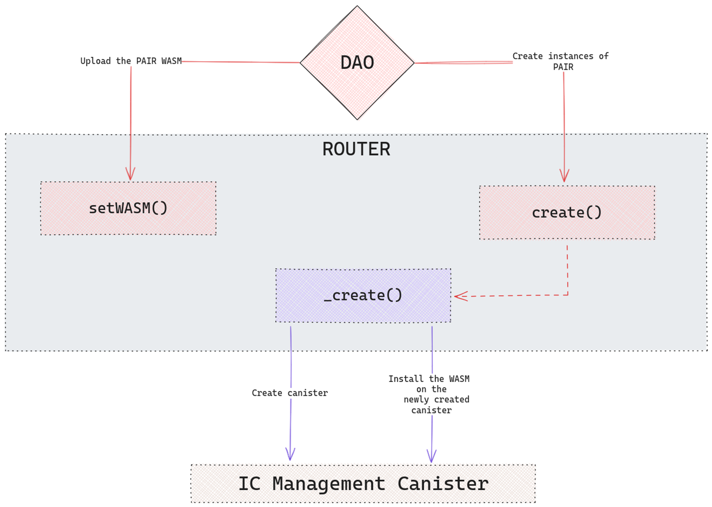
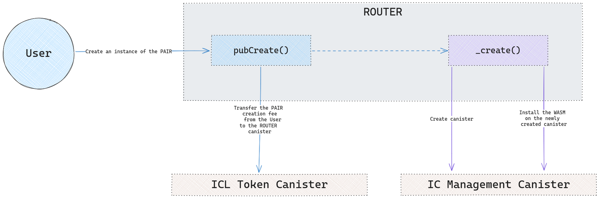
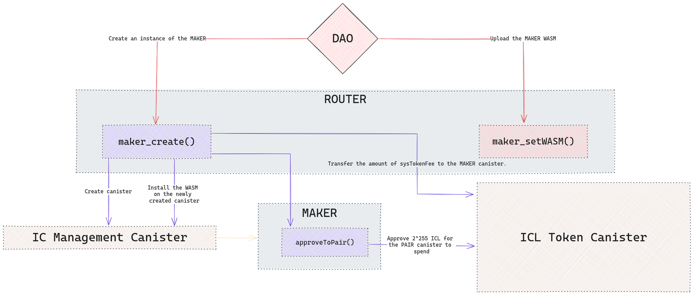
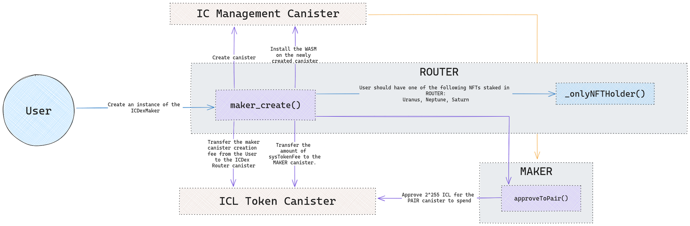

<p align="center">
  
</p>
</br>
</br>

# ICDex Audit Report

> ⚠️ **General Disclaimer:**
> This audit report aims to detail the current state of security and potential weaknesses of the audited app within a limited scope. It does not make any recommendations regarding the app’s user experience, investment potential, or other factors.

## Scorecard

This scorecard is a broad overview of all our findings. You can also view the [Summary of Findings](#summary-of-findings) from our initial audit review and then see how the ICDex team updated their code in response to those initial findings by viewing [Post-Audit Review #1](#post-audit-review-1).

| Area | Description |
| --- | --- |
| Access Controls | **Sufficient**: Only a few methods are callable by anyone, most are owner-only (where the owner is a controller of the canister). |
| Architecture/Design | **Moderate**: The design of ICDex rests on a multi-canister architecture and often operations need to touch multiple canisters, introducing potential atomicity problems. ICTC is a framework that is introduced to solve these problems. The auditors identified some vulnerabilities in the usage that were addressed by the development team. In general, the users should be aware of the following assumptions that must hold true for usage ICTC to remain correct:  1) that any retriable task within a “transaction” must be idempotent, as it can be attempted multiple times 2) that any retriable task with a “transaction” must be re-orderable with regard to the other tasks of the same “transaction”, as it is appended to the end of the task queue on failure; and 3) that once the set of tasks for a transaction are created their tasks can run concurrently with tasks from other transactions as tasks are mostly created atomically, but executed concurrently. No tests were provided to the audit team for review and implementing extensive tests for ICTC was outside the scope of this audit. Therefore, it is unknown whether these critical ICTC assumptions hold true for all the possible combinations of tasks for all transactions where ICTC is used. It is strongly recommended that the development team open sources a robust test suite that explores many different interleavings of ICTC execution for the most critical cases where it is used. |
| SNS Readiness | **Sufficient**: The overall design and ownership system fit well with the SNS model. The auditors identified some vulnerabilities that were addressed by the development team. (see [SNS-Readiness Related Findings](#sns-readiness-related-findings)). |
| Scalability | **Sufficient**: The system as a whole is scalable by its nature of being a multi-canister architecture. Certain state (like ICEvents) might eventually overflow the capacity of a single canister. This can be fixed in time, and the development team made it clear in the documentation where these shortcomings exist. |
| Upgradeability | **Sufficient**: Though some potential bugs were found, and some recommendations were made to communicate the current limitations, the system is upgradeable and has fallbacks in case things go wrong. |
| Documentation | **Strong**: The ICDex ecosystem of canisters is well documented and, though the system is complex, it’s easy for external developers to understand from a high-level perspective without needing to dive into the code.  |
| Testing & Verification | **Poor**: No tests were provided to the auditors during the audit. At the time of the audit, there was no clear way to perform reproducible builds. There isn’t a permanent store of record where all events from all canisters will be stored for possible later auditing/debugging/transparency, permanently. |

### Scorecard levels:

* **Poor**: The scored area does not meet best practices. The area is very deficient and improvements to it as a whole must addressed immediately.
* **Moderate**: The scored area almost meets best practices. The area has some core deficiencies but there are some key actionable items that, if addressed, would make this area minimally meet best practices.
* **Sufficient**: The scored area matches best practices, even though some key, concrete items could be improved.
* **Strong**: The scored area surpasses best practices and only minor issues, if any, were found.

---

## Table of Contents

   * [Scorecard](#scorecard)
   * [Introduction](#introduction)
      + [Purpose](#purpose)
      + [Auditing Agency](#auditing-agency)
      + [Audit Team](#audit-team)
   * [Methodology & Assessment Priorities](#methodology--assessment-priorities)
      + [State of Audits on ICP](#state-of-audits-on-icp)
      + [Phase 1: Scoping](#phase-1-scoping)
      + [Phase 2: Execution](#phase-2-execution)
      + [Phase 3: Finalization](#phase-3-finalization)
      + [Risk Assessment Priorities](#risk-assessment-priorities)
   * [Disclaimers & Scope](#disclaimers--scope)
      + [Review watermarks](#review-watermarks)
      + [General Disclaimers](#general-disclaimers)
      + [Within scope](#within-scope)
      + [Outside of scope](#outside-of-scope)
   * [Summary of Findings](#summary-of-findings)
      + [Tally of issues by severity](#tally-of-issues-by-severity)
      + [Security Concerns](#security-concerns)
      + [Quality & Documentation](#quality--documentation)
      + [SNS-Readiness](#sns-readiness)
   * [Application Architecture](#application-architecture)
      + [System Overview](#system-overview)
      + [Security Measures](#security-measures)
      + [Broad Security Risks](#broad-security-risks)
      + [General Recommendations](#general-recommendations)
      + [Components](#components)
         - [PAIR creation flow](#pair-creation-flow)
         - [MAKER creation flow](#maker-creation-flow)
      + [Public functions](#public-functions)
         - [ROUTER](#router)
         - [PAIR](#pair)
         - [MAKER](#maker)
   * [Repository Assessment](#repository-assessment)
      + [Code Quality Assessment](#code-quality-assessment)
      + [CI/CD Assessment:](#cicd-assessment)
   * [Detailed List of Findings](#detailed-list-of-findings)
      + [Summary](#summary)
      + [Security Related Findings](#security-related-findings)
      + [Non-Security Related Findings](#non-security-related-findings)
      + [SNS-Readiness Related Findings](#sns-readiness-related-findings)
   * [Post-Audit Review #1](#post-audit-review-1)
      + [New Issues](#new-issues)
      + [Current Status of all found issues](#current-status-of-all-found-issues)
      + [List of changes since the initial audit review](#list-of-changes-since-the-initial-audit-review)

---

## Introduction

This document is the official code security audit report by [Solidstate](https://www.solidstateauditing.com/) for the [ICDex](https://iclight.io/ICDex/) decentralized order book exchange. It represents a professional security review by a team of industry-native [Internet Computer Protocol](https://icpguide.com/) (”ICP”) experts.

The initial audit review was started on December 14th, 2023, and completed on January 31st, 2024, with [Post-Audit Review #1](#post-audit-review-1) completed on February 7th, 2024 to incorporate the ICDex team's latest code updates since the audit began along with their resolutions and responses to the [Detailed List of Findings](#detailed-list-of-findings).

### Purpose

This audit report provides a detailed security review of the ICDex decentralized order book exchange application, specifically within the context of its impending decentralization swap sale on the SNS. It was created on behalf of the ICDex team as a public due diligence resource for the ICP ecosystem participants who will collectively be taking over control of ICDex during its SNS launch.

### Auditing Agency

Solidstate is the first ICP-native code security auditing agency. It’s a venture by [Code & State](https://www.codeandstate.com/), which is an independent venture studio devoted to making it easier to build and earn on the Internet Computer. Solidstate contracts independent ICP protocol experts, who each have extensive experience building secure ICP decentralized applications, to execute professional code security audits for ICP projects. Our audits follow accepted industry standards while expanding them to cover the unique security considerations of ICP decentralized applications.

#### Integrity Directives

Solidstate conducts audits with the highest standards of professional integrity and deep respect for the ICP ecosystem.

We work with our clients to allow them some control over the scope and duration of the audits, but clients do not have any control over the content of the final audit report. Our audit reports must be an accurate representation of all findings during the audit.

Compensation for Solidstate audits is determined by a fixed USD-based daily rate that’s contracted with the client upfront. To avoid any potential conflicts of interest, Solidstate does not accept any native tokens or equity from a project as compensation for executing its audit.

Solidstate and Code & State do not hold any equity stake in ICDex.

Solidstate auditors are instructed to follow these directives:

- The [scope](#within-scope) of the audit must be made clear in the audit report.
- The audit report must list any important security considerations that were not covered during the audit as [outside of scope](#outside-of-scope).
- All known issues identified and verified must be included in the [detailed list of findings](#detailed-list-of-findings) on the audit report.
- Issues will remain listed as open or “not fixed” on the audit report until an appropriate resolution is verified during a post-audit review.
- In general, any significant considerations that might impact prospective investors and users of the decentralized application should be included in the final audit report.

### Audit Team

#### Lead Auditor: [David Alves](https://twitter.com/dribeiroalves)

David is a leading mind in the development and security of decentralized infrastructure. While at DFINITY Foundation, he served as the Engineering Lead in charge of the creation of the NNS and the SNS. This experience gives him a rare level of protocol expertise that uniquely qualifies him as a leader in the emerging field of ICP security.

#### Senior Auditor: Anonymous by request

Our senior auditor co-founded notable projects on ICP since Genesis and brings over a decade of development experience. They also have experience creating security tools for ICP dapps and currently serve as a CTO at a Web2 startup.

#### Junior Auditor: [Alan](https://twitter.com/Aegon_TheGreat)

Our junior auditor is a rare technical talent who led the development of multiple notable ICP projects. They currently serve as a Tech Lead in the Web3 space for a notable brand.

#### Project Manager: [Isaac Valadez](https://twitter.com/isaac_icp)

Isaac is the Venture Lead at Code & State. He assembled the auditor team, worked with the lead auditor and ICDex team to coordinate the execution of the audit, and assisted in writing and structuring this final audit report.

## Methodology & Assessment Priorities

### State of Audits on ICP

ICP is unlike any other cloud network or L1 blockchain:

- It is asynchronous
- It hosts front ends
- It hosts complex data models
- It introduces new mutability types
- It decentralizes large amounts of data storage and significant computing capacity
- It can interact directly with both Web2 and other Web3 protocols
- It allows for multi-canister decentralized application architecture, which is a completely new technological frontier

As with any technology that pushes new boundaries, the advanced capabilities of ICP introduce novel security implications. Many established Web3 industry standards don’t translate to ICP. As such, security audits on the Internet Computer Protocol is an emerging field in its early stages, with few standards, resources, and examples to pull from.

ICP auditors face the challenge of exploring and developing new industry methodologies so that decentralized applications on ICP can have their security properly evaluated. This means strong protocol expertise and extensive experience building on ICP are critical requirements for any ICP auditor.

### Phase 1: Scoping

- ICDex provided access to their code repository, documentation, canister IDs, and all other required assets.
- ICDex and the Lead Auditor collaborated to scope the project and set [risk assessment priorities](#risk-assessment-priorities).
- The lead auditor defined the audit assignments and the security practices necessary for this audit.

### Phase 2: Execution

- The auditors conducted a detailed code review of the ICDex GitHub repository.
- Each auditor deployed the code locally and evaluated it according to their assignments.
- The audit team collaborated heavily both internally and with ICDex throughout the audit.

### Phase 3: Finalization

- The auditors conducted a post-audit review to:
    1. Incorporate the ICDex team's latest code updates since work on the initial audit review began.
    2. Evaluate any attempted resolutions for issues identified during the initial audit review.
- The audit team collected the results into this final audit report.

### Risk Assessment Priorities

These are the main risk assessment priorities that ICDex was evaluated for:

#### Users have tokens stolen by attackers

- **Description:** If vulnerabilities exist within ICDex's management of Web3 tokens, attackers could exploit these to directly siphon tokens from users' accounts, leading to significant financial losses and eroding trust in the platform.

#### Users have ICDex liquidity stolen by attackers

- **Description:** ICDex is a decentralized order book exchange that includes a staking protocol that is designed to approximate AMM liquidity positions. Any vulnerabilities might allow attackers to drain this liquidity, resulting in extensive financial loss for liquidity providers.

#### Users have tokens made frozen/inaccessible (either maliciously or unintentionally)

- **Description:** Vulnerabilities or bugs could render Web3 tokens inaccessible, either by malicious intent or unintended code behavior. This could lock funds indefinitely or temporarily, leading to significant financial losses and eroding trust in the platform.

#### Users have ICDex liquidity made frozen/inaccessible (either maliciously or unintentionally)

- **Description:** ICDex is a decentralized order book exchange that includes a staking protocol that is designed to approximate AMM liquidity positions. Liquidity could become frozen due to code malfunctions or malicious exploits, causing liquidity providers to lose access to their assets.

#### ICDex order book manipulation

- **Description:** Bad actors might try to stall or manipulate the proper execution of orders for a pair to benefit themselves or cause harm to others.

#### ICDex open orders attacked or manipulated

- **Description:** Attackers might try to stall, open, cancel, or otherwise manipulate the open orders of other users for their benefit.

#### ICDex pair trading halted or made inaccessible (either maliciously or unintentionally)

- **Description:** Due to bugs, high network congestion, or malicious attacks, the trading of Pair could become temporarily inaccessible, disrupting the platform's main functionality.

#### Data is lost during the canister upgrade process due to a failure while saving it in the stable storage

- **Description:** Upgrades are essential for system improvement. However, mishandling during the upgrade process, especially in saving data to stable storage, could result in irreversible data loss.

#### Exploitation of intermediate state exposed by inter-canister calls

- **Description:** When a canister makes an inter-canister call the temporary state created before the call is made persistent and visible. An attacker might be able to exploit this fact to their favor.

## Disclaimers & Scope

### Review watermarks

The initial audit review performed in the code was based on commit `29c3d312843a5efa834051962af1cab00c7ef234` of the [https://github.com/iclighthouse/ICDex](https://github.com/iclighthouse/ICDex) GitHub repository. It was from this commit hash that the auditors reviewed all the code/documentation/scripts.

A post-audit review of fixes was done at commit: `482d5d448542067e1901323a5fd8ebbe32c19142`, the reviews of the fixes can be found in [Post-Audit Review #1](#post-audit-review-1).

### General Disclaimers

- **ICP DeFi is experimental** - ICP decentralized app security is a constantly changing new frontier full of unknowns. Any potential users of defi dapps on ICP should keep this in mind, and do their own research.
- **Use at your own risk** - Neither Solidstate, Code & State nor our auditors are responsible for any losses experienced by users of the ICDex decentralized order book exchange.
- **Not investment advice** - Nothing in this report is investment advice.
- **Not comprehensive** - There is no such thing as a comprehensive audit, but there is always a limited scope. The work performed for this audit is captured within this report. Readers of this report should not assume that anything not explicitly covered here was evaluated.
- **No guarantees** - Due to the experimental nature of audits for ICP applications, neither Solidstate, Code & State, nor the auditors make any guarantees regarding the security of the ICDex decentralized application. We conducted a best-effort audit in good faith with talented protocol experts, but that is not enough to guarantee that new exploits won’t ever be discovered on a technology as novel as ICP.
- **Limited applicability** - ICP canisters have mutable code. This audit report was conducted on a specific commit hash of ICDex, and the issues were verified to be fixed on another specific hash (see section above). Once the code is updated again, the applicability of this audit is voided and incremental reviews are recommended, as future versions of the ICDex source code may introduce new vulnerabilities.

### Within scope

- ICDex code for these canisters and canister types:
    - ICDexRouter (from this point referred to as “Router”)
    - ICDexPairs (from this point referred to as “Pair”)
    - ICDexMakers (from this point referred to as “Maker”)
- ICDex multi-canister dapp
    - Security of critical DeFi functions (order, liquidity, wallets)
    - SNS launch readiness
    - Upgradeability
    - Scaling
    - State/Variable management
    - Best practices with the code repository (documentation, build-ability, comments, etc.)

### Outside of scope

- **Protocol-level exploits** - Auditing the entire Internet Computer Protocol, and the related tooling/packages provided by DFINITY Foundation, was outside of the scope of this audit.
- **All other ICLighthouse dapps** - ICLighthouse has built many other decentralized applications, and some of these other applications are even direct main header navigation links in the ICDex front end. All other ICLighthouse dapps, canisters, and repos were outside of the scope of this audit.
- **ICRouter** - ICRouter (not to be confused with “ICDexRouter”) is used to provide a cross-chain bridge for web3 assets, which might then be traded on ICDex. This canister code was outside of the scope of this audit.
- **ICTC** - This stands for “IC Transaction Coordinator”. It is a distributed transaction framework for ICP Defi applications developed by the ICDex team, and it is also fundamental to the operations of ICDex. The auditors did review some of the code for ICTC and it will be included in the ICDex SNS launch, but it was only code reviewed within the context of how it directly impacts the security of critical ICDex defi operations. ICTC did not receive independent in-depth audit evaluation/review outside the context of ICDex. Even with regard to its security impact on ICDex, conducting comprehensive edge case testing of ICTC was outside of the scope of this audit.
- **Internal modules** - ICDex uses various modules found in the [icl-vessel GitHub repo](https://github.com/iclighthouse/icl-vessel). While a code review of these modules was done, the modules did not receive independent in-depth audit evaluation/review outside the context of ICDex, and conducting comprehensive edge case testing was outside of the scope of this audit.
- **ICHouse analytics** - ICDex pair data and analytics are reported on another ICLighthouse dapp called [ICHouse](https://ic.house/swaps). ICHouse was outside of the scope of this audit.
- **Integrated wallet providers and external dependencies** - External wallet providers such as Plug and other external dependencies were outside of the scope of this audit.
- **ICLighthouse Planet Cards NFT Collection** - While the function call interactions between the NFTs and ICDex were reviewed, an audit of the NFT collection canister code was outside of the scope of this audit.
- **Malicious token canisters** - Malicious tokens can compromise the security of any DeFi application to steal funds from users, even in ways a DEX may not be able to prevent. In addition, ICP tokens may have mutable code and suddenly become unsafe, possibly even compromising ICP defi applications like ICDex to impact users who never even directly interacted with the malicious token. Any potential users of defi dapps on ICP should be careful not to interact with an ICP token or defi application they do not trust, and do their own research.
- **Testing** - The auditors review and audit existing tests in the client repository, but it’s outside of the scope of this audit for the auditors to develop new tests for the client repository.
- **Front-end Integration** - The security of the integration between the front end and the back end was outside of the scope of this audit.

## Summary of Findings

In this section, we present a summary of the findings from the initial audit review. The full list and details are presented in the [Detailed List of Findings](#detailed-list-of-findings) section, and the findings for the latest code commit can be found in [Post-Audit Review #1](#post-audit-review-1).

We audited the code across 3 main verticals.

1. **Security**: Here we audited for code correctness and potential DOS or attack vectors.
2. **Quality & Documentation**: Here we audited for testing coverage, quality of documentation, reproducibility of the build, etc.
3. **SNS-Readiness**: Here we audited for how well the architecture and the code are ready to be handed over to the control of an SNS DAO.

We classify our findings into the following categories:

- **Low**: Stylistic or grammatical error that doesn’t influence how the application runs.
- **Medium**: Erroneous return or calculation that doesn’t affect the integrity of the overall application.
- **High**: A problem that affects the overall integrity of the application, but doesn’t allow the extraction of funds.
- **Very High**: A problem that affects the overall integrity of the application and allows a sophisticated caller to directly extract value or take control of critical application functions.

### Tally of issues by severity

| Category | Number of Findings |
| --- | --- |
| Very High | 4 *Only 2 applicable after an SNS launch |
| High | 14 |
| Medium | 18 |
| Low | 10 |
| Total: | 46 |

See [here](#current-status-of-all-found-issues) for the status after [Post-Audit Review #1](#post-audit-review-1).

### Security Concerns

We identified vulnerabilities of varying severity within the ICDex system. Notably:

- **Lock Mechanism Vulnerabilities**: Incorrect handling of **`sysTransactionLock`** poses a significant risk, potentially allowing unauthorized actions such as double withdrawals (SS-ICDEX-000).
- **Race Conditions and TOCTOU Issues**: Functions like **`add()`** exhibit vulnerabilities to race conditions and Time-of-Check to Time-of-Use (TOCTOU) issues, threatening system integrity (SS-ICDEX-009, SS-ICDEX-032).

### Quality & Documentation

This category revealed gaps in testing coverage and documentation clarity:

- **Testing Deficiencies**: A notable absence of functional and concurrency tests for public methods and ICTC functionality indicates a risk of undetected bugs and regressions (SS-ICDEX-044, SS-ICDEX-045).
- **Documentation and Code Clarity**: Issues such as the complex **`add`** function (SS-ICDEX-019) and ambiguous operation descriptions (SS-ICDEX-020) highlight the need for better documentation and code simplification.

### SNS-Readiness

Assessment in this area uncovered several critical areas needing attention before transitioning to SNS governance:

- **Governance and Control**: Uncertainties around the transition of control mechanisms to SNS, including the setting of **`icDao`** as the controller and public verification of canister ownership, present very high-severity risks to SNS readiness (SS-ICDEX-039, SS-ICDEX-040).
- **Operational Transparency**: The lack of mechanisms to list all pair canisters (SS-ICDEX-041) and to verify controller ownership post-SNS donation impedes transparency, a cornerstone of SNS governance.

## Application Architecture

### System Overview

ICDex leverages a sophisticated multi-canister architecture that hinges upon the interconnected relationships among its core canisters, namely Router, instances of Pair, Maker, and ICTC.

The ICDex Router canister assumes a pivotal role, serving as the factory contract for both Pair and Maker canisters. Its comprehensive suite of methods facilitates dynamic capabilities, including upgrades, reinstalls, and version rollbacks, designed to address potential challenges in the event of upgrade failures. Notably, the governance of trading pair canisters stands as a primary functionality within this canister. It is imperative to underscore that the rightful owner of Router is vested in the ICDex DAO, underscoring a commitment to decentralized governance.

Instances of Pair canisters play a pivotal role in facilitating transactions between two tokens. Deployed by the Router canister, the responsibility for initiating this deployment lies with both the owner of Router (who can execute this action without incurring any fee) and any user willing to deposit the requisite fee for this purpose. This flexibility in deployment ensures accessibility and user-driven participation in the ICDex ecosystem.

Instances of Maker canisters are designed to give users the ability to provide liquidity for a given trading pair in a way that simulates the Automated Market Maker (AMM) LP experience of familiar DEXs such as Uniswap, though ICDex remains an order book exchange. The deployment and management of Maker canisters are orchestrated by Router. Maker instances employ an automated grid strategy for orders to approximate the general functionality of an AMM LP position.

### Security Measures

#### Containment

The architecture adopts an approach of isolated order books for each trading pair. Every pair is traded in its own canister. This design is meant to contain any disruptions to a single pair so that they don’t spill over to other pairs.

In addition, the optional Maker canister is also separate from its corresponding trading pair. In the worst-case scenario of an error in a Maker instance, it should not impact the operations of the related Pair instance.

#### Canister Features

The Router canister’s main security feature is checking the owner (which can be the Principal ID for any of the canister’s controllers) upon invoking all of the management commands.

Pair canisters are equipped with several mechanisms that increase their security:

- Canister Pausing - The whole canister can be paused, which halts any actions and fund transactions so that the current issues can be diagnosed and resolved.
- Anti-DDOS - The mechanism that throttles the maximum amount of transactions per second (TPS) is ICTC. This system handles all transactions of funds in a delayed manner. If there are too many errors in fund transfers it pauses the whole canister.
- Private Actions - Pair canisters have both public and private actions. Every private action can only be executed by an admin or other dedicated group of privileged users.

Maker canisters are equipped with a TransactionLock feature that ensures certain actions on the canister are done synchronously. In case of any issue with TransactionLock, the whole canister is frozen and will require manual intervention to reactivate.

#### Governance

Router is the central point of governance over the rest of the created canisters (Pair and Maker). It is used to instantiate, update, pause, and stop all trading Pair and Makers instances. In addition, it also serves as a main hub of information about available trading pairs in ICDex.

Pair governance options are pause, unpause, and config functions. They are designed to only be run by the current owner of the canister, which by default is the Router.

Maker has similar governance options to Pair.

In the case that there are unhandled or predicated edge situations in Pair or Maker, those canisters will pause automatically. To unpause, there is a need to call an unpause function by the current owner of the given canister.

#### Scalability

ICDex scales by creating dedicated canisters for every pair. Outside of possible but infrequent non-ideal conditions (such as if the whole subnet is experiencing high demand), this architecture should serve as a generally reliable mechanism for ensuring scalability. When it becomes possible for Pair canisters to be created in separate subnets, this will further increase the scalability of the whole DEX.

#### Auditability and Transparency

The audited code is available publicly. The code itself is complex in both the architecture and style it was written. The primary Motoko code for Router, Pair, and Maker is written into single files for each canister type, with each of those files being >2000 lines long. This decreases code transparency. In addition, the naming of the public functions mixes Camel and Snake cases. This may be due to the requirements of different standards implemented in the code, however this is not mentioned in the documentation.

Many of the crucial functions are complex and do not have any comments near the code explaining how they work. The project comes with README and markdown files explaining the basic concepts behind DEX as a whole.

### Broad Security Risks

#### Availability

In the case of network congestion or DDOS attacks, it is possible in theory to force a canister to pause (via the anti-DDOS built-in mechanism). Since the speed of governance votes to unpause a paused pair could take time and be difficult to predict/control, this puts the general availability of the DEX at potential risk. If there is a high demand for the whole subnet, there is a possibility that multiple pairs could get paused at once.

In the current version of the SNS, only one call can be done via a single SNS proposal (of course it can be done by proxy to have multiple calls, but it increases the complexity of the whole system). In case multiple canisters require multiple actions to fix, it could require multiple SNS proposals and take time to collect all the necessary votes for them to be adopted.

#### Transaction Fees

By default, transactions are done in tunnel mode (see docs/ICDexPair.md:373) in the case that a transaction requires filling from multiple orders, it will issue multiple transactions and incur multiple fees. This could add a possible source of transaction fee inefficiency.

#### Interoperability

Pair canisters support the ICRC-1 token standard. However, the current version of ICRC-1 does not include any mechanisms preventing the token canister owner from replacing the target canister code. It is strongly suggested that appropriate disclosures are put in place, informing the users to make their own due diligence before trading on any pair.

#### Data Consistency

Every Pair canister comes with backup and restore functions. The restore is a multipart process, that directly overwrites the data required for the operation of the canister. If those functions are mishandled that could disable the canister, or potentially cause a loss of funds. Currently, the system is designed to have the backup and restore functions handled via Router, which implements a complex backup and restore procedure. If the restore is interrupted for any reason (high network demand, failed calls, etc.) the target canister may become inoperable. The restore functions modify variables directly.

#### Scalability

The current design does have some scalability limitations, due to the centralized register of pairs in Router. Under specific situations (such as high network demand) access to pair information might be hindered, possibly to the extent that the whole DEX is rendered temporarily inoperable.

#### Liquidity

Liquidity is supplied by market participants actively trading and optionally by an instance of Maker. Maker canisters are an implementation of a Grid Bot trading strategy. With any implementation of a grid bot, there is always a risk that liquidity could potentially be siphoned by third parties that have enough influence over the market. Furthermore, if the pair canister can be forced to pause, liquidity providers might temporarily lose access to withdraw their liquidity. In a market with high volatility, frozen open order positions can lose value quickly.

#### Governance risks

Pair canisters can be paused, either directly via a call or by transfer failures. In the case of network congestion, a pause can be triggered automatically. To unpause, direct action is required. In the current architecture, the unpause action is designed to be called by DAO. Providing how SNS voting works, there is potential that this could take a substantive amount of time.

#### Test suites

No test suites were found in the repositories. Without a test suite, there is an increased risk that bugs could be introduced during ongoing development which may even break already tested and proven functionalities.

### General Recommendations

#### Security Enhancements

**Improve TransactionLock Mechanism**: Enhance the Maker canister's TransactionLock feature to prevent freezing and require manual intervention less frequently. If possible, get rid of TransactionLock completely.

**Enhance ICTC System**: Improve the handling of ICTC transfers and increase testing coverage. The ultimate vision for the ICTC is ambitious, but until there is much more extensive testing and/or formal proofs for ICTC, simplifying it will make it easier to reason about and test. One option is to reduce the state space of the tasks being executed. We considered the following potential changes:

- Never redo tasks automatically (takes care of the idempotency and task re-ordering problems), i.e. if anything goes wrong it immediately reverts to manual compensation.
- Add concurrency tests for operations like `ICDexPair.withdraw`to make sure that many concurrent withdraws possibly even on the same accounts can happen concurrently and behave adequately, especially in the presence of failures.

#### Governance and Scalability

**Enhance Governance Protocols**: Streamline the governance protocol for faster response during emergency situations, particularly for unpausing canisters.

#### Readability

To enhance the overall readability of the codebase, it is advisable to break the code into smaller, more manageable files. Additionally, consider adding more detailed documentation, including comments and explanations for critical lines of code. This will make it easier for developers to understand and work with the project.

#### Maintainability

The absence of provided tests is a significant concern. Without tests, it becomes challenging to verify if new changes are functioning correctly and do not introduce issues elsewhere in the code. It's crucial to implement a robust testing suite to ensure the project's stability and maintainability.

#### Tests

No tests were found in the audited repository. To ensure the critical functions of the canisters are working as intended, it's crucial to establish a robust suite of tests. The following scenarios should be included in the testing plan:

- **ICDexRouter:**
    - `pause`
    - `unpause`
    - `upgrade`
    - `create`
    - `pubCreate`
    - `setWasm`
- **ICDexPair:**
    - `pause`
    - `unpause`
    - `trade`
    - `cancel`
    - `deposit`
    - `withdraw`
    - `backup`
    - `recovery`
- **ICDexMaker:**
    - `add`
    - `remove`
    - `configure`
    - `backup`
    - `recovery`

Implementing these tests will provide confidence in the functionality of the code and help catch any issues early in the development process.

In summary, addressing these code quality, CI/CD, and testing issues is vital for enhancing the project's readability, maintainability, and overall reliability. This will make it easier for the development team to collaborate effectively and ensure a stable and well-documented codebase.

Beyond functionally testing the above methods, the test suite should exercise concurrent update calls of all methods that use ICTC and are not fully atomic.

#### Risk Mitigation

1. **Implement Test Suites**: Develop comprehensive test suites for all components to identify and address potential bugs and vulnerabilities.
2. **Backup and Restore Safeguards**: Implement safeguards and checkpoints in the backup and restore functions to prevent data loss or canister disablement.
3. **Token Standard Security**: Advocate for improvements in the ICRC-1 standard to prevent unauthorized code changes in token canisters.

---

### Components

> **Diagram Guide:**
>
> - Inter-canister calls and transactions initiated by external parties are marked as solid lines.
> - Internal function calls in canisters are marked as dotted lines.
> - Boxes with dotted borders are functions and their larger layouts determine their canister.
> - User and DAO operations are respectively colored blue and red.

#### PAIR creation flow

##### By the DAO:

1. The DAO entity uploads the PAIR canister’s WASM to the ROUTER via the `setWASM()` method.
2. The DAO entity creates a new instance of the PAIR canister by calling the `create()` method.
3. The ROUTER canister internally calls the `_create()` private function to start the process of creating the new PAIR canister.
4. The ROUTER canister makes an inter-canister call to the IC Management Canister to create a new empty canister.
5. The ROUTER canister makes an inter-canister call to the IC Management Canister to install the stored PAIR WASM on the newly created empty canister.



##### By user:

1. The user creates a new instance of the PAIR canister by calling the `pubCreate()` method.
2. The ROUTER canister makes an inter-canister call to the ICL token canister to transfer the PAIR creation fee from the user’s account to its own.
3. The ROUTER canister internally calls the `_create()` private function to start the process of creating the new PAIR canister.
4. The ROUTER canister makes an inter-canister call to the IC Management Canister to create a new empty canister.
5. The ROUTER canister makes an inter-canister call to the IC Management Canister to install the stored PAIR WASM on the newly created empty canister.



#### MAKER creation flow

##### By the DAO:

1. The DAO entity uploads the MAKER canister’s WASM to the ROUTER via the `maker_setWASM()` method.
2. The DAO entity creates a new instance of the PAIR canister by calling the `maker_create()` method.
3. The ROUTER canister makes an inter-canister call to the IC Management Canister to create a new empty canister.
4. The ROUTER canister makes an inter-canister call to the IC Management Canister to install the stored MAKER WASM on the newly created empty canister.
5. The ROUTER canister makes an inter-canister call to the ICL token canister to approve the `sysTokenFee` amount of tokens to the MAKER canister.
6. The ROUTER canister makes an inter-canister call to the MAKER’s `approveToPair()` function.
7. The MAKER canister makes an inter-canister call to the ICL token canister to approve the amount of `2^555` tokens to the PAIR canister to spend.



##### By user:

1. The user creates a new instance of the PAIR canister by calling the `maker_create()` method.
2. The ROUTER internally calls the `_onlyNFTHolder()` private function to check if the user has staked one of the required NFTs for this operation: Saturn, Uranus, Neptune
3. The ROUTER canister makes an inter-canister call to the ICL token canister to transfer the MAKER creation fee from the user’s account to its own.
4. The ROUTER canister makes an inter-canister call to the IC Management Canister to create a new empty canister.
5. The ROUTER canister makes an inter-canister call to the IC Management Canister to install the stored MAKER WASM on the newly created empty canister.
6. The ROUTER canister makes an inter-canister call to the ICL token canister to approve the `sysTokenFee` amount of tokens to the MAKER canister.
7. The ROUTER canister makes an inter-canister call to the MAKER’s `approveToPair()` function.
8. The MAKER canister makes an inter-canister call to the ICL token canister to approve the amount of `2^555` tokens to the PAIR canister to spend.



### Public functions

This list contains all of the publicly executable functions of ICDex canisters, omitting privileged management functions that are executable only to the owner of the canister (which are the large majority of functions).

#### ROUTER

---

**Method `NFTDeposit`:**

Stakes user-owned NFT in the canister.

**Arguments:**

- `_collectionId`: The Principal ID of the NFT collection.
- `_nftId`: The NFT ID
- `_sa`: The deposit subaccount.

**Returns:**

No returned value.

---

**Method `NFTWithdraw`:**

Withdraws a staked user-owned NFT from the canister.

**Arguments:**

- `_nftId`: The NFT ID
- `_sa`: The subaccount.

**Returns:**

No returned value.

---

**Method `NFTBindMaker`:**

Binds a new VIP-maker.

**Arguments:**

- `_nftId`: The NFT ID
- `_pair`: The PAIR canister’s principal ID
- `_maker`: The maker account ID
- `_sa`: The subaccount

**Returns:**

No returned value.

---

**Method `NFTUnbindMaker`:**

Unbinds a VIP-maker.

**Arguments:**

- `_nftId`: The NFT ID
- `_pair`: The PAIR canister’s principal ID
- `_maker`: The maker account ID
- `_sa`: The subaccount.

**Returns:**

No returned value.

---

**Method `maker_create`:**

Deploy and create a new MAKER canister. The caller either must be the ROUTER owner or a user who holds any of the following NFTs: Neptune, Uranus, Saturn

**Arguments:**

- `pair`: The PAIR canister’s principal ID
- `allow`: Public or private visibility settings
- `name`: The MAKER’s name
- `lowerLimit`: The lower price limit settings
- `upperLimit`: The upper price limit settings
- `spreadRate`: Inter-grid spread ratio for grid orders
- `threshold`: Total liquidity threshold settings
- `volFactor`: The computation factor for calculating the liquidity pool’s limit.
- `creator`: Optional creator address.

**Returns:**

`canister`: The principal ID of the newly created MAKER canister.

---

**Method `maker_update`:**

Updates a deployed instance of the MAKER. The caller must be either the ROUTER or the MAKER owner.

**Arguments:**

- `pair`: The PAIR canister’s principal ID
- `maker`: The MAKER canister’s principal ID
- `name`: MAKER name
- `version`: The WASM version that should be used for the upgrade

**Returns:**

Null in the case of a failed upgrade and the MAKER’s principal ID in case of a successful upgrade.

---

**Method `maker_rollback`:**

Performs rollback on a MAKER canister. The caller must be either the ROUTER or the MAKER owner.

**Arguments:**

- `_pair`: The PAIR canister’s principal ID
- `_maker`: The MAKER canister’s principal ID

**Returns:**

Null in the case of a failed operation and the MAKER’s principal ID in case of a successful one.

---

**Method `maker_approveToPair`:**

Triggers the MAKER canister to approve a certain amount of the `sysToken` for the PAIR to spend. The caller must be either the ROUTER or the MAKER owner.

**Arguments:**

- `_pair`: The PAIR canister’s principal ID
- `_maker`: The MAKER canister’s principal ID
- `_amount`: Amount of tokens to approve

**Returns:**

A boolean that indicates the success of the operation.

---

**Method `maker_remove`:**

Removes a MAKER. The caller must be either the ROUTER or the MAKER owner.

**Arguments:**

- `_pair`: The PAIR canister’s principal ID
- `_maker`: The MAKER canister’s principal ID

**Returns:**

No returned value.

---

#### PAIR

---

**Method `trade`:**

Non-brokerage supporting generic trade function.

**Arguments:**

- `_order`: An `OrderPrice` type argument that defines the price, the type of the operation (Buy/Sell), the quantity, and/or the amount values for the trade
- `_orderType`: Type of the order (e.g. LMT, MKT)
- `_expiration`: Optional expiration time in nanoseconds
- `_nonce`: Optional specified nonce value
- `_sa`: Optional subaccount
- `_data`: Optional metadata

**Returns:**

A `TradingResult` value.

---

**Method `trade_b`:**

Brokerage supporting generic trade function.

**Arguments:**

- `_order`: An `OrderPrice` type argument that defines the price, the type of the operation (Buy/Sell), the quantity, and/or the amount values for the trade
- `_orderType`: Type of the order (e.g. LMT, MKT)
- `_expiration`: Optional expiration time in nanoseconds
- `_nonce`: Optional specified nonce value
- `_sa`: Optional subaccount
- `_data`: Optional metadata
- `_brokerage`: Optional data containing the broker’s principal ID and the fee rate

**Returns:**

A `TradingResult` value.

---

**Method `tradeMKT`:**

Non-brokerage supporting fast MKT trade function. The trader receives a certain amount of the credit token if there is any matching order.

**Arguments:**

- `_token`: The debit token canister’s principal ID
- `value`: The amount of debit tokens to be traded
- `_nonce`: Optional specified nonce value
- `_sa`: Optional subaccount

**Returns:**

A `TradingResult` value.

---

**Method `tradeMKT_b`:**

Brokerage supporting fast MKT trade function. The trader receives a certain amount of the credit token if there is any matching order.

**Arguments:**

- `_token`: The debit token canister’s principal ID
- `value`: The amount of debit tokens to be traded
- `_limitPrice`: The order’s limit price
- `_nonce`: Optional specified nonce value
- `_sa`: Optional subaccount
- `_brokerage`: Optional data containing the broker’s principal ID and the fee rate

**Returns:**

A `TradingResult` value.

---

**Method `fallback`:**

Retrieves funds for the user from an inactive order.

**Arguments:**

- `_nonce`: Nonce value
- `_sa`: Optional subaccount

**Returns:**

A boolean value that indicates the success of the operation.

---

**Method `fallbackByTxid`:**

Retrieves funds for the user from an inactive order by getting the order’s transaction ID. Only callable by the trader and the PAIR owner.

**Arguments:**

- `_txid`: The transaction ID
- `_sa`: Optional subaccount

**Returns:**

A boolean value that indicates the success of the operation.

---

**Method `accountConfig`:**

Configures user preferences such as the `ExchangeMode` and the `KeepingBalanceInTraderAccount`.

**Arguments:**

- `_exMode`: Pool mode or Tunnel mode default configuration
- `_enKeepingBalance`: Boolean for keeping the balance

**Returns:**

No returned value.

---

**Method `deposit`:**

Trader deposits funds into their account.

**Arguments:**

- `_token`: The deposit token
- `_value`: The deposit amount
- `_sa`: Optional subaccount

**Returns:**

No returned value.

---

**Method `depositFallback`:**

Trader retrieves deposited funds that are not being processed.

**Arguments:**

- `_sa`: Optional subaccount

**Returns:**

Amounts of returned tokens for both pair tokens.

---

**Method `withdraw`:**

Trader retrieves funds from their account.

**Arguments:**

- `_value0`: Optional token0 value to withdraw
- `_value1`: Optional token1 value to withdraw
- `_sa`: Optional subaccount

**Returns:**

Amounts of withdrawn tokens for both pair tokens.

---

**Method `withdraw2`:**

Trader retrieves deposited funds that are not being processed as synchronously as possible.

**Arguments:**

- `_value0`: Optional token0 value to withdraw
- `_value1`: Optional token1 value to withdraw
- `_sa`: Optional subaccount

**Returns:**

Amounts of returned tokens for both pair tokens along with the status of the operation (completed or pending).

---

**Method `sto_cancelPendingOrders`:**

Cancels all strategy orders in the book for a trader.

**Arguments:**

- `_soid`: The order ID
- `_sa`: Optional subaccount

**Returns:**

No returned value.

---

**Method `sto_createProOrder`:**

Creates a pro-order strategy.

**Arguments:**

- `_arg`: Strategy order settings
- `_sa`: Optional subaccount

**Returns:**

Strategy order ID

---

**Method `sto_updateProOrder`:**

Creates a pro-order strategy.

**Arguments:**

- `_soid`: Strategy order ID
- `_arg`: Strategy order settings
- `_sa`: Optional subaccount

**Returns:**

Strategy order ID

---

**Method `sto_createStopLossOrder`:**

Creates a stop-loss strategy order.

**Arguments:**

- `_arg`: Strategy order settings
- `_sa`: Optional subaccount

**Returns:**

Strategy order ID

---

**Method `sto_updateStopLossOrder`:**

Updates a stop-loss strategy order.

**Arguments:**

- `_soid`: Strategy order ID
- `_arg`: Strategy order settings
- `_sa`: Optional subaccount

**Returns:**

Strategy order ID

---

**Method `IDO_updateQualification‎`:**

Updates a participant’s qualification status

**Arguments:**

- `_sa`: Optional subaccount

**Returns:**

Cumulative volume from the pair

---

**Method `ta_setReferrer`:**

Sets up the trader’s referrer once.

**Arguments:**

- `_ambassador`: Ambassador address
- `_entity`: Optional text
- `_sa`: Optional subaccount

**Returns:**

A boolean value that indicates the success of the operation.

---

**Method `drc205_txn2`:**

Performs an inter-canister call to the DRC205 canister in case of not finding the transaction record in the PAIR canister.

**Arguments:**

- `_txid`: The transaction ID

**Returns:**

Optional transaction record. Null if the transaction was not found.

---

**Method `cancel`:**

Cancels an existing order.

**Arguments:**

- `_nonce`: Nonce value
- `_sa`: Optional subaccount

**Returns:**

No returned value.

---

**Method `cancelByTxId`:**

Cancels an existing order by the transaction ID. Only callable by the trader and the PAIR owner.

**Arguments:**

- `_txid`: Transaction ID
- `_sa`: Optional subaccount

**Returns:**

No returned value.

---

**Method `cancelAll`:**

Cancels one or more traders’ orders in batch, either invoked by a single trader for their own trades or by the PAIR owner for one or many traders.

**Arguments:**

- `_args`: The PAIR owner or the trader specifies their subaccount/account ID
- `_side`: Optional argument for the side that needs to be canceled (Buy or Sell trades)

**Returns:**

No returned value.

---

#### MAKER

---

**Method `add`**

Adds liquidity.

The ratio of token0 to token1 needs to be estimated based on the current NAV, and the excess side of the token will be refunded.

**Arguments:**

- `token0`: Amount of token0 to add
- `token1`: Amount of token1 to add
- `_sa`: Optional subaccount

**Returns:**

Number of added shares

---

**Method `remove`**

Removes liquidity.

**Arguments:**

- `_shares`: Number of shares to remove
- `_sa`: Optional subaccount

**Returns:**

- `value0`: Amount of token0 retrieved
- `value1`: Amount of token1 retrieved

---

**Method `drc207`**

Returns the monitor-ability configuration of the canister.

**Arguments:**

No arguments

**Returns:**

Monitor-ability configuration of the canister.

---

**Method `fallback`**

Retrieve funds when an LP has a deposit exception and the funds are left in his DepositAccount.

**Arguments:**

- `_sa`: Optional subaccount

**Returns:**

- `value0`: Amount of token0 retrieved
- `value1`: Amount of token1 retrieved

---

**Method `getAccountShares`**

Returns the LP's liquidity share and time-weighted value.

**Arguments:**

- `_account`: Account

**Returns:**

LP's liquidity share and time-weighted value.

---

**Method `getAccountVolUsed`**

Returns the liquidity quota that has been used by the LP.

**Arguments:**

- `_account`: Account

**Returns:**

Used liquidity quota

---

**Method `getUnitNetValues`**

Returns NAV values.

**Arguments:**

No arguments

**Returns:**

- `shareUnitSize`: Unis size of share
- `data`: List of unit net value

---

**Method `get_account_events`**

Returns events by account.

**Arguments:**

- `_accountId`: Account Id

**Returns:**

List of events

---

**Method `get_event`**

Returns an event based on the block height of the event.

**Arguments:**

- `_blockIndex`: Block Height

**Returns:**

Event

---

**Method `get_event_count`**

Returns the total number of events (height of event blocks).

**Arguments:**

No arguments

**Returns:**

Block Height

---

**Method `get_event_first_index`**

Returns the height of the first block of the saved event record set. (Possibly earlier event records have been cleared).

**Arguments:**

No arguments

**Returns:**

Block Height

---

**Method `get_events`**

Returns events list.

**Arguments:**

- `_page`: Page of results
- `_size`: Number of results

**Returns:**

List of events

---

**Method `ictc_TM`**

Returns TM name for SagaTM Scan

**Arguments:**

No arguments

**Returns:**

Always returns “Saga”

---

**Method `ictc_getAdmins`**

Returns the list of ICTC administrators

**Arguments:**

No arguments

**Returns:**

List of ICTC Administrators

---

**Method `ictc_getCalleeStatus`**

Returns the status of the callee.

**Arguments:**

- `_callee`: Principal

**Returns:**

Callee status

---

**Method `ictc_getPool`**

Returns lists of active transaction orders and transaction tasks

**Arguments:**

No arguments

**Returns:**

- `toPool`: active transaction orders
- `ttPool`: transaction tasks

---

**Method `ictc_getTO`**

Returns a transaction order

**Arguments:**

- `_toid`: Transaction order id

**Returns:**

Transaction order

---

**Method `ictc_getTOCount`**

Returns the total number of transaction orders

**Arguments:**

No arguments

**Returns:**

Total number of transaction orders

---

**Method `ictc_getTOPool`**

Returns a list of active transaction orders

**Arguments:**

No arguments

**Returns:**

List of active transaction orders

---

**Method `ictc_getTOs`**

Returns transaction order list

**Arguments:**

- `_page`: Page of results
- `_size`: Number of results

**Returns:**

Transaction order list

---

**Method `ictc_getTT`**

Returns a record of a transaction task

**Arguments:**

- `_ttid`: Transaction Task Id

**Returns:**

Transaction task

---

**Method `ictc_getTTByTO`**

Returns all tasks of a transaction order

**Arguments:**

- `_toid`: Transaction Order Id

**Returns:**

All tasks of transaction order

---

**Method `ictc_getTTErrors`**

Returns the transaction task records for exceptions

**Arguments:**

- `_page`: Page of results
- `_size`: Number of results

**Returns:**

- `data`: Exceptions
- `totalPage`: Total number of pages
- `total`: Total number of tasks

---

**Method `ictc_getTTPool`**

Returns a list of active transaction tasks

**Arguments:**

No arguments

**Returns:**

List of active transaction tasks

---

**Method `ictc_getTTs`**

Returns a list of transaction tasks

**Arguments:**

- `_page`: Page of results
- `_size`: Number of results

**Returns:**

- `data`: Transaction tasks
- `totalPage`: Total number of pages
- `total`: Total number of tasks

---

**Method `info`**

Returns ICDexMaker information.

**Arguments:**

No arguments

**Returns:**

- `version`: Version of Maker
- `name`: Name of Maker
- `paused`: Is paused
- `initialized`: Is initialized
- `sysTransactionLock`: Is locked
- `visibility`: Visibility of Maker
- `creator`: Creator Principal
- `withdrawalFee`: Fee of withdrawal
- `poolThreshold`: Threshold for activating liquidity limit.
- `volFactor`: A factor for calculating liquidity limits based on volumes.
- `gridSoid`: Strategy ID of the Grid Order
- `shareDecimals`: The decimals of the shares, which are assigned at initialization time.
- `pairInfo`: Information about Pair and Tokens
- `gridSetting`: Settings of the grid

---

**Method `stats`**

Returns the latest status data for ICDexMaker. (Data may be delayed).

**Arguments:**

No arguments

**Returns:**

- `holders`: Nat number of holders
- `poolBalance`: Balances of both tokens, including balance taken from DEX
- `poolLocalBalance`: Local pool balances
- `poolShares`: Number of pool shares
- `poolShareWeighted`: Number of pool shares weighted
- `latestUnitNetValue`: Price per single share

---

**Method `stats2`**

Returns the latest status data for ICDexMaker.

This is a composite query that will fetch the latest data.

**Arguments:**

No arguments

**Returns:**

- `holders`: Nat number of holders
- `poolBalance`: Balances of both tokens, including balance taken from DEX
- `poolLocalBalance`: Local pool balances
- `poolShares`: Number of pool shares
- `poolShareWeighted`: Number of pool shares weighted
- `latestUnitNetValue`: Price per single share
- `apy24h`: Estimated APY 24h
- `apy7d`: Estimated APY 7d

---

**Method `wallet_receive`**

Receive cycles

**Arguments:**

No arguments

**Returns:**

No returned value.

---

## Repository Assessment

### Code Quality Assessment

#### Structure

The project currently consists of three main files: ICDexRouter, ICDexPair, and ICDexMaker. Additionally, sagas are handled in a separate file. This organization leads to long files, with the ICDexPair file exceeding 6500 lines. This impacts the code’s readability.

#### Coding Standards

- **Function Naming:**
The codebase exhibits a mix of camel case and snake case function naming. This inconsistency might be due to the implementation of the ICRC-1 standard. Unfortunately, there's a lack of documentation specifying the preferred naming convention for functions.
- **Variable Naming:**
Similar to function naming, there's a mix of camel case and snake case used for variables. The absence of clear guidelines on naming conventions makes it difficult to maintain consistency.

### CI/CD Assessment:

#### Build Reproducibility:

The current documentation lacks sufficient instructions for safely building and deploying the entire project. It is recommended to include a script, specifically designed for Linux, that can automate the build process. This script should also calculate and display hashes for the built modules, ensuring reproducibility.

#### Dependency Management:

The project relies on both the Vessel and Mops package managers for handling dependencies. However, the documentation does not provide detailed instructions or references to external documentation explaining how to install and use these package managers. Clarifying these steps is essential for ensuring that external developers can set up the project without difficulties.

## Detailed List of Findings

### Summary

To recap, we classified our findings into the following categories:

- **Low**: Stylistic or grammatical error that doesn’t influence how the application runs.
- **Medium**: Erroneous return or calculation that doesn’t affect the integrity of the overall application.
- **High**: A problem that affects the overall integrity of the application, but doesn’t allow the extraction of funds.
- **Very High**: A problem that affects the overall integrity of the application and allows a sophisticated caller to directly extract value or take control of critical application functions.

### Security Related Findings

---

#### **SS-ICDEX-000: `sysTransactionLock` release vulnerability**

- **Component:** MAKER
- **Severity:** Very High
- **Details:**
   Handling of `sysTransactionLock` in the `remove()` and `add()` functions is flawed. There's at least one scenario where the lock can be released by a call different than the one that acquired it, leading to potential integrity issues. The sequence of events leading to this issue includes interleaved executions of multiple `remove()` calls, where the second call might release the lock acquired by another thread. This vulnerability could potentially be exploited to perform unauthorized actions, such as double withdrawals.
- **Implication:**
   Improper handling of `sysTransactionLock` can lead to race conditions, resulting in inconsistent state and potential security breaches.
- **Recommendation:**
   Revise the lock mechanism. Since both `add()` and `remove()` functions make several async calls it would be advisable to have either a global lock allowing only one of `add()` or `remove()` to be called at the same time. A potential improvement on this would be a per-pair lock, enabling the concurrent addition/removal of liquidity to different trading pairs, but not to the same pair.

---

#### **SS-ICDEX-001: `getOwner` and `changeOwner` are commented out**

- **Component:** MAKER
- **Severity:** High
- **Details:**
   The functions `getOwner` and `changeOwner` are commented out. `changeOwner` is particularly crucial for changing the owner to the SNS, and `getOwner` is necessary to verify the completion of this change.
- **Implication:**
   Lack of these functions could impede the management and verification of ownership, which is critical for the platform's integrity and governance.
- **Recommendation:**
   Uncomment and implement these functions to ensure proper ownership management and verification.

---

#### **SS-ICDEX-002: InitAdd state issue in `add()`**

- **Component:** MAKER
- **Severity:** Medium
- **Details:**
In the `add()` function, there is a risk that two different calls might concurrently perceive `InitAdd` as true, leading to potential state inconsistencies.
- **Implication:**
Concurrent access without proper synchronization can cause race conditions and inconsistent states within the canister.
- **Recommendation:**
Implement synchronization mechanisms or state checks to prevent concurrent issues with the `InitAdd` state.

---

#### **SS-ICDEX-003: `_init()` Function unreachable by first trade**

- **Component:** PAIR
- **Severity:** Medium
- **Details:**
Despite the `_init()` function's intended design to be triggered by the first trade, it cannot be called directly due to a precondition check in the public trade functions which prevents `_trade()` from being reached if the canister is not initialized.
- **Implication:**
This misalignment between the intended and actual behavior of the `_init()` function can cause functional issues or unexpected behavior in the trading process.
- **Recommendation:**
Review and adjust the logic surrounding the `_init()` function to ensure it aligns with its intended purpose and is accessible as designed.

---

#### **SS-ICDEX-004: Float usage for liquidity shares in `_remove()`**

- **Component:** MAKER
- **Severity:** Medium
- **Details:**
The `_remove()` function uses floating-point numbers to store liquidity shares.
- **Implication:**
Floats can introduce precision issues, especially in financial calculations, potentially leading to inaccuracies in liquidity management.
- **Recommendation:**
Consider using fixed-point arithmetic or other more precise methods for handling financial calculations to avoid precision issues.

---

#### **SS-ICDEX-005: Backups issue with field overflow**

- **Component:** MAKER
- **Severity:** Medium
- **Details:**
The backup mechanism in Maker might lead to individual fields overflowing the response size. There's a need for paginated blocks instead of the current approach.
- **Implication:**
Oversized fields in backups can lead to incomplete or failed data retrieval, affecting the integrity and reliability of the backup process.
- **Recommendation:**
Implement a pagination mechanism in the backup process to handle large data sets effectively and ensure data integrity.

---

#### **SS-ICDEX-006: Inconsistent state risk in backups**

- **Component:** MAKER
- **Severity:** Medium
- **Details:**
There is a potential risk of inconsistent state in backups as the canister might fulfill requests in the intervals between backup calls.
- **Implication:**
Inconsistent backups can lead to data integrity issues and challenges in restoring to a known good state.
- **Recommendation:**
Implement mechanisms to ensure a consistent state during backups, such as state freezing or snapshotting at the time of backup initiation.

---

#### **SS-ICDEX-007: DOS Risk through add or remove spam**

- **Component:** MAKER
- **Severity:** Medium
- **Details:**
Spamming the open `add` or `remove` functions could potentially lead to a Denial of Service (DOS) as these functions require acquiring a lock.
- **Implication:**
Excessive load or malicious spamming could overload the canister, leading to service disruption.
- **Recommendation:**
Implement rate limiting or other anti-spam measures to protect against DOS attacks.

---

#### **SS-ICDEX-008: Rapid growth risk in ICEvents**

- **Component:** MAKER
- **Severity:** Medium
- **Details:**
ICEvents is prone to rapid growth, which could significantly increase the cycles consumed during serialization to/from stable memory, especially during upgrades.
- **Implication:**
Excessive growth of ICEvents could hinder canister upgrades and affect overall performance.
- **Recommendation:**
Consider implementing data pruning, archiving strategies, or more efficient serialization methods to manage the size of ICEvents effectively.

---

#### **SS-ICDEX-009: TOCTOU Issue in `add()` volume calculations**

- **Component:** MAKER
- **Severity:** Medium
- **Details:**
There is a Time-of-Check to Time-of-Use (TOCTOU) vulnerability in the volume calculation process within the `add` function.
- **Implication:**
TOCTOU vulnerabilities can lead to data inconsistencies and potential exploitation where an attacker might take advantage of the time gap between the check and the use.
- **Recommendation:**
Review and refactor the volume calculation process to mitigate the TOCTOU vulnerability, ensuring atomicity and consistency.

---

#### **SS-ICDEX-010: Deployment failures due to incomplete WASM upgrades**

- **Component:** ROUTER
- **Severity:** Medium
- **Details:**
Failures occur during canister deployments by the router if there is an incomplete or unsuccessful Wasm upgrade. This issue was verified with a shell script, indicating a need for better handling or feedback for such scenarios.
- **Implication:**
Failure to handle incomplete or unsuccessful upgrades can lead to deployment issues and service disruptions.
- **Recommendation:**
Implement mechanisms to automatically roll back to a backup Wasm or change the Wasm global variable only upon a successful upgrade completion.

---

#### **SS-ICDEX-011: Float usage for monetary values**

- **Component:** ROUTER
- **Severity:** Medium
- **Details:**
The router uses floating-point numbers to store monetary values (fee in sto config).
- **Implication:**
Similar to SS-ICDEX-004, using floats for monetary values can introduce precision issues, leading to financial inaccuracies.
- **Recommendation:**
Adopt fixed-point arithmetic or other precise methods for handling monetary values to ensure accuracy.

---

#### **SS-ICDEX-012: No size limit for ICDexMaker wasm**

- **Component:** ROUTER
- **Severity:** Low
- **Details:**
There is no limit imposed on the size of maker Wasm files in the router.
- **Implication:**
Unrestricted Wasm file sizes can lead to inefficiencies and potential vulnerabilities, such as buffer overflow attacks.
- **Recommendation:**
Introduce size limits and validation checks for maker Wasm files to enhance security and efficiency.

---

#### **SS-ICDEX-013: Information leakage pending orders**

- **Component:** PAIR
- **Severity:** High
- **Details:**
Through the 3237 vulnerability, anyone can access information on pending orders, which could be exploited to gain insights into user orders and manipulate the market.
- **Implication:**
This vulnerability leads to a significant risk of information leakage and market manipulation.
- **Recommendation:**
Restrict access to pending order information and implement appropriate security checks to prevent unauthorized access.

---

#### **SS-ICDEX-014: accountWithdrawToids is changed but never checked**

- **Component:** PAIR
- **Severity:**  High
- **Details:**
The `accountWithdrawToids` field is set to add accounts withdrawing, (which is set at the beginning and end of the saga) but it is never checked.
- **Implication:**
Two sagas withdrawing from the same account might happen at the same interleaving operations.
- **Recommendation:**
Check that no saga is withdrawing from an account before starting another one.

---

#### **SS-ICDEX-015: Queue management issue for failed tasks in ICTC**

- **Component:** ICTC
- **Severity:** High
- **Details:**
Failed tasks in ICTC are placed at the end of the queue, potentially leading to tasks in a saga being run in varying orders. This makes reasoning about saga execution challenging.
- **Implication:**
Improper queue management can lead to unpredictable behavior and difficulties in maintaining the canister's state.
- **Recommendation:**
Revise the queue management strategy to ensure a predictable and consistent order of task execution for sagas.

---

#### SS-ICDEX-029: Inadequate token approval in ICDexMaker Creation

- **Component:** ROUTER
- **Severity:** High
- **Details:**
The ICDexMaker approves an amount of ICL to its pair that it does not possess during creation, as seen in the code snippet.

```rust
let arg: ICRC1.TransferArgs = {
           from_subaccount = null;
           to = {owner = makerCanister; subaccount = null};
           amount = sysTokenFee;
           fee = null;
           memo = null;
           created_at_time = null;
         };
         ignore await token.icrc1_transfer(arg);
         let maker : actor{
           approveToPair : shared (_token: Principal,
                                   _std: TokenStd,
                                   _amount: Nat) -> async Bool;
            } = actor(Principal.toText(makerCanister));
 ignore await maker.approveToPair(sysToken, #icrc1, 2 ** 255);
```

This could lead to discrepancies in token management and potential inconsistencies in token accounting.

- **Implication:**
This issue could allow for the approval of non-existent tokens, potentially leading to financial inaccuracies or exploitation in token management.
- **Recommendation:**

Ensure that the token approval process aligns with the actual token holdings to maintain accurate and secure token management.

---

#### SS-ICDEX-032: TOCTOU Vulnerability in add() Function

- **Component:** MAKER
- **Severity:** High
- **Details:**
The add() function exhibits a Time-of-Check-to-Time-of-Use (TOCTOU) vulnerability due to multiple asynchronous calls after a single check.
- **Implication:**
This vulnerability could lead to race conditions, where the state of the system may change between the time of check and the time of use, potentially leading to security breaches or inconsistencies.
- **Recommendation:**
Revise the add() function to ensure consistent state checks throughout its execution to mitigate TOCTOU risks.

---

#### SS-ICDEX-033: Risk of grid non-restart in remove shares of ICDexMaker

- **Component:** MAKER
- **Severity:** High
- **Details:**
In the ICDexMaker, if the condition `(resValue0 > 0 or resValue1 > 0) and _shares <= sharesAvailable` is not met during fund withdrawal, the grid may not restart, potentially halting operations.
- **Implication:**
Failure to restart the grid could lead to operational disruptions and hinder the withdrawal of funds from the DEX.
- **Recommendation:**
Implement a failsafe mechanism to ensure the grid restarts even if the condition is not met, maintaining operational continuity.

---

#### SS-ICDEX-034: Handling grid starting scenarios in ICDexMaker

- **Component:** MAKER
- **Severity:** Medium
- **Details:**
The ICDexMaker has grid 'starting' code in three different places (add, remove, and config), raising concerns about handling scenarios where the grid must be started manually.
- **Implication:**
Inefficient or unclear handling of grid-starting scenarios could lead to operational difficulties, especially in cases requiring manual intervention.
- **Recommendation:**
Streamline the grid starting process and provide clear guidelines for scenarios requiring manual starting of the grid.

---

#### SS-ICDEX-035: Potential loss of funds due to assert in _ictcUpdateGridOrder

- **Component:** MAKER
- **Severity:** Very High
- **Details:**
The `_ictcUpdateGridOrder` function in ICDexMaker contains an assert on `sysTransactionLock`. If this assert fires, it could trap and revert the canister to a previous state, risking fund loss.
- **Implication:**
This assert could lead to a system state reversal, potentially causing financial losses if it is triggered.
- **Recommendation:**
Replace the assert with an error throw or redesign the call to prevent a scenario where triggering the assert could cause fund loss.

---

#### SS-ICDEX-036: Recovery from failed liquidity removal in ICDexMaker

- **Component:** MAKER
- **Severity:** High
- **Details:**
In ICDexMaker, a failed removal of liquidity results in GridOrder being stuck in `#Stopped`, raising questions about recovery methods.
- **Implication:**
The lack of a clear recovery process from a failed liquidity removal could lead to operational deadlock and affect liquidity management.
- **Recommendation:**
Develop and document a recovery process for scenarios where liquidity removal fails and GridOrder is stuck.

---

#### SS-ICDEX-037: Public accessibility of queries in ICDexMaker with private visibility

- **Component:** MAKER
- **Severity:** Medium
- **Details:**
In the ICDexMaker, despite the `visibility #Private` setting where only the creator can add liquidity, all queries including info and stats are publicly available.
- **Implication:**
Public access to queries in a privately controlled environment could lead to unintended information disclosure or manipulation.
- **Recommendation:**
Restrict public access to queries in line with the private visibility settings to ensure information security and control.

---

#### SS-ICDEX-038: Non-idempotent ICTC transfers

- **Component:** ALL
- **Severity:** High
- **Details:**
ICTC transfers are not idempotent, as evident in the ICRC1 transfer args creation, where `created_at_time` is set to null. Multiple transactions to the ledger canister could result in multiple withdrawals, especially as tasks are retried by ICTC.
- **Implication:**
Non-idempotent transfers may lead to unintended multiple withdrawals, causing financial discrepancies and potential losses.
- **Recommendation:**
Ensure idempotency in ICTC transfers to prevent unintended multiple transactions and maintain financial integrity.

---

#### SS-ICDEX-043: Redundancy in brokerage and non-brokerage supporting functions in pair

- **Component:** PAIR
- **Severity:** Medium
- **Details:**
The implementation of brokerage-specific functions (`trade_b`, `tradeMKT_b`) alongside their non-brokerage equivalents (`trade`, `tradeMKT`) introduces redundancy. The brokerage functions operate identically to their counterparts when the brokerage argument is omitted, raising questions about the necessity of separate functions.
- **Implication:**
The presence of redundant functions for brokerage and non-brokerage operations could lead to unnecessary complexity in the codebase, making it harder to maintain and understand. Additionally, having optional brokerage arguments in functions designed for brokerage support might lead to misuse or confusion about the functions' intended use.
- **Recommendation:**
Consider merging the brokerage-supporting functions with their non-brokerage counterparts to streamline the codebase. Ensure that the brokerage functionality is integrated in a manner that clearly differentiates between brokerage and non-brokerage operations, possibly by making the brokerage argument mandatory in contexts where it is applicable.

---

#### SS-ICDEX-044: Insufficient functional test coverage for public methods

- **Component:** All
- **Severity:** High
- **Details:**
Functional testing is crucial for verifying the correct behavior of these methods under various conditions and inputs, ensuring that the system behaves as expected from an end-user perspective.
- **Implication:**
Without adequate functional test coverage, there's a higher risk of undetected bugs and regressions in the public interfaces of the system. This can lead to unreliable software behavior in production, potentially affecting user experience and trust.
- **Recommendation:**
Develop and implement a comprehensive set of functional tests that cover all public methods under various scenarios and inputs. Ensure that these tests are integrated into the continuous integration and deployment pipeline to catch regressions and errors early in the development lifecycle.

---

#### SS-ICDEX-045: Lack of concurrency tests for ICTC functionality

- **Component:** All
- **Severity:** High
- **Details:**
There are no concurrency tests for the Inter-Canister Token Transfer (ICTC) functionality. Concurrency testing is essential for systems like this, where multiple operations may be executed in parallel, to ensure data consistency and to prevent race conditions and deadlocks.
- **Implication:**
The absence of concurrency tests could result in undetected issues related to race conditions, deadlocks, or inconsistent states, especially under high network loads or in complex transaction scenarios. This could compromise the integrity of token transfers and affect the overall reliability of the system.
- **Recommendation:**
Implement a series of concurrency tests specifically designed to exercise the ICTC functionality under various parallel and interleaved execution scenarios. These tests should aim to uncover any potential issues with data consistency, race conditions, or deadlocks to ensure robust ICTC operations.

---

### Non-Security Related Findings

---

#### **SS-ICDEX-017: Lack of build and hash calculation instructions for canisters**

- **Component:** ALL
- **Severity:** High
- **Details:**
There's no guidance on how to build the canister and calculate the hash of the built canister for comparison with deployed canisters. This omission complicates the process of verifying and reproducing builds, affecting the integrity and trustworthiness of the deployment process.
- **Recommendation:**
Provide detailed instructions for building canisters and calculating their hashes, ensuring transparent and verifiable deployment processes.

---

#### **SS-ICDEX-018: Need for consolidated and consistent 'initialized' and 'paused' checking**

- **Component:** ALL
- **Severity:** Medium
- **Details:**
Currently, the code lacks a centralized function to consistently handle `initialized` and `paused` checks, leading to redundancy and potential issues in maintainability. This problem is evident in various functions across the ICDexPair and ICDexMaker components.
- **Recommendation:**
Implement a dedicated function to handle these checks, enhancing code maintainability and simplifying updates to the logic.

---

#### **SS-ICDEX-019: Complexity of add function in maker**

- **Component:** MAKER
- **Severity:** Medium
- **Details:**
The `add` function is excessively complex and hard to understand, which could be improved by splitting it into smaller parts or enhancing its documentation with more detailed comments.
- **Recommendation:**
Refactor the `add` function for simplicity or provide comprehensive comments to aid in understanding and maintaining the code.

---

#### **SS-ICDEX-020: Ambiguous use of non-essential operation description**

- **Component:** MAKER
- **Severity:** Low
- **Details:**
The phrase “This operation is not required for non-essential purposes” is used frequently but lacks clarity, making it difficult to understand its meaning and implications.
- **Recommendation:**
Clarify or rephrase this description to convey its intended meaning more effectively.

---

#### **SS-ICDEX-021: Invalid condition in the _create function of the router canister**

- **Component:** ROUTER
- **Severity:** Medium
- **Details:**
There's an invalid condition in the `_create` function of the Router canister, where the last condition should be checking `token1Std` instead of `token0Std`.
- **Recommendation:**
Correct the conditional statement to ensure accurate functionality.

---

#### **SS-ICDEX-022: Unnecessary else clause in the _testToken function of the router canister**

- **Component:** ROUTER
- **Severity:** Low
- **Details:**
The `_testToken` function contains an unnecessary `else` clause, which could be removed for cleaner code, as the rest of the function won’t run after the return statement in the preceding if block.
- **Recommendation:**
Remove the redundant `else` clause to streamline the function.

---

#### **SS-ICDEX-023: Redundant assertions in the _create function of the router canister**

- **Component:** ROUTER
- **Severity:** Low
- **Details:**
Assertions in lines 434 and 439 of the `_create` function are unnecessary and could be replaced with a simple error handling mechanism for the `_testToken` calls.
- **Recommendation:**
Implement graceful error handling in place of the current assertions for improved code efficiency and clarity.

---

#### **SS-ICDEX-024: Unnecessary ic.update_settings call in router canister**

- **Component:** ROUTER
- **Severity:** Low
- **Details:**
The `_create` function of the Router canister includes an unnecessary call to `ic.update_settings` following the creation and installation of the WASM on the token pair canister.
- **Recommendation:**
Optimize the canister creation process by setting the necessary configurations in the initial creation call, eliminating the need for a subsequent update settings call.

---

#### **SS-ICDEX-025: Inconsistency in handling order prices in tradeMKT and tradeMKT_b functions**

- **Component:** PAIR
- **Severity:** Medium
- **Details:**
The `tradeMKT_b` function accepts a limit price, whereas the `tradeMKT` function does not, leading to inconsistency in how order prices are handled.
- **Recommendation:**
Address this discrepancy to ensure consistent handling of order prices across functions.

---

#### **SS-ICDEX-026: Redundant logic in tradeMKT and tradeMKT_b functions**

- **Component:** PAIR
- **Severity:** Low
- **Details:**
The functions `tradeMKT_b` and `tradeMKT` autonomously populate the `order` variable, which appears redundant given that the `trade` and `trade_b` functions already receive and validate this value.
- **Recommendation:**
Evaluate and potentially streamline these functions to remove unnecessary logic and improve code efficiency.

---

#### **SS-ICDEX-027: Broker functions effectiveness with zero rate**

- **Component:** PAIR
- **Severity:** Low
- **Details:**
In the current implementation, being a broker with a fee set to zero in `trade_b` and `tradeMKT_b` functions is meaningless.
- **Recommendation:**
Implement a validation check to ensure that broker fees are within a reasonable range, avoiding zero rates.

---

#### **SS-ICDEX-028: Unused initArgs.owner**

- **Component:** PAIR
- **Severity:** Low
- **Details:**
The `initArgs.owner` variable in the ICDexPair.mo file is filled but not used, and the line that should assign the owner value is commented out.
- **Recommendation:**
Uncomment and utilize the `owner` variable for access control checks in the `init` function.

---

#### SS-ICDEX-030: Unnecessary Update Settings Call in maker_create

- **Component:** ROUTER
- **Severity:** Low
- **Details:**
The maker_create() function of the Router canister includes an unnecessary update settings call, which could be optimized for efficiency.
- **Implication:**
Unnecessary calls may lead to inefficiencies and increased operational costs, impacting the overall performance of the system.
- **Recommendation:**
Optimize the maker_create() function by removing redundant calls, improving system efficiency.

---

#### SS-ICDEX-042: Redundant NFT Collection Canister ID Argument in Router

- **Component:** ROUTER
- **Severity:** Low
- **Details:**
The `NFTDeposit` method in the Router canister includes a `_collectionId: CollectionId` argument, which is redundantly compared to a globally defined `nftPlanetCards` owner variable. This redundancy could be optimized by directly utilizing the `nftPlanetCards` value, eliminating the need for the argument.
- **Implication:**
Including redundant arguments not only increases the complexity of function calls but also poses a risk of mismatches or errors during implementation. Simplifying the method by removing unnecessary parameters can enhance code maintainability and reduce potential errors.
- **Recommendation:**
Optimize the `NFTDeposit` method by removing the `_collectionId` argument and directly using the `nftPlanetCards` global variable, streamlining the function and improving code efficiency.

---

### SNS-Readiness Related Findings

---

#### **SS-ICDEX-016: Unclear SNS launch procedure regarding ICL tokens**

- **Component:** SNS
- **Severity:** High
- **Details:**
The process for launching an SNS is not clearly defined. ICDexRouter requires a governance token/ledger to operate, but this only becomes available after the SNS is approved. This procedure should be clearly documented especially if there already exists one ICL token as referred to in the code.
- **Implication**:
The newly deployed SNS ledger that will hold the SNS Governance tokens must be aligned with the references to ICL tokens in ICDexRouter.
- **Recommendation**:
Create and/or implement a procedure describing how this will happen upon SNS launch and put it into practice.

---

#### SS-ICDEX-031: Unclear Relationship between Owner and Creator

- **Component:** ALL
- **Severity:** Medium
- **Details:**
The relationship between the Owner and Creator roles is ambiguous, especially regarding compatibility with an owning SNS.
- **Implication:**
Ambiguity in role definitions could lead to confusion and mismanagement within the system, affecting overall security and functionality.
- **Recommendation:**
Clarify the roles and responsibilities of the Owner and Creator roles to ensure clear governance and operational clarity.

---

#### SS-ICDEX-039: There is no way to set icDao as the controller of Router

- **Component:** ROUTER
- **Severity:** Very High
- **Details:**
It’s implied that icDao is the principal that will be set to the SNS governance canister, but this principal doesn’t seem to be set as the controller of the Router canister and there doesn’t seem to exist a way to make it so. Moreover, the pre-SNS centralized controllers should no longer be controllers post-launch.
- **Implication:**
If the SNS governance canister can’t be set as the controller of the Router canister, it won’t be able to upgrade it and since the Router canister is the owner/upgrader of the other canisters, the deployment will be orphaned. Moreover, the original controller, pre-SNS launch, should be able to be removed from the controllers of the router canister.
- **Recommendation:**
Make sure to set icDao as the controller of the Router canister, as well as of the other canisters.

---

#### SS-ICDEX-040: Users/SNS participants must be able to know who the controllers/owners of ICDEX canisters are

- **Component:** ALL
- **Severity:** Very High
- **Details:**
Users must be able to verify that the canisters were indeed donated to the SNS.
- **Implication:**
When a canister or set of canisters are donated to the SNS users should be able to verify that this happened, otherwise, they won’t be able to trust the system.
- **Recommendation:**
Expose a method, in all canisters, that returns all the controllers, owners, admins, and/or any other principal with privileges over the public ICDex components.

---

#### SS-ICDEX-041: Users/SNS participants should be able to list all the Pair canisters

- **Component**: ROUTER
- **Severity**: Medium
- **Details**:
Users should be able to list all Pair canisters much like they can do for Maker canisters.
- **Implication**:
Pair canisters are an integral part of ICDex infrastructure and thus users should be able to list them.
- **Recommendation**:
Add a public method to list all Pair canister IDs.

---

## Post-Audit Review #1

A “post-audit review” is essentially another audit focused on reviewing and incorporating all changes in the code since the previously audited commit. The majority of this report was based on the “initial audit review”, and this section covers the findings of the first and last “post-audit review” required to incorporate code changes leading up to the publication of this final audit report.

### New Issues

---

#### SS-ICDEX-046: No check that the values of token canisters’ principal IDs during the PAIR canister creation are different

**Component**: ROUTER

**Severity**: Low

**Details**:

There is no check on the user-provided values of the base and quote tokens’ canisters.

**Implication**:

PAIR canisters need different base and quote tokens.

**Recommendation**:

Add a safety check to confirm the principal IDs of the token canisters are not the same.

---

### Current Status of all found issues

#### Summary

| Severity | Found | Fixed/Partially Fixed | Not an Issue | Not fixed (see Notes) |
| --- | --- | --- | --- | --- |
| Very High | 3 | 3 | - | - |
| High | 12 | 6 | 3 | 3 |
| Medium | 21 | 5 | 5 | 11 |
| Low | 11 | 4 | 2 | 5 |

#### Detailed statuses

| Finding | Severity | Status | Commit | Notes |
| --- | --- | --- | --- | --- |
| SS-ICDEX-000 | Very High | Fixed | [1599c143a13c612282dd0455c672341b2a9ab878](https://github.com/iclighthouse/ICDex/commit/1599c143a13c612282dd0455c672341b2a9ab878) | A new lock was introduced (sysGlobalLock) that wraps the totality of the add() and remove() methods, thus preventing the interleaving that would lead to the vulnerability. |
| SS-ICDEX-001 | High | Not an Issue | - | There's an alternative method to change the owner of the Router canister (sys_config), thus the changeOwner and getOwner functions are not necessary. It's recommended to remove the commented-out code. |
| SS-ICDEX-002 | High | Fixed | [1511f7c62eec42c8ec6bee6eb177c2431150a9f1](https://github.com/iclighthouse/ICDex/commit/1511f7c62eec42c8ec6bee6eb177c2431150a9f1) | A new lock was introduced (sysGlobalLock) that wraps the main part of the add() method, fixing the issue. |
| SS-ICDEX-003 | Medium | Fixed | [89b9e30465edf259ac3acb753c4c0325609402ee](https://github.com/iclighthouse/ICDex/commit/89b9e30465edf259ac3acb753c4c0325609402ee) | The code was refactored such that the check as to whether the canister is initialized doesn't happen before the conditional call to _init() |
| SS-ICDEX-004 | Medium | Not an Issue | - | Float was used for display purposes only and not for storing shares. |
| SS-ICDEX-005 | Medium | Not Fixed | - | The documentation specifically mentions that these functions are not paginated and how to potentially shrink the state, which means the vulnerability is acknowledged. However, a plan should be put in place to 1) allow anyone to know the size of the state that needs to be backed up so that it's possible to know when this will become a problem and 2) eventually paginate the state. |
| SS-ICDEX-006 | Medium | Not Fixed | - | - |
| SS-ICDEX-007 | Medium | Not Fixed | - | ICDex team reports: "That's one of the points of attack that we're concerned about. We have designed withdrawal fees for this purpose to raise the cost of operating so. We will consider adding more restrictions in the future." |
| SS-ICDEX-008 | Medium | Not Fixed | - | ICDex team reports: "The ICEvents module exists in ICDexRouter and ICDexMaker, not in ICDexPair. ICDexRouter and ICDexMaker do not incur a high frequency of operation logging, and a cleanup function has been set up to prevent it from taking up a large amount of stable memory." |
| SS-ICDEX-009 | Medium | Not Fixed | - | ICDex team reports: "In most cases, the use of "volume" data is not required to be absolutely real-time." |
| SS-ICDEX-010 | Medium | Fixed | [da5ce256ba4c490fac6c10df41c2b08124f7db59](https://github.com/iclighthouse/ICDex/tree/da5ce256ba4c490fac6c10df41c2b08124f7db59) | - |
| SS-ICDEX-011 | Medium | Not Fixed | - | ICDex team reports: "This is a post-fee rule, charged at a rate that has no impact on security and may affect the caller's predictability of results." |
| SS-ICDEX-012 | Low | Not Fixed | - | ICDex team reports: "The limit for the same subnet is 10M, if it exceeds 10M, the upgrade will fail." |
| SS-ICDEX-013 | High | Not an Issue | - | ICDex team reports: "This involves environmental assumptions at the time of design. On-chain data, unless encrypted, cannot actually be hidden, and nodes in IC are aware of that data even if we do not provide this method. So, we assume that everyone in the market has access to that data, and data transparency is an important assumption. I think this is one of a number of features that DEX has had to sacrifice. Now, pending() has to enter _account, or it will report an error, which is a weak control." |
| SS-ICDEX-014 | High | Fixed | [7327b0bd2c6e77df5a6d4e896fc64e3212bf2d5d](https://github.com/iclighthouse/ICDex/tree/7327b0bd2c6e77df5a6d4e896fc64e3212bf2d5d) | - |
| SS-ICDEX-015 | Medium (downgraded from High) | Not Fixed |  | ICDex team reports: "The task queue in ICTC adopts the theory of "ring memory", which can be understood as it rotates in a circle, and it is manageable and predictable. "Ring memory" is sometimes used in traditional financial mega-exchanges, but of course, we have implemented a simple version. There is a clear strategy for handling failed tasks: whether to attempt or not - to move to the error record set - to set the transaction order as "Blocking"." Auditor notes: Issued downgraded from High to Medium because of the team’s explanation and because maximum attempts in transfers (in pair) were set to 1 (SS-ICDEX-038). The auditors still feel that adding tasks to the end of the queue on failure greatly increases the number of possible orders of execution for tasks and makes it very hard to reason about what's happening and in which order. |
| SS-ICDEX-016 | High | Fixed | [41b9455e611d65d82c04b563fef0f1fb6cb6162a](https://github.com/iclighthouse/ICDex/commit/41b9455e611d65d82c04b563fef0f1fb6cb6162a) | Updated readme.md |
| SS-ICDEX-017 | High | Fixed | [ba4ea636d1b42353d805728c3a15aca4cde9226b](https://github.com/iclighthouse/ICDex/commit/ba4ea636d1b42353d805728c3a15aca4cde9226b) | Readme now contains the instructions to build all canisters, the only thing missing is how to obtain the hash, e.g. sha256 <canister_wasm> |
| SS-ICDEX-018 | Medium | Not Fixed | - | ICDex team reports: "The matter will be considered in the next refactoring." |
| SS-ICDEX-019 | Medium | Partially fixed | - | ICDex team reports: "The new version has been partially refactored, but still has a high level of complexity. More comments will be added later." |
| SS-ICDEX-020 | Low | Not Fixed | - | ICDex team reports: "It means that the program has an unanticipated result, such as a strange exception, and data consistency needs to be achieved by these methods, but this implies risk." |
| SS-ICDEX-021 | Medium | Fixed | [ebd2e9a283725653c5b15190d81fb1d830c8ddff](https://github.com/iclighthouse/ICDex/commit/ebd2e9a283725653c5b15190d81fb1d830c8ddff) | - |
| SS-ICDEX-022 | Low | Fixed | [2b9a177ce763b57e4b4ac2ef15393ef5e7ba2af9](https://github.com/iclighthouse/ICDex/commit/2b9a177ce763b57e4b4ac2ef15393ef5e7ba2af9) | - |
| SS-ICDEX-023 | Low | Not Fixed | - | - |
| SS-ICDEX-024 | Low | Fixed | [c968f2343426a47da51c2f13b93736f571db08ef](https://github.com/iclighthouse/ICDex/commit/c968f2343426a47da51c2f13b93736f571db08ef) | - |
| SS-ICDEX-025 | Medium | Partially Fixed | - | ICDex team reports: "This is historical baggage. Unfortunately, these methods have been used externally. We recommend using the tradeCore() method. This is described in the documentation notes for the new version." |
| SS-ICDEX-026 | Low | Partially Fixed | - | ICDex team reports: "This is historical baggage. Unfortunately, these methods have been used externally. We recommend using the tradeCore() method. This is described in the documentation notes for the new version." |
| SS-ICDEX-027 | Low | Not an Issue | - | ICDex team reports: "Brokers are often external Dapps, and if they launch a free campaign at some point, they need to allow broker_fee = 0." |
| SS-ICDEX-028 | Low | Not Fixed | - | ICDex team reports: "We will remove this code in a later version." |
| SS-ICDEX-029 | Medium (downgraded from High) | Not Fixed | - | ICDex team reports: "This is an over-approval strategy. It can improve performance, but there may be potential security issues. Maker is controlled by the Router, and Pair is also controlled by the Router. These approvals are internal approving, so the security issues are lower." |
| SS-ICDEX-030 | Low | Fixed | [c968f2343426a47da51c2f13b93736f571db08ef](https://github.com/iclighthouse/ICDex/commit/c968f2343426a47da51c2f13b93736f571db08ef) | - |
| SS-ICDEX-031 | Medium | Not an Issue | - | ICDex team clarified: Creator is only relevant in Maker where it corresponds to the principal that created the Maker and is used to support private Makers. |
| SS-ICDEX-032 | High | Fixed | [1511f7c62eec42c8ec6bee6eb177c2431150a9f1](https://github.com/iclighthouse/ICDex/commit/1511f7c62eec42c8ec6bee6eb177c2431150a9f1) | A new lock was introduced (sysGlobalLock) that wraps the main part of the add() method, fixing the issue. |
| SS-ICDEX-033 | High | Not Fixed | - | ICDex team reports: "The grid strategy is stopped when (values.value0 > available0InPool or values.value1 > available1InPool) is satisfied and reset when ((resValue0 > 0 or resValue1 > 0) and _shares <= sharesAvailable) is satisfied. If (values.value0 > available0InPool or values.value1 > available1InPool) is satisfied but not ((resValue0 > 0 or resValue1 > 0) and _shares <= sharesAvailable), it means that the program is not producing the expected results and should not continue to place orders. Perhaps more stringent measures such as "pause" should be taken." |
| SS-ICDEX-034 | Medium | Not an Issue | - | ICDex team reports: "deleteGridOrder() and createGridOrder() provide interfaces for governance [to fix the problem].” and “Restarting the Grid strategy will not happen often, only for large amounts of add() or remove(), because of the need to reschedule funds.” |
| SS-ICDEX-035 | Medium (downgraded from Very High) | Not Fixed | - | The ICDex team refactored the code but the assertion still exists, now in _depositToDex(). Even though it’s unknown whether this assertion can be triggered now that there is a sysGlobalLock the fact remains that, if it is, then an add() transaction will be halted mid-way, after the deposits in LOCS 1661 and 1663 of ICDexMaker are done. |
| SS-ICDEX-036 | High | Not an Issue | - | A stuck grid order can be fixed from governance. |
| SS-ICDEX-037 | Medium | Not an Issue | - | ICDex team reports: “Yes. This is how it is currently designed. More possibilities will be explored in the future as well.” |
| SS-ICDEX-038 | High | Fixed | [ab4115b823e79838769726cca001a2210f8d434f](https://github.com/iclighthouse/ICDex/commit/ab4115b823e79838769726cca001a2210f8d434f) | - |
| SS-ICDEX-039 | Very High | Fixed | [41b9455e611d65d82c04b563fef0f1fb6cb6162a](https://github.com/iclighthouse/ICDex/commit/41b9455e611d65d82c04b563fef0f1fb6cb6162a) | - |
| SS-ICDEX-040 | Very High | Fixed | [41b9455e611d65d82c04b563fef0f1fb6cb6162a](https://github.com/iclighthouse/ICDex/commit/41b9455e611d65d82c04b563fef0f1fb6cb6162a) | - |
| SS-ICDEX-041 | Medium | Not an Issue | - | Method getPairs(_page: ?Nat, _size: ?Nat) is available to allow all users to list the pairs canisters. |
| SS-ICDEX-042 | Low | Not an Issue | - | ICDex team comment: This prepares for multiple NFT collections so that the API interface can be used without modification. |
| SS-ICDEX-043 | Medium | Not Fixed | - | ICDex team reports: "This is historical baggage. Unfortunately these methods have been used externally. We recommend using the tradeCore() method" |
| SS-ICDEX-044 | High | Not Fixed | - | ICDex team reports: "Right now our test scripts are still scattered and use multiple tools and require more manual intervention during testing. We will refine the unit testing program and will open source all the code." |
| SS-ICDEX-045 | High | Not Fixed | - | ICDex team reports: "Right now our test scripts are still scattered and use multiple tools and require more manual intervention during testing. We will refine the unit testing program and will open source all the code." |
| SS-ICDEX-046 | Low | Not  Fixed | - | - |

### List of changes since the initial audit review

Below is the list of important changes that were introduced into the code. This list is not exhaustive and focuses on the security and code quality changes.

#### ICDexMaker.mo

This file contains code responsible for the Grid Order-based Market Maker, which can work directly on given token pairs

**Changes:**

- Added variable sysGlobalLock, which is used to mitigate issues with transactionLock
- Increased withdrawalFee
- Added ICRC2 flag for both tokens, a variable to enable support for ICRC2 actions on given token
- Added support for second grid order, with spread x5 than the first one. Support for second grid order was added to all relevant functions. Second grid works independently from the first
- Added new query function get accountSharesAll which returns the amount of pool shares for all users
- Created a dedicated function for DEX withdrawal and deposit to clean up public calls

#### ICDexPair.mo

This file contains code for the pair of tokens, including Order Book and Strategy Orders.

**Changes:**

- Added new functionality of Auction Mode
- Decreased max number of orders that can be stored in OrderBook from 50,000 to 20,000
- Added function to keep the memory under a certain level. When the level is exceeded it pauses the pair and disables trading
- Cleaned old commented code, addressing quality issues
- Refactored trade functions to all use the same _tradeCore, addressing one of the code quality issues
- Changed upper limit of pro order from 2000 to 500

#### ICDexRouter.mo

The entry point for the creation and management of pairs and market makers

**Changes:**

- Refactored functions to upload wasm files in chunks, addresses one of the issues in the initial audit review
- Added function to pause all pairs at once with a single call
- Added function to manage auction mode in pairs

#### CallType.mo

**Changes:**

- Cleaned up most of the dead code

#### SagaTM.mo

**Changes:**

- Updated versioning schema to match schema used in other files
- Increased Saga limits from 200 to 500
- Added handling of special _toid == 0

#### TA.mo

**Changes:**

- Added limit of actions in _clear to avoid execution time limit that can trap and revert canister state

#### EventTypes.mo

**Changes:**

- Simplified function setICDex, increases code readability
- Removed rollbackPairWasm and rollbackMaker, decreasing the code base
- Added function PairAuctionMode

#### ICDexPrivate.mo

**Changes:**

- Added function setAuctionMode

#### StrategyOrder.mo

**Changes:**

- Refactored some of the code, increasing code readability
- Remove old commented code, increasing the readability and maintainability of the code
