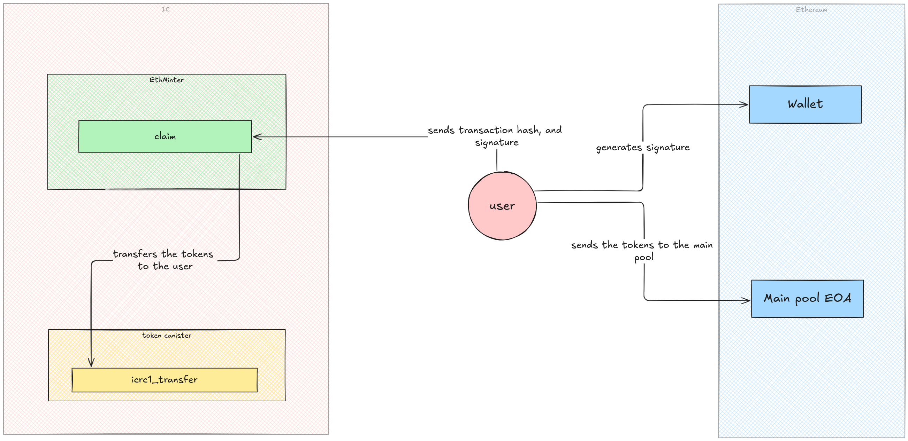

<p align="center">
  
</p>
</br>
</br>

# **ICRouter Audit Report**

> ⚠️ **General Disclaimer**
> This audit report aims to detail the current state of security and potential weaknesses of the audited app within a limited scope. It does not make any recommendations regarding the app’s user experience, investment potential, or other factors.

## Scorecard

This scorecard is a broad overview of all our findings. You can also view the [Summary of Findings](#summary-of-findings) from our initial audit review and then see how the ICLighthouse core team updated their code in response to those initial findings by viewing [Post-Audit Review #1](#post-audit-review-1).

| **Area** | **Description** |
| --- | --- |
| **Access Controls** | **Strong:** Only a few methods are accessible by any principal; most methods are accessible by “owner” only. While this poses some potential problems for governance, it doesn’t allow undue access to core information and functionality. |
| **Architecture/Design** | **Sufficient:** The system’s architecture is generally sound and should be sufficient to handle the traffic in the short and medium term.  |
| **Governance** | **Moderate:** The system is manageable, but it is heavily reliant on the “owner” role to perform maintenance and will be hard to manage by other canisters or directly by an SNS governance canister. |
| **Scalability** | **Sufficient:** There are two types of unbound state, persistent (accounts, etc) and temporary (RPC logs, etc). The persistent unbound state will always pose a limit to scalability, but that can be fixed as the project’s usage grows, however the temporary state can grown much faster and, even though there are means for “owner” to trim it, it doesn’t seem like there’s a cap or that there a way to monitor this state. |
| **Upgradeability** | **Sufficient**: Though some potential bugs were found, and some recommendations were made to communicate the current limitations, the system is upgradeable and has fallbacks in case things go wrong. |
| **Documentation** | **Moderate:** The general architecture and the inter-canister interactions are sufficiently documented in the GitHub repository, but the auditors recommend the code should also be documented, both at the method level and in critical portions of the code. |
| **Testing & Verification** | **Poor**: No tests were provided to the auditors during the audit. At the time of the initial audit review, there was no clear way to perform reproducible builds. |

### Scorecard levels:

**Poor:** The scored area does not meet best practices. The area is very deficient, and improvements to it as a whole must be addressed immediately.

**Moderate**: The scored area almost meets best practices. The area has some core deficiencies, but there are some key actionable items that, if addressed, would make this area meet best practices minimally.

**Sufficient**: The scored area matches best practices, even though some essential, concrete items could be improved.

**Strong**: The scored area surpasses best practices, and only minor issues, if any, were found.

---

## Table of Contents

   * [Scorecard](#scorecard)
   * [Introduction](#introduction)
      + [Purpose](#purpose)
      + [Auditing Agency](#auditing-agency)
      + [Audit Team](#audit-team)
   * [Methodology & Assessment Priorities](#methodology--assessment-priorities)
      + [State of Audits on ICP](#state-of-audits-on-icp)
      + [Phase 1: Scoping](#phase-1-scoping)
      + [Phase 2: Execution](#phase-2-execution)
      + [Phase 3: Finalization](#phase-3-finalization)
      + [Risk Assessment Priorities](#risk-assessment-priorities)
   * [Disclaimers & Scope](#disclaimers--scope)
      + [Review watermarks](#review-watermarks)
      + [General Disclaimers](#general-disclaimers)
      + [Within scope](#within-scope)
      + [Outside of scope](#outside-of-scope)
   * [Summary of Findings](#summary-of-findings)
      + [Tally of issues by severity](#tally-of-issues-by-severity)
      + [Security Concerns](#security-concerns)
      + [Quality & Documentation](#quality--documentation)
   * [Application Architecture](#application-architecture)
      + [System Overview](#system-overview)
      + [Risks & Considerations](#risks--considerations)
      + [Recommendations](#recommendations)
      + [Components](#components)
      + [Public Functions](#public-functions)
   * [Repository Assessment](#repository-assessment)
   * [Detailed List of Findings](#detailed-list-of-findings)
      + [Summary](#summary)
      + [Security Related Findings](#security-related-findings)
      + [Non-Security Related Findings](#non-security-related-findings)
   * [Post-Audit Review #1](#post-audit-review-1)
      + [Status of found issues](#status-of-found-issues)
---
## Introduction

This document is the official code security audit report by [Solidstate](https://www.solidstateauditing.com/) for the [ICRouter Decentralized Application](https://iclight.io/icRouter), which is a product of the [ICLighthouse DAO](https://iclight.house/). It represents a professional security review by a team of industry-native [Internet Computer Protocol](https://icpguide.com/) ("ICP") experts.

The initial audit review was started on September 16th, 2024, and completed October 16th, 2024, with the Post-Audit Review #1 started Oct 26, 2024, and completed on Oct 27, 2024. The latest audit review incorporated the team's latest code updates since the audit began along with their resolutions and responses to the [detailed list of initial audit findings.](#detailed-list-of-findings)

### Purpose

This audit report provides a detailed security review of the [ICRouter GitHub repository](https://github.com/iclighthouse/icRouter) and its [Ethereum](https://github.com/iclighthouse/icRouter/tree/main/eth) and [Bitcoin](https://github.com/iclighthouse/icRouter/tree/main/btc) minter canisters. Solidstate was hired to provide security assessments of the code responsible for managing assets on both the Ethereum Mainnet and Bitcoin networks through the tECDSA signatures made available by the Internet Computer Protocol.

### Auditing Agency

Solidstate is the first ICP-native code security auditing agency. It's a venture by [Code & State](https://www.codeandstate.com/), which is an independent venture studio devoted to making it easier to build and earn on the Internet Computer. Solidstate contracts independent ICP protocol experts with extensive experience in building secure ICP-decentralized applications to execute professional code security audits for ICP projects. Our audits follow accepted industry standards while expanding them to cover the unique security considerations of ICP decentralized applications.

#### Integrity Directives

Solidstate conducts audits with the highest standards of professional integrity and deep respect for the ICP ecosystem.

We work with our clients to allow them some control over the scope and duration of the audits. However, clients do not have any control over the content of the final audit report. Our audit reports must accurately represent all findings during the audit.

Compensation for Solidstate audits is determined by a fixed USD-based daily rate contracted with the client upfront. To avoid potential conflicts of interest, Solidstate does not accept native tokens or equity from a project as compensation for executing its audit.

Solidstate and Code & State do not hold any equity stake in ICLighthouse DAO.

Solidstate auditors are instructed to follow these directives:

- The [scope](#within-scope) of the audit must be made clear in the audit report.
- The audit report must list any important security considerations that were not covered during the audit as [out of scope](#outside-of-scope).
- All known issues identified and verified must be included in the [detailed list of findings](#detailed-list-of-findings) on the audit report.
- Issues will remain listed as open or “not fixed” on the audit report until an appropriate resolution is verified during a post-audit review.
- In general, the final audit report should include any significant considerations that might impact prospective investors and users of the decentralized application.

### Audit Team

#### Lead Auditor: [David Alves](https://twitter.com/dribeiroalves)

David is a leading mind in the development and security of decentralized infrastructure. While at DFINITY Foundation, he served as the Engineering Lead in charge of the creation of the NNS and the SNS. This experience gives him a rare level of protocol expertise that uniquely qualifies him as a leader in the emerging field of ICP security.

#### Security Researcher: [Nima Rasooli](https://x.com/0xNimaRa)

With a history of leading the development of multiple notable ICP projects, Nima now works full time as a Security Researcher at Solidstate, bringing a strong blend of technical knowledge and hands-on experience in the Web3 space.

#### Senior Auditor: Anonymous by request

Our senior auditor has co-founded notable projects on ICP since Genesis and brings over a decade of development experience. They also have experience creating security tools for ICP dApps and currently serve as a CTO at a Web2 startup.

#### Project Manager: [Esteban Suarez](https://x.com/EstebanSuarez)

As Project Lead at Solidstate, Esteban oversees the audit’s progress, ensures clear communication between the audit team and the client, and assists in the organization and delivery of the final report.

#### Technical Writer: [Robin Moore](https://twitter.com/RobinMooreWeb3)

Robin edited the auditors' raw input into this final report. Leveraging her expertise in editing, process documentation, technical content creation, and deep research, she strives to make technology accessible and engaging for everyone, from beginners to enthusiasts.

## Methodology & Assessment Priorities

### State of Audits on ICP

ICP is unlike any other cloud network or L1 blockchain:

- It is asynchronous
- It hosts front ends
- It hosts complex data models
- It introduces new mutability types
- It decentralizes large amounts of data storage and significant computing capacity
- It can interact directly with Web2 and other Web3 protocols
- It allows for multi-canister decentralized application architecture, which is an entirely new technological frontier

As with any technology that pushes new boundaries, ICP's advanced capabilities introduce novel security implications. Many established Web3 industry standards don't translate to ICP. As such, security audits on the Internet Computer Protocol are an emerging field in its early stages, with few standards, resources, and examples to draw from.

ICP auditors face the challenge of exploring and developing new industry methodologies so that decentralized applications on ICP can have their security properly evaluated. This means strong protocol expertise and extensive experience building on ICP are critical requirements for any ICP auditor.

### Phase 1: Scoping

- ICRouter team provided access to their code repository, documentation, canister IDs, and all other required assets.
- ICRouter team and the Lead Auditor collaborated to scope the project and set [risk assessment priorities](#risk-assessment-priorities).
- The lead auditor defined the audit assignments and the security practices necessary for this audit.

### Phase 2: Execution

- The auditors conducted a detailed code review of the provided [**ICRouter** GitHub repository](https://github.com/iclighthouse/icRouter).
- Each auditor deployed the code locally and evaluated it according to their assignments.
- The audit team collaborated heavily both internally and with ICRouter core team throughout the audit.
- The audit team delivered the findings to the client in an initial audit review.

### Phase 3: Finalization

- The auditors conducted a [post-audit review](#post-audit-review-1) to:
    1. Incorporate the ICRouter teams latest code updates since work on the initial audit review began.
    2. Evaluate any attempted resolutions for issues identified during the initial audit review.
- The audit team collected the results into this final audit report.

### Risk Assessment Priorities

These are the main risk assessment priorities evaluated for the ICRouter:

#### Cross-Chain Data Consistency and Integrity

- **Description**: Since ICRouter relies on multiple chains (Bitcoin, IC, Ethereum), data consistency across these chains is critical. Delays, discrepancies, or tampering in data synchronization (such as confirmations or block verifications) could lead to transaction inconsistencies or duplicate minting/retrieval of assets.
- **Impact**: Inconsistent data between chains could disrupt ICRouter operations, leading to possible fund loss, data corruption, or double-spending.

#### Unauthorized Minting and Retrieval of Wrapped Tokens

- **Description**: ICRouter-wrapped tokens (e.g., icETH, icERC20) are designed to maintain a 1:1 correspondence with assets on the external chain. Any exploit enabling unauthorized minting or the retrieval of wrapped tokens could allow attackers to inflate token supplies or access underlying assets illegitimately.
- **Impact**: Unauthorized minting or retrieval could lead to inflation or devaluation of wrapped tokens, resulting in financial losses for users and impacting the integrity of ICRouter cross-chain operations.

#### Excessive Gas Consumption and Scalability Constraints

- **Description**: Operating across multiple blockchains inherently increases the risk of excessive gas consumption and scalability challenges, especially given the high frequency of Ethereum transactions.
- **Impact**: Excessive gas costs could increase operational expenses and affect the user experience. Without adequate scaling solutions, the ICRouter may struggle to process high transaction volumes efficiently, leading to delays or downtime.

#### Governance Manipulation in RPC Whitelists and Keeper Roles

- **Description**: ICRouter relies on governance to approve RPC whitelists and assign Keepers, but vulnerabilities in governance could lead to the misuse of these roles, enabling malicious actors to manipulate RPC endpoints or disable essential functions.
- **Impact**: Manipulation of governance could compromise RPC accuracy, resulting in transaction inconsistencies, delayed asset transfers, or vulnerabilities within the TSS framework.


## Disclaimers & Scope

### Review watermarks

The initial audit review performed in the code was based on commit `daa39f40e9e156ab13ac5d830503d165be3e9970` of the [ICRouter GitHub repository](https://github.com/iclighthouse/icRouter). It was from this commit hash that the auditors reviewed all the code/documentation/scripts.

A post-audit review of fixes was done at commit: `7776cc26d0887556505b0e36800c44b5331c188c`, the reviews of the fixes can be found in [Post-Audit Review #1](#post-audit-review-1).

### **General Disclaimers**

- **ICP DeFi is experimental -** ICP decentralized app security is a constantly changing new frontier full of unknowns. Potential users of DeFi dApps on ICP should keep this in mind and do their own research.
- **Use at your own risk** - Neither Solidstate, Code & State, nor our auditors are responsible for any losses experienced by users of ICRouter.
- **Not investment advice** - Nothing in this report is investment advice.
- **Not comprehensive** - There is no such thing as a comprehensive audit, but there is always a limited scope. This report captures the work performed for this audit. Readers should not assume that anything not explicitly covered here was evaluated.
- **No guarantees** - Due to the experimental nature of audits for ICP applications, neither Solidstate, Code & State, nor the auditors make any guarantees regarding the security of ICRouter. We conducted a best-effort audit with talented protocol experts in good faith, but that is not enough to guarantee that new exploits won't ever be discovered on a technology as novel as ICP.
- **Limited applicability** - ICP canisters have mutable code. This audit report was conducted on a specific commit hash of ICRouter, and the issues were verified to be fixed on another specific hash (see section above). Once the code is updated again, the applicability of this audit is voided and incremental reviews are recommended, as future versions of the ICRouter source code may introduce new vulnerabilities.

### Within Scope

ICRouter code for these canisters and canister types:

- **ETH Minter Canister** (referred to as "ETH Minter")
- **BTC Minter Canister** (referred to as "BTC Minter")

ICRouter multi-canister dApp:

- **Governance**
- **Upgradeability**
- **Scaling**
- **State/Variable Management**
- **Best Practices with the Code Repository** (documentation, build-ability, comments, etc.)

### Outside of Scope

- **Protocol-Level Exploits**: This audit did not include auditing the entire Internet Computer Protocol, including the tooling and packages provided by DFINITY Foundation.
- **All Other ICLighthouse Dapps**: ICLighthouse has developed various other decentralized applications. This audit is limited to ICRouter, so all other ICLighthouse dapps, canisters, and repositories fall outside the scope of this audit.
- **IC Transaction Coordinator (ICTC)**: The IC Transaction Coordinator, or ICTC, is a distributed transaction framework used in ICP DeFi applications and is integral to ICDex operations. Although some ICTC code was reviewed for relevance to critical ICRouter operations, ICTC did not undergo independent, in-depth evaluation, and no comprehensive edge-case testing was conducted.
- **Threshold Signature Schemes (TSS)**: TSS mechanisms were reviewed within the scope of minting and redeeming wrapped tokens on ICRouter. However, they did not receive an independent evaluation or formal verification beyond their direct impact on ICRouter functionality.
- **Testing**: While existing tests within the client repository were reviewed, auditors did not develop additional tests for ICRouter or expand testing coverage in the client repository.

## Summary of Findings

This section summarizes the findings from the initial audit review. The complete list and details are given in the [Detailed List of Findings](#detailed-list-of-findings) section, and the findings for the latest code commit can be found in [Post-Audit Review #1](#post-audit-review-1).

We audited the code across two main verticals.

1. **Security**: Here, we audited for code correctness and potential DOS or attack vectors.
2. **Quality & Documentation**: Here, we audited for testing coverage, quality of documentation, reproducibility of the build, etc.

We classify our findings into the following categories:

- **Low**: Stylistic or grammatical error that doesn’t influence how the application runs.
- **Medium**: Erroneous return or calculation that doesn’t affect the integrity of the overall application.
- **High**: A problem that affects the overall integrity of the application but doesn’t allow the extraction of funds.
- **Very High**: A problem that affects the overall integrity of the application and allows a sophisticated caller to extract value or take control of critical application functions directly.

### **Tally of issues by severity**

| Category | Number of Findings |
| --- | --- |
| Very High | 0 |
| High | 8 |
| Medium | 16 |
| Low | 7 |
| Total: | 31 |

### **Security Concerns**

Multiple vulnerabilities were identified within the ICRouter system, with varying levels of severity:

- **Reliance on Hardcoded External Responses**: Hardcoded expectations for responses from providers create potential points of failure if response formats change unexpectedly (SS-ICROUTER-002).
- **Throughput Limitation in ETH Minter**: The ETH minter’s sequential transaction processing reduces the system's capacity to handle multiple transactions concurrently, posing a risk for delays and increasing transient state (SS-ICROUTER-020).

### **Quality & Documentation**

Lack of thorough testing and clear documentation emerged as quality concerns:

- **Insufficient Testing**: Inadequate test coverage across components, especially for multi-chain canister interactions, increases the risk of undetected bugs and vulnerabilities (SS-ICROUTER-003, SS-ICROUTER-007).
- **State Monitoring Deficiencies**: Inconsistent mechanisms to monitor the state size of the ETH and BTC minter canisters limit the ability to address storage concerns (SS-ICROUTER-006).
- **Overall Documentation**: Lack of comprehensive comments and code annotations makes understanding and maintenance harder, especially for complex functions (SS-ICROUTER-027).

## Application Architecture

### System Overview

The ICRouter is designed to enable seamless communication between the Internet Computer (IC) and other blockchain networks, specifically **Ethereum** and **Bitcoin**. It consists of two main components: the **Ethereum Minter** and the **BTC Minter**, each responsible for handling transactions on their respective networks.

**ICRouter Design:**

The ICRouter utilizes **Threshold ECDSA (tECDSA) signatures** generated by the Internet Computer's subnet nodes. These signatures allow the IC subnet to securely control Externally Owned Accounts (EOAs) on Ethereum and Bitcoin networks. This decentralized approach enhances security by reducing the reliance on a single point of failure, ensuring that accounts on external blockchains are managed collectively by the IC.

**RPC Handling:**

Instead of using the EVM RPC Canister developed by DFINITY, the ICRouter implements a custom RPC handling system. This system interacts with external services via HTTPS outcalls, allowing it to communicate with Ethereum nodes directly.

**Code Implementation: Public Functions**

The ICRouter code is written in **Motoko** and uses **ICTC** to schedule asynchronous execution on the Internet Computer. ICTC also manages retries in case of failed operations. However, in certain parts of the code, the use of ICTC appears redundant and could potentially be optimized for efficiency.

**Ethereum Minter Complexity:**

On the Ethereum side, the Ethereum Minter is more complex as it handles not only Ether but also ERC20 tokens. It acts as a **factory canister**, creating and managing token canisters while tracking the states of multiple tokens across numerous EOAs. Each user is assigned an EOA for deposits, but eventually, the funds from these EOAs are centralized into one main pool, EOA. This centralization simplifies control but introduces potential bottlenecks, especially during withdrawals.

**Bitcoin Minter Simplicity:**

In contrast, the Bitcoin side is more straightforward to reason about. It follows a more traditional approach by handling just one asset—Bitcoin. The Bitcoin Minter takes custody of BTC and mints its bridged counterpart, **icBTC**, on the Internet Computer. This straightforward implementation focuses solely on managing the conversion of BTC into icBTC and vice versa, without the added complexity of dealing with multiple tokens and EOAs like in the Ethereum Minter.

### Risks & Considerations

#### **Considerations:**

The project architecture is divided into several canisters responsible for BTC and ETH integration, cycle management, and token creation on the IC. Currently, the documentation is incomplete. There is a README that provides an overview of the canister structure and general functionality, but it lacks detailed usage instructions, insights into internal mechanisms, and guidelines for building and testing.

#### **Security Measures:**

In both the ETH and BTC integrations, two roles have been introduced: `owner` and `ictc_admin`. The majority of the functions in both canisters are dedicated to these administrative roles. These functions are quite comprehensive, providing fine-grained control over the internal workings of the canisters. Whoever controls at least the `owner` role has full control of the funds of all the canisters. Assuming this role is to be given to another canister directly or indirectly managed by SNS governance this won’t be a problem.

#### **Governance:**

Both the ETH and BTC integrations include functions to back up and restore the canister's state. Combined with the ability to pause the canister, this should be sufficient to perform any necessary updates. The large majority of the public functions of the ETH and BTC minter canisters are gated to the `owner` role, which is responsible for performing most of the maintenance. This presents a potential problems: the management/governance of the canisters seems very complex and it will be hard to delegated to another canister (directly or indirectly managed by SNS governance) and if it’s not totally delegated then principal(s) with this `owner` role have full access to all funds and all details.

#### **Scalability:**

Although the integration is divided into two canisters—ETH and BTC—each operates as a single canister. In the event of high demand or subnet congestion, there is currently no option to add additional canisters to distribute the load. At present, there is no straightforward way to scale beyond a single canister. There are two types of state that can grow unbounded in either of the canisters: persistent state (e.g. `accounts`), which cannot be discarded, and temporary state, that can (e.g. `ck_rpcLogs`). Persistent state will grow with usage to a point where it will eventually overcome the storage abilities of a single canister, but there will likely be opportunity to address this over time, temporary state, however can grow much faster and can be made to grow maliciously. The latter can be cleared by functions gated to `owner` but there is apparently no way of monitoring how big this state has become, which should be fixed. 

#### **Auditability and Transparency:**

The project requires more comprehensive documentation. Additionally, the code is quite convoluted, with most of the relevant logic for both ETH and BTC integrations consolidated into single files. `icETHMinter` has over 5,200 lines of code, while `icBTCMinter` has over 2,400 lines. This structure makes the code harder to read and understand, obscuring its logic. Finally there doesn’t seem to exist a reproducible release process that anyone can execute to produce release artifacts, including the wasms for canister upgrades.

#### **Risks:**

Lack of test suites open up the possibility to introduce bugs, in later stages of development. New bugs can be introduced to critical functions like deposit or withdrawal making the whole solution open to misuse.

### Recommendations

#### Governance

1. Consider splitting the responsibilities delegated to the `owner` role into multiple roles, such that core, critical, but less often called functions can be delegated to a canister directly or indirectly managed by SNS (who should be the actual `owner` ), but other, less critical, functions like clearing logs, backing up state, etc, can be performed by another role (e.g `maintainer`).

#### Scalability

1. Consider adding multiple canisters that can handle deposits and withdrawals from the same blockchain at the same time. They can be split between different subnets to increase availability and scalability.
2. Consider exposing methods that allow a maintainer or other individuals some indication of either total state size or at least the size of the temporary state, such as `ck_rpclogs` in the ETH canister.

#### Readability

1. Split the code base into smaller files; there is a lot of code shared between `icETHMinter` and `icBTCMinter`. It will increase the readability and maintainability of the code.
2. Standardize functions and variable names. Camel Case and Snake Case are used together, which makes it harder to read the code
3. Try to keep code files smaller and split the files based on concerns; 2,400 lines of code is too big.
4. Document your code thoroughly. Apart from initial comments and occasional function-level comments, there needs to be more documentation detailing the internal workings of the functions. Adding comprehensive comments throughout the code will significantly improve readability, making future development and contributions easier.

#### Maintainability/Upgradability

The following points have already been mentioned but are re-mentioned here since they affect the maintainability and upgradeability of the system.

1. Reproducible builds: there should be a means and instructions for anyone to build the canister artifacts to verify that the upgraded WASMs match the code.
2. Split the owner role into at least owner and maintainer: If the owner role is delegated to another canister, it makes it very hard to maintain the system. Consider adding a maintainer role for less critical but often executed maintenance functions.
3. Monitor transient unbounded state: This state should be monitored explicitly or alternatively capped to ensure that it doesn’t grow beyond the canister's capacity. 

#### Tests

Create tests that will cover crucial functionality of `icETHMinter` and `icBTCMinter`. The tests can be unit tests with mock responses to `http_outcalls` and BTC integration calls. The goal is to ensure that canister functions are working properly and cannot be abused.

The following scenarios should be considered in the testing plan:

1. `icETHMinter`
    1. Obtaining an account for deposits
    2. Minting ETH in a wrapped token on IC
    3. Minting ERC20 token in a wrapped token on IC
    4. Burning wrapped ETH on IC
    5. Burning wrapped ERC20 token on IC
2. `icBTCMinter`
    1. Obtaining an account for deposits
    2. Minting BTC in a wrapped token on IC
    3. Burning wrapped BTC on IC

#### Risk Mitigation

1. Develop an external monitoring solution: While the IC is a powerful blockchain, it’s crucial to implement a backup monitoring solution for transactions between ETH/BTC and the IC. In case of congestion, incorrect deposits, withdrawals, or other issues, an external monitoring system will allow swift action, such as pausing the canister to prevent further problems. This ensures better responsiveness and control during unforeseen events. 

---

### Components

**Ethereum Minter:**

The Ethereum Minter component includes two primary deposit methods that users can leverage. These methods allow users to either:

1. **Send tokens to the main pool** owned by the canister.

   

    
3. **Send tokens to their own Externally Owned Account (EOA)**, which is also owned by the canister.

   
    

In both cases, regardless of the method chosen, the assets will ultimately be transferred to a single EOA managed by the canister. In the second method, where users deposit tokens into their own EOA, the canister will subsequently move the tokens into its main pool.

This design centralizes all assets in one EOA, simplifying control but introducing potential performance concerns, particularly in the withdrawal process.

**Potential Bottleneck in Withdrawal Process:**

One significant design trade-off in this architecture is the potential bottleneck it creates during the withdrawal process from IC to Ethereum. Since all assets are concentrated in a single EOA, the canister must process all withdrawal requests through this pool. This limitation means that multiple withdrawal requests cannot be processed concurrently, leading to delays if there is a high volume of transactions. The decision to centralize assets in a single EOA rather than distribute them introduces the risk of congestion, particularly under high transaction load, which could affect the overall performance and responsiveness of the bridge.

**Security Considerations:**

A key aspect of the ICRouter design is its reliance on tECDSA for secure key management. The decision to use HTTPS outcalls rather than an existing EVM RPC Canister introduces trade-offs. While it limits some flexibility and potential future interoperability, it also provides greater independence and modularity in the system’s design. This balance between flexibility and control is essential for maintaining security without sacrificing long-term adaptability.

**Bitcoin Minter:**

The Bitcoin Minter lets users deposit Bitcoin and receive the corresponding wrapped token, **icBTC**, on the Internet Computer Protocol. Each user is assigned a unique Bitcoin deposit address generated by the canister. This address is derived using **Threshold ECDSA (tECDSA) signatures**, ensuring that each deposit address is securely tied to the user. At the same time, the Internet Computer subnet collectively manages these addresses without relying on any single party.

Once the user deposits Bitcoin to their unique address, the Bitcoin Minter canister credits their account with icBTC tokens. This token represents their Bitcoin holdings on the Internet Computer. When users wish to retrieve their actual Bitcoin, they can "burn" their icBTC tokens, triggering a reverse process where their Bitcoin is sent back to them from the corresponding Bitcoin address.

It's important to note that **icBTC** is distinct from **ckBTC**, which was developed by DFINITY. icBTC is issued as part of the **ICLighthouse** project, offering an alternative tokenized representation of Bitcoin on the Internet Computer while relying on a decentralized, tECDSA-based architecture for secure handling of BTC deposits and withdrawals.

---

### Public Functions

Both the Ethereum Minter (134 functions) and Bitcoin Minter (74 functions) consist of numerous functions. However, only a limited number of state-changing functions are exposed publicly—5 for the Ethereum Minter and 4 for the Bitcoin Minter. The remaining functions are used for internal canister administration and are not accessible to end users interacting with the canisters. Below is a list of the most important selected functions. For a complete list, please refer to the official documentation.

Both canisters contain similar functions to manage ICTC (more details [here](https://github.com/iclighthouse/ICTC)) 

### icETHMinter - Core Functions

---

**Method `get_deposit_address`**

**Description:**
This component retrieves the deposit address for the external chain. This address is tied to the provided account and will be used to deposit funds on the external chain.

**Arguments:**

- _account [Account]: Account

**Returns:**

- EthAddress: Ethereum address

---

**Method `update_balance`**

**Description:**
This is used with deposit method 1. It updates the balance for a given account and mints the corresponding wrapped token on IC.

**Arguments:**

- _token [?EthAddress]: Optional Ethereum token address, and it defaults to ETH transfer
- account [Account]: Account

**Returns:**

- #Ok or #Err depending on the result of the update
---
**Method `claim`**

**Description:**
This is used with deposit method 2. It mints wrapped tokens on IC by providing transaction txid on external chain and signature.

**Arguments:**

- account [Account]: Account
- txHash [TxHash]: Transaction hash
- signature [Nat8[]]: Signature as array of Nat8

**Returns:**

- #Ok or #Err depending on the result of the update
---
**Method `retrieve`**

**Description:**
This retrieves tokens for a given address on external chain.

**Arguments:**

- _token [?EthAddress]: Optional Ethereum token address; defaults to ETH
- address [EthAddress]: Ethereum address
- amount [Wei]: Amount in Wei
- sa [?[Nat8]]: Optional array of Nat8, and is used for calculating sender account

**Returns:**

- #Ok or #Err depending on the result of the update
---
**Method `cover_tx`**

**Description:**
 A re-build transaction, potentially in response to low gas prices, etc.

**Arguments:**

- _txi [TxIndex]: Transaction index
- sa [?[Nat8]]: Optional array of Nat8 used for calculating sender account

**Returns:**

- ?BlockHeight: Optional block height
---
### icETHMinter - Admin Functions
---
**Method:** `updateRpc`

**Description:** This changes the status of RPC for given Keeper account.

**Arguments:**

- _account [Account]: The account for which to update RPC status
- _act [{#remove; #set: {#Available; #Unavailable}}]: The action to perform, which can be either:
    - `#remove`: Remove RPC configuration
    - `#set`: Set RPC status to either:
        - `#Available`: Mark RPC as available
        - `#Unavailable`: Mark RPC as unavailable

**Returns:**

- Bool: Success status of the RPC update operation
---
**Method:** `resetNonce`

**Description:** This resets the transaction nonce value based on the specified blockchain state. The nonce is used to ensure proper transaction ordering and prevent double-spending.

**Arguments:**

- _arg [Variant]:
    - #latest: Reset nonce based on the latest confirmed block
    - #pending: Reset nonce based on the pending block

**Returns:**

- Nonce: The new nonce value after reset
---
### icETHMinter - Keeper Functions

Functions related to management of RPC Urls in ETH Minter. 

---
**Method:** `keeper_set_rpc`

**Description:** This manages RPC (Remote Procedure Call) endpoints by allowing the addition, removal, and status updates of RPC nodes. This function is restricted to keeper/owner access.

**Arguments:**

- _act [Record]: Action to perform on RPC configuration
    - #remove: Removes an RPC endpoint
    - #put: Adds or updates an RPC endpoint with:
        - name [Text]: Name identifier for the RPC endpoint
        - url [Text]: URL of the RPC endpoint
        - status [{#Available; #Unavailable}]: Current status of the RPC endpoint
- _sa [?Sa]: Optional array of Nat8, used for calculating sender account

**Returns:**

- Bool: Success status of the operation
---
### icBTCMinter - Core Functions
---
**Method:** `get_btc_address`

**Description:** This returns the deposit address, which is different for each user. This address is used to receive BTC to wrap them on IC.</br>

**Arguments:**
- _account [Account]: The account for which to generate/retrieve the Bitcoin address

**Returns:**

- Text: Bitcoin address string
---
**Method:** `update_balance`

**Description:** This mints the corresponding icBTC on IC after transferring BTC to the deposit address.</br>

**Arguments:**

- _account [Account]: The account whose balance needs to be updated

**Returns:**

- #Ok or #Err depending on the result of the update
---
**Method:** `retrieve_btc`

**Description:** Initiates a Bitcoin withdrawal/retrieval transaction with the specified parameters.</br>

**Arguments:**

- args [Minter.RetrieveBtcArgs]: Arguments containing withdrawal details
- sa [?Sa]: Optional array of Nat8, used for calculating sender account

**Returns:**

- #Ok or #Err depending on the result of the update
---
**Method:** `batch_send`

**Description:** This processes a batch of pending transactions, optionally starting from a specific transaction index. Normally the timer performs these tasks, only needs to be called for testing or when urgently needed.</br>

**Arguments:**

- _txIndex [?Nat]: Optional transaction index to start processing from

**Returns:**

- Bool: Success status of the batch processing operation
---
## Repository Assessment

### Documentation

The repository contains the main README file, which contains a short project summary, and two additional README files, one for BTC and ETH integrations. The additional README files contain more details on how to deploy both integrations.

The current README files need to be revised and require improvement. Consider incorporating the following sections for a more comprehensive guide:

- Local Development Environment Setup
    - Prerequisites: List of software, tools, or libraries.
    - Clone the Repository: Instructions on how to clone the repository.
    - Dependency Installation: Steps for installing necessary dependencies.
    - Configuration: Information on environment variables and configuration files.
    - Running Locally: Detailed instructions for running the project locally.
    - Debugging: Debugging tips during local development.
    - Common Issues: Outline potential problems and their solutions.
- Build Instructions
    - Dependencies: List of required libraries or tools for building the project, including the exact version.
    - Build Steps: Clear instructions on how to compile or build the project.
    - Reproducibility: For SNS purposes, include a step-by-step guide to ensure the build is reproducible, with hash values matching SNS proposal hashes.
- Testing Instructions
    - Test Suite: Specify the testing tool or framework.
    - Running Tests: Commands for executing tests.
    - Writing Tests: Guidelines for creating or modifying tests.
- Deployment
    - Pre-requisites: Outline any environment setup requirements.
    - Deployment Steps: Detailed, step-by-step instructions for deploying the project.
    - Continuous Deployment: Info on continuous deployment, if applicable.
- Usage
    - Include examples that demonstrate how to use the project.
- Features & Functionality
    - Provide an overview of the project's main features and functionality.
- Contribution Guidelines
    - Outline how to contribute, report bugs, and suggest new features.

### Build Errors

- **icETHMinter**
    - **Build Status**: Builds successfully.
    - **Warnings**: 127 warnings occurred during the build process. Consider reviewing and addressing these warnings.
- **icBTCMinter**
    - **Build Status**: Builds successfully.
    - **Warnings**: 28 warnings occurred during the build process. Consider reviewing and addressing these warnings.

### Tests

Currently, no tests are implemented for this project. The absence of a test suite significantly increases the risk of introducing bugs and regression issues as development progresses. Implement a testing strategy, including unit tests, integration tests, and end-to-end tests to ensure core features are correct and reduce future maintenance costs.

### Refactoring and cleanup

**icETHMinter**

The file contains over 5200 lines of code, making it excessively large and difficult to manage. This leads to increased code complexity, making it hard to understand and maintain. As a result, the risk of bugs rises, and effective collaboration is hindered.

**icBTCMinter**

The file has over 2400 lines of code and is also overly complex and difficult to navigate. Like **icETHMinter**, this file needs more comments, especially in key public and private methods.

## Detailed List of Findings

### Summary

To recap, we classified our findings into the following categories:

- **Low**: Stylistic or grammatical error that doesn’t influence how the application runs.
- **Medium**: Erroneous return or calculation that doesn’t affect the integrity of the overall application.
- **High**: A problem that affects the overall integrity of the application, but doesn’t allow the extraction of funds.
- **Very High**: A problem that affects the overall integrity of the application and allows a sophisticated caller to directly extract value or take control of critical application functions.

### Security Related Findings

---

#### SS-ICROUTER-001: Potential Double Execution of `update_balance` Leading to Double Burn

- **Component:** Ethereum Integration
- **Severity:** High
- **Details:** It appears possible to call `update_balance` twice concurrently for the same account, resulting in in multiple sagas for the same deposit running at once. Access to `_depositNotify` from `update_balance` is only restricted by a 6-second timing constraint. If an attacker can delay the first call (e.g., causing it to take more than 6 seconds by interfering with external service responses), or because it naturally takes more than 6 seconds two calls could enter `_depositNotify` simultaneously.
For instance, the first call progresses to line 2575 and gets stuck while fetching the balance. Since `depositing_tx_index` is set only at line 2591, a second call initiated after 6 seconds can also reach line 2575. Both calls may proceed in parallel, potentially leading sagas for the same deposit being started. It’s hard to reason about all the possible interactions of multiple sagas for the same deposit running at the same time, but it’s almost certain that for ERC20 transfers the ck token would be burnt more than one (side effect of this method’s call even if the sagas fail)
- **Implication:** This vulnerability allows an attacker kick off multiple sagas for the same deposit at once. While a path to withdraw funds wasn’t actually found, the many possible combinations of executions of the sagas make it hard to be certain that one doesn’t exist.
- **Recommendation:** Implement proper synchronization mechanisms to prevent concurrent executions of `update_balance` for the same account. The mechanism could be as simple as adding the transaction to the set of “depositing txs”, *before* the async call to fetch balance is made.

---

#### SS-ICROUTER-002: Reliance on Hardcoded Response Bytes from External Providers

- **Component:** Ethereum Integration
- **Severity:** High
- **Details:** The system uses hardcoded expected response bytes when communicating with external providers. If these providers modify their response headers or formats, the DEX functionality could break, rendering it unusable due to the inability to parse or accept the new responses.
- **Implication:** Any change in the response format from external providers could disrupt operations, leading to downtime and preventing users from executing trades or accessing their funds.
- **Recommendation:** Develop flexible response parsing that can handle variations in response formats. Utilize standard protocols and implement robust error handling to adapt to changes in external provider responses. Regularly update and test the system against potential changes from providers.

---

#### SS-ICROUTER-003: Lack of Comprehensive Testing for Multi-Chain Canisters

- **Component:** Ethereum Integration
- **Severity:** High
- **Details:** There is a general lack of tests for multi-chain canister interactions. Without thorough testing scenarios to confirm assumptions about canister behavior and EVM transaction correctness, there is a high risk of introducing vulnerabilities during development and deployment stages.
- **Implication:** The absence of extensive tests may lead to undetected bugs, security vulnerabilities, and system failures, potentially resulting in financial losses and loss of user trust.
- **Recommendation:** Implement comprehensive testing suites using tools like PocketIC or MOPS. Create scenarios that cover various aspects of multi-chain interactions, including edge cases and failure modes, to ensure the reliability and security of the canister operations.

---

#### SS-ICROUTER-004: Insufficient Timing Constraints Allow Multiple Concurrent Retrieves

- **Component:** Ethereum Integration
- **Severity:** High
- **Details:** The time interval of 6 seconds set in the `retrieve` function is insufficient, as HTTP requests can take up to 60 seconds or more. This shrort interval allows a single user to initiate multiple `retrieve` calls simultaneously, potentially leading to race conditions or excessive load on the system.
- **Implication:** Allowing multiple concurrent retrieve operations can cause inconsistent states, increased resource consumption, and potential exploitation by malicious users to disrupt service availability.
- **Recommendation:** Increase the time interval to at least match the maximum expected duration of an HTTP request (e.g., 60 seconds). Implement proper request throttling and concurrency control to prevent overlapping retrieve operations for the same user.

---

#### SS-ICROUTER-005: Complex UTXO Accounting in `update_balance` Lacks Testing and Clarity

- **Component:** Bitcoin integration
- **Severity:** High
- **Details:** The UTXO accounting logic in `update_balance` is intricate and difficult to follow, especially regarding how multiple threads handle UTXOs simultaneously. Without thorough testing and clear documentation, it's challenging to verify correctness and ensure that UTXOs are not processed multiple times.
- **Implication:** Complex and opaque code increases the risk of bugs that could result in double-counting UTXOs, leading to double-minting tokens and financial discrepancies.
- **Recommendation:** Enhance the testing suite to include comprehensive tests covering UTXO handling under various concurrent scenarios. Refactor the code to improve readability, possibly by simplifying the logic or adding detailed comments explaining each step.

---

#### SS-ICROUTER-006: Lack of Consistent State Size Monitoring for ETH and BTC Minter Canisters

- **Component**: ETH and BTC Minter Canisters
- **Severity**: High
- **Details**: The ETH and BTC minter canisters rely heavily on the "owner" role to manage and contain the size of the canister state. However, there are no consistent or built-in mechanisms to monitor or alert when the state approaches critical size limits. Key state components, such as `ck_rpcLogs` and `blockEvents`, lack visibility into their growth, making it difficult to detect or respond to potential overflow conditions.
- **Implication**: Without reliable monitoring of state size, the canisters face an elevated risk of reaching capacity limits unexpectedly, which could lead to performance degradation, system instability, or data loss if limits are exceeded without warning.
- **Recommendation**: Implement state monitoring for these components with thresholds and alerts. A recommended approach is to add periodic logging of state sizes or integrate automated monitoring that tracks growth of critical structures like `ck_rpcLogs` and `blockEvents`. This setup would enable proactive management and help avoid issues related to state overflow.

---

#### SS-ICROUTER-007: Insufficient Testing Across All Components

- **Component**: All components 
- **Severity**: High
- **Details**: The system lacks an extensive test suite to verify the correct behavior of critical functions across all components. This includes the ETH and BTC Minter canisters, Router, and ICTC, among others. Without comprehensive testing, particularly around edge cases and concurrent transaction handling, there is a higher risk of undetected bugs, which can compromise system integrity, user experience, and trustworthiness.
- **Potential Impact**:
1. **Increased Vulnerability to Bugs**: Key functionality, especially around transaction processing, liquidity management, and state consistency, may not behave as expected under all conditions.
2. **Security Risks**: Unverified paths in the code could allow for unforeseen vulnerabilities, potentially leading to exploitable scenarios.
3. **Reliability Issues**: Without thorough testing, the system may fail to handle high-demand or edge-case scenarios reliably, impacting uptime and performance.

- **Recommendation**:
1. **Comprehensive Test Coverage**: Develop a robust test suite that covers both unit and integration testing for all critical functions in each component. This should include:
    - **Transaction Lifecycle Tests**: Tests covering nonce handling, transaction sequencing, and retry mechanisms.
    - **Concurrency and Race Conditions**: Especially for components handling sequential tasks, such as ICTC.
    - **State Management**: Ensure state integrity under various scenarios (e.g., unexpected failures, rollbacks).
    - **Pre-consensus Checks**: Verify that all checks are executed pre-consensus to avoid unnecessary resource consumption.
2. **Automated Testing Pipeline**: Integrate tests into an automated CI/CD pipeline to detect issues early in the development lifecycle.
3. **Stress and Load Testing**: Implement load testing to evaluate performance under high demand, simulating real-world transaction throughput requirements.

---

#### SS-ICROUTER-008: Redundant Checks Across Update Methods Should Be Centralized

- **Component:** All Components
- **Severity:** Medium
- **Details:** Most public methods contain repeated checks for conditions such as system pause status, cycle balance, transaction queue size, rate limits, and DOS protection. This repetition increases the risk of inconsistencies and omissions when updates are made.
- **Implication:** Having duplicate code scattered across methods makes maintenance more challenging and error-prone, potentially leading to security gaps if a check is missed or not updated uniformly.
- **Recommendation:** Refactor the code to centralize these checks into common utility functions or middleware. This approach ensures consistency, simplifies maintenance, and reduces the likelihood of missing critical checks during updates.

---

#### SS-ICROUTER-009: Common Checks Should Be Done Pre-Consensus Across Components To Avoid Cycles Drainage

- **Component**: All
- **Severity**: Medium
- **Details**: The system currently includes critical checks, such as cycles balance verification, input integrity validation, and basic security checks. However, these checks are executed post-consensus, which results in cycles consumption and system resource use even for operations that could be determined as invalid early on.
- **Implication**: Performing these checks post-consensus can lead to unnecessary resource use, impacting performance and increasing operational costs. Moving or adding these validations pre-consensus would prevent invalid operations from consuming additional cycles and system resources.
- **Recommendation**: Refactor the existing checks to execute pre-consensus across all critical components, where possible. This change would improve efficiency by ensuring only valid operations reach consensus, optimizing resource management and reducing potential system load.

---

#### SS-ICROUTER-010: Nonce Invalidation Due to Block Timing on Ethereum Main Pool Transactions

- **Component**: Ethereum integration
- **Severity**: Medium
- **Details**: In the Ethereum Minter canister, the process of retrieving tokens involves sequentially fetching the nonce, creating, and signing transactions. However, this process relies on the assumption that the nonce retrieved for a transaction will remain valid until the transaction is broadcasted. This assumption is vulnerable under certain conditions: if a block is mined within ~12 seconds (or the typical Ethereum block interval) containing other transactions from the same Ethereum account (EOA) of the main pool, the nonce can become outdated. When this happens, the transaction will fail due to an invalid nonce.
- **Code Reference**:
```
let task1 = _buildTask(?txiBlob, Principal.fromActor(this), #custom(#getNonce(txi, ?[toid])), [], 0, null, null);
let _ttid1 = saga.push(toid, task1, null, null);
let task2 = _buildTask(?txiBlob, Principal.fromActor(this), #custom(#createTx(txi)), [], 0, null, null);
let _ttid2 = saga.push(toid, task2, null, null);
let task3 = _buildTask(?txiBlob, Principal.fromActor(this), #custom(#signTx(txi)), [], 0, null, null);
```
- **Potential Impact**: In periods of high traffic or frequent transactions, this issue could lead to a higher rate of transaction failures due to nonce conflicts. Failed transactions might increase processing delays and potentially create bottlenecks in the transaction queue, leading to reduced throughput and reliability in high-demand scenarios.
- **Recommendation**: The canister should internally store the latest used or fetched nonce of the main pool's EOA. Whenever a `getTransactionCount` call is made to fetch the nonce, it should compare the received nonce with the one stored internally. If the internally stored nonce is higher than the fetched nonce, it should discard the fetched nonce and attempt to retrieve it again after a few seconds.

---

#### SS-ICROUTER-011: Prevalence of Hardcoded Numbers Without Explanatory Comments

- **Component:** All Components
- **Severity:** Medium
- **Details:** The codebase contains numerous hardcoded numerical values lacking comments or explanations, making it difficult to understand their purpose or impact. For example, in `icBTCMinter.mo`, there is a hardcoded condition:
```
if (fees.size() > 39) {
    return fees[39];
} else {
    return 5000;
};
```
- **Implication:** Uncommented hardcoded values hinder code readability and maintainability, increasing the likelihood of errors during future modifications or debugging efforts.
- **Recommendation:** Review the codebase to identify all hardcoded numbers. Add comments explaining their significance or, where appropriate, replace them with named constants to improve clarity and facilitate easier updates.

---

#### SS-ICROUTER-012: Flawed Counting of Outstanding Asynchronous Messages

- **Component:** All Components
- **Severity:** Medium
- **Details:** The mechanism for tracking outstanding asynchronous messages is flawed. In certain situations, it's possible to undercount the outstanding messages—for instance, when the count is reduced within a `try {}` block while additional operations are still pending before the `catch {}` block, potentially leading to double counting.
- **Implication:** Inaccurate tracking of asynchronous messages can cause resource management issues, leading to overloading the system or misapplying rate limits, which may impact performance or security.
- **Recommendation:** Implement a robust method for tracking asynchronous operations, possibly by wrapping all async calls within a management layer that accurately increments and decrements the count, ensuring that all paths are accounted for correctly.

---

#### SS-ICROUTER-013: Compilation Errors in `icETHMinter` Indicate Code Quality Issues

- **Component:** Ethereum Integration
- **Severity:** Medium
- **Details:** There are 126 errors reported during the build process of `icETHMinter`. While the errors may not be critical for functionality, they reflect code quality issues and could mask underlying problems or hinder future development efforts.
- **Implication:** A high number of build errors can impede development progress, obscure significant issues, and make the codebase less approachable for new developers, potentially leading to overlooked vulnerabilities.
- **Recommendation: A**ddress the compilation errors by cleaning up the code, removing unused variables, fixing deprecated function calls, and adhering to coding standards. This will improve code quality, readability, and maintainability.

---

#### SS-ICROUTER-014: Consideration of Account Abstraction for Deposit Management

- **Component:** Ethereum Integration
- **Severity:** Medium
- **Details:** Currently, deposits using Method 1 require sending funds to a deposit address, which incurs additional fees to aggregate funds into the main account. Utilizing Account Abstraction (AA) could simplify the process by reducing the need for multiple transactions and lowering operational costs.
- **Implication:** Not using AA results in higher transaction fees and a more complex deposit process, potentially leading to inefficiencies and a suboptimal user experience.
- **Recommendation:** Evaluate the feasibility of implementing Account Abstraction for managing deposits. By allowing smart contract-based accounts, AA can streamline deposit handling, reduce fees, and enhance the overall efficiency of the system.

---

#### SS-ICROUTER-015: Static Network Fee Calculation on Deposits

- **Component:** Ethereum Integration
- **Severity:** Medium
- **Details:** In the deposit process, network fees are calculated statically rather than dynamically. For instance, in lines 2580-2582:
```
ignore _subFeeBalance(eth_, networkFee.maxFee + gasFee.maxFee);
let feeAccount = {owner = Principal.fromActor(this); subaccount = ?sa_one};
ignore _burnCkToken(eth_, Blob.fromArray(sa_one), networkFee.maxFee + gasFee.maxFee, feeAccount, ?'burn_ck_token(fee)');
```
The system decrements the canister's fee balance and transfers (not burns) the static fee amount from the user's subaccount to the router's balance. Relying on static fees may not accurately reflect current network conditions.
- **Implication:** Using static fees can lead to overcharging or undercharging users, causing financial discrepancies and potential user dissatisfaction. It may also result in failed transactions if the actual network fees exceed the static estimate.
- **Recommendation:** Implement dynamic fee calculation by fetching the current gas prices and network fees at the time of the transaction. Adjust the fee handling logic to ensure users are charged accurately based on real-time network conditions.

---

#### SS-ICROUTER-016: Limitations of Deposits Using Method 2 and Lack of Contract Support

- **Component:** Ethereum Integration
- **Severity:** Medium
- **Details:** Deposits using Method 2 are limited to direct ETH transfers or direct calls to supported ERC20 tokens using the standard `transfer` function. Deposits from contracts or using Account Abstraction are not supported, which may lead to user funds being lost if incorrect deposit methods are used.
- **Implication:** Users may inadvertently send funds in unsupported ways, resulting in lost deposits and requiring manual intervention to recover funds. This limitation can also hinder user experience and reduce the system's flexibility.
- **Recommendation:** Expand support to handle deposits from contracts and using Account Abstraction. Implement safeguards and clear user instructions to prevent incorrect deposit methods. Where feasible, add mechanisms to detect and recover unsupported deposits.

---

#### SS-ICROUTER-017: Lack of Checksum Validation for Ethereum Addresses

- **Component:** Ethereum Integration
- **Severity:** Medium
- **Details:** The system often validates Ethereum addresses only by checking their length or format but does not perform checksum validation. Ethereum addresses include a checksum to detect typos or errors in the address.
- **Implication:** Failure to validate the checksum can result in accepting invalid addresses, leading to failed transactions or loss of funds when attempting to interact with incorrect addresses.
- **Recommendation:** Implement checksum validation for Ethereum addresses wherever they are accepted or used within the system. This will enhance address validity checks and reduce the risk of errors.

---

#### SS-ICROUTER-018: Complexity Due to Dual Deposit Methods on EVM

- **Component:** Ethereum Integration
- **Severity:** Medium
- **Details:** The system currently supports two distinct methods for depositing funds on the EVM: Method 1 is robust but more complex, while Method 2 is simpler but less flexible. Maintaining both methods increases code complexity and the potential for errors.
- **Implication:** Having two methods complicates the codebase, making it harder to maintain and audit. It may also confuse users or developers, increasing the risk of misimplementation or vulnerabilities.
- **Recommendation:** Assess the necessity of maintaining both deposit methods. Consider consolidating into a single, efficient method that balances robustness and cost-effectiveness. Simplifying the deposit process can reduce complexity and improve system reliability.

---

#### SS-ICROUTER-019: Critical Method `_ictcSendNativeToken` Lacks Testing

- **Component:** Ethereum Integration
- **Severity:** Medium
- **Details:** The `_ictcSendNativeToken` method is crucial for sending tokens on the EVM chain. It is a high-risk function with significant security implications, yet there are no tests validating its behavior.
- **Implication:** Without tests, there's a higher risk of undiscovered bugs or vulnerabilities in this critical function, which could lead to failed transactions, financial losses, or security breaches.
- **Recommendation:** Develop comprehensive tests for `_ictcSendNativeToken` to verify its correctness under various scenarios, including edge cases and error conditions. Ensure that the method handles all inputs securely and reliably.

---

#### SS-ICROUTER-020: Throughput Limitation in ETH Minter Canister Withdrawals Due to Sequential Processing

- **Component**: ETH Minter Canister
- **Severity**: Medium
- **Details**: The ETH minter canister processes withdrawals directly from a central main pool, resulting in a throughput bottleneck due to its reliance on sequential nonce ordering. Transactions with higher nonces cannot be processed until all prior nonce transactions have been completed, effectively limiting the canister’s ability to handle high transaction volumes concurrently.
- **Implication**: This sequential processing constraint significantly limits throughput, especially during peak transaction times. As a result, users may experience delays in processing withdrawals if there is a backlog of pending transactions with lower nonces.
- **Recommendation**: Consider implementing an alternative withdrawal mechanism or sub-pooling strategy that allows concurrent processing without strict reliance on nonce order. This could involve organizing pending transactions into prioritized or parallelized queues to improve overall throughput and reduce delays.

---

#### SS-ICROUTER-021: Incorrect Logging of `minConfirmations` Value

- **Component:** Ethereum Integration
- **Severity:** Medium
- **Details:** In line 3601, when setting the `_minConfirmations` value, the log outputs the user-provided value. However, if the provided value is less than 5, the system overrides it to 5 as per the preceding condition. The log does not reflect this adjustment, potentially misleading administrators.
- **Implication:** Inaccurate logging can cause confusion and misinform about the actual configuration, complicating debugging and system monitoring.
- **Recommendation:** Modify the logging statement to output the effective `_minConfirmations` value after validation and adjustment. This ensures that logs accurately represent the system's operational parameters.

---

#### SS-ICROUTER-022: Incorrect Logging of `minRPCConfirmations` Value

- **Component:** Ethereum Integration
- **Severity:** Medium
- **Details:** In line 3612, the system uses the user-provided argument in the log for `minRPCConfirmations`. However, if the user sets this value to 0, the system overrides it to 1 as per the preceding check, but the log still displays 0.
- **Implication:** This discrepancy between the logged value and the actual operational value can mislead administrators, potentially affecting system monitoring and troubleshooting.
- **Recommendation:** Adjust the logging to display the actual `minRPCConfirmations` value after validation. This ensures transparency and accuracy in system logs.

---

#### SS-ICROUTER-023: `setDepositMethod` Accepts Invalid Values

- **Component:** Ethereum Integration
- **Severity:** Medium
- **Details:** The `setDepositMethod` function accepts any `Nat8` value as a deposit method. This lack of validation allows setting invalid or unsupported deposit methods, which may lead to unexpected behavior.
- **Implication:** Accepting arbitrary values can cause the system to enter undefined states or behave unpredictably, potentially leading to errors or vulnerabilities.
- **Recommendation:** Implement input validation to ensure that only valid and supported deposit methods can be set. Consider using an enumeration or variant type to represent acceptable methods, providing compile-time checks and improved code clarity.

---

#### SS-ICROUTER-024: Unused Retrieved Gas Price in Deposit Processing

- **Component:** Ethereum Integration
- **Severity:** Low
- **Details:** In line 2560, the variable `_gasPrice` is assigned the result of `await*_ fetchGasPrice()`, but it is never used thereafter. This suggests that the function fetches the gas price unnecessarily, relying instead on static gas fees.
- **Implication:** Fetching but not using the gas price is inefficient and may indicate overlooked code that could be updated to improve fee accuracy or performance.
- **Recommendation:** Either utilize the retrieved `_gasPrice` in fee calculations to reflect dynamic network conditions or remove the unnecessary fetch operation to optimize performance. Review related code to ensure consistency in fee handling.

---

#### SS-ICROUTER-025: `_method2TxnNotify` Does Not Need to Be Asynchronous

- **Component:** Ethereum Integration
- **Severity:** Low
- **Details:** The `_method2TxnNotify` function is declared as asynchronous but does not perform any asynchronous operations within its body.
- **Implication:** Marking a function as async when it doesn't need to be can lead to unnecessary overhead and may confuse developers about the function's behavior.
- **Recommendation:** Remove the async declaration from `_method2TxnNotify` to reflect its actual synchronous operation, improving code clarity and performance.

---

#### SS-ICROUTER-026: Whitelist Requirement in `keeper_set_rpc` Hinders Operations

- **Component:** Ethereum Integration
- **Severity:** Low
- **Details:** The `keeper_set_rpc` function requires RPC URLs to be whitelisted by the admin before a keeper can change their RPC endpoint. This process can delay operations, as keepers must contact the admin for updates.
- **Implication:** The requirement adds operational friction and may hinder timely updates, potentially impacting system responsiveness or keeper efficiency.
- **Recommendation:** Redesign the function to validate new RPC URLs automatically before acceptance, eliminating the need for admin intervention while ensuring security and validity of the endpoints.

---
### Non-Security Related Findings

---

#### SS-ICROUTER-027: Overall Lack of Documentation Hindering Code Understanding

- **Component:** Ethereum Integration
- **Severity:** High
- **Details:** The codebase suffers from poor documentation, with many methods lacking comments and insufficient code annotations. This makes it challenging to understand the system's functionality, logic, and intended behavior.
- **Implication:** Inadequate documentation hampers maintenance, increases the likelihood of introducing bugs during updates, and makes onboarding new developers more difficult. It also poses risks in identifying and addressing security vulnerabilities.
- **Recommendation:** Invest in comprehensive documentation of the codebase. Add comments to methods and code sections explaining their purpose, parameters, and operation. Maintain up-to-date documentation as the system evolves.

---

#### SS-ICROUTER-028: Misleading Transfer Call Marked as Burn with Incorrect Logging

- **Component:** Ethereum Integration
- **Severity:** Low
- **Details:** In certain instances, transfer operations are incorrectly marked as burns in the code and accompanying logs. This mislabeling can cause confusion when auditing transactions or debugging the system.
- **Implication:** Misrepresenting the nature of operations can lead to misunderstandings about system behavior, complicate audits, and obscure the tracking of funds.
- **Recommendation:** Review and correct the code to accurately reflect the type of operation being performed. Update logging statements to provide precise and clear information about each transaction.

---

#### SS-ICROUTER-029: Insufficient Documentation of Recovery Functions

- **Component:** Ethereum Integration
- **Severity:** Low
- **Details:** Additional management functions like `rebuildAndResend` and `rebuildAndContinue` appear to serve as fallback mechanisms when EVM transactions fail. However, there is a lack of detailed documentation explaining their purpose and usage.
- **Implication:** Without proper documentation, these functions may be misunderstood or misused, leading to ineffective recovery processes or further errors.
- **Recommendation:** Provide comprehensive documentation for these functions, including usage scenarios, expected inputs, and operational effects. This will aid developers and administrators in effectively utilizing these recovery mechanisms.

---

#### SS-ICROUTER-030: `_updateBalance` Used Only in Debug Code Without Clear Documentation

- **Component:** Ethereum Integration
- **Severity:** Low
- **Details:** The `_updateBalance` function is utilized exclusively within debug code, but this is not clearly documented. Its presence may confuse developers about its role and whether it is part of the production logic.
- **Implication:** Unclear documentation can lead to misuse of debug functions in production code or uncertainty about their purpose, potentially introducing errors.
- **Recommendation:** Clearly document `_updateBalance` as a debug-only function. Consider separating debug utilities from production code to prevent accidental usage in operational contexts.

---

#### SS-ICROUTER-031: Suggestion to Use Enums or Variants for Deposit Methods

- **Component:** Ethereum Integration
- **Severity:** Low
- **Details:** The deposit methods are currently represented in a way that allows any `Nat8` value, which can lead to invalid or unsupported methods being set. Using an enumeration or variant type would enforce valid values at the type level.
- **Implication:** Without strict type enforcement, there's a higher risk of invalid values causing undefined behavior or errors in the system.
- **Recommendation: I**mplement an enum or variant type for deposit methods to ensure only valid options are selectable. This enhances type safety, improves code clarity, and reduces the potential for errors.

---

## Post-Audit Review #1

A “post-audit review” is essentially another audit focused on reviewing and incorporating all changes in the code since the previously audited commit. The majority of this report was based on the “initial audit review”, and this section covers the findings of the first and last “post-audit review” required to incorporate code changes leading up to the publication of this final audit report.

### Status of found issues

**Summary**

| **Severity** | **Found** | **Fixed/Partially Fixed** | **Not an Issue** | **Not fixed (see Notes)** |
| --- | --- | --- | --- | --- |
| Very High | 0 | N/A | N/A | N/A |
| High | 8 | 4 | 0 | 4 |
| Medium | 16 | 5 | 3 | 8 |
| Low | 7 | 3 | 2 | 2 |

**Detailed statuses**

| **Finding** | **Severity** | **Status** | **Commit** | **Notes** |
| --- | --- | --- | --- | --- |
| **SS-ICROUTER-001** | High | Fixed | `de7a90432bb0b7f1eaeee02dc5fddfbff1c9a868` | The developers have resolved the issue that could lead to a potential double burn in the `update_balance` function. |
| **SS-ICROUTER-002** | High | Partially Fixed | N/A | Developers rely on hardcoded responses for stability and efficiency but plan to handle changes through governance and upgrades. However, this may still pose risks if external providers alter response formats unexpectedly. |
| **SS-ICROUTER-003** | High | Not Fixed | N/A | Acknowledged the need for comprehensive testing but no specific actions have been detailed yet. |
| **SS-ICROUTER-004** | High | Fixed | N/A | Increased the time limit to 10 seconds and implemented more stringent access control for the same user to mitigate the issue. |
| **SS-ICROUTER-005** | High | Not Fixed | N/A | Developers’ response: “The code is verified and tested to work safely. Subsequent iterations of the code may pose a risk.</br>Strategies to reduce risk:</br>- Locks can be added against an account to synchronise its execution. </br>- Limit the range of blocks for collecting UTXOs.” |
| **SS-ICROUTER-006** | High | Fixed | `99156e5084b900ed16f145abf000c806bf077b2b` | `capacity()` method was added to address this |
| **SS-ICROUTER-007** | High | Not Fixed | N/A | Acknowledged the lack of testing across components; comprehensive test suites are needed. |
| **SS-ICROUTER-027** | High | Not Fixed | N/A | Developers pointed out that a lot of the of the public methods are commented in centralized documents in the repositories. Auditors would still advise to 1) move the comments close to the code. 2) add comments to methods and code sections that are of relevance even if they are not public. |
| **SS-ICROUTER-008** | Medium | Not Fixed | N/A | Developers will focus on centralizing redundant checks in the next code refactoring. |
| **SS-ICROUTER-009** | Medium | Not Fixed | N/A | Developers’ response: “This will be focused on in the next refactoring.” |
| **SS-ICROUTER-010** | Medium | Not Fixed | N/A | Developers’ response: “Account EOA sends transactions synchronously, so the chance of a nonce error is extremely low. Pool EOA caches the nonce and doesn't fetch it every time (via governance).</br>`if (tx.txType == #Withdraw or tx.txType == #DepositGas){      accountId := _accountId(Principal.fromActor(this), null);     let (_mainAddress, mainNonce) = _getEthAddressQuery(accountId);     nonce := mainNonce; }else{     nonce := await* _fetchAccountNonce(tx.from, #pending); };`”|
| **SS-ICROUTER-011** | Medium | Not Fixed | N/A | Developers’ response: “Hard-coded values can be regarded as protocol constants; they are almost never changed, and they can be changed by means of upgrades. Definitions and comments will be sought to be given later.” |
| **SS-ICROUTER-012** | Medium | Not Fixed | N/A | Developers’ response: “As of now, asynchronous counting is not very useful at runtime, and access restrictions need to be designed in multiple dimensions. Its important use is to see data changes during stress tests.” |
| **SS-ICROUTER-013** | Medium | Not fixed | N/A | Developers’ response: “The development of this project spanned multiple dfx and motoko releases, and most of these warnings were introduced as a result of upgrades to dfx and motoko. We have had several refinement upgrades, and have not improved the warnings that are of low importance.” |
| **SS-ICROUTER-014** | Medium | Not Fixed | N/A | Developers’ response: “There are no plans to adopt the AA model for the time being. This is because the AA model also needs to cope with issues such as asset management and risk exposure.” |
| **SS-ICROUTER-015** | Medium | Not an issue | N/A | Developers’ response: “Gas price is obtained at regular intervals and used for static calculations. Because getting gas price in real time will degrade performance and consume many cycles. gas price changes are generally linear, so there is no need to get it in real time.</br>In the code, the following sentences are used to get the gas price:</br>`if (_now() > lastGetGasPriceTime + getGasPriceIntervalSeconds){ignore await* _fetchGasPrice();};`” |
| **SS-ICROUTER-016** | Medium | Not an issue | N/A | Developers’ response: “Yes. Contract accounts cannot be operated using Method 2. Extensible option exists for the future: the contract account sends a notification tnx of 0 amount to Minter after the deposit.” |
| **SS-ICROUTER-017** | Medium | Not Fixed | N/A | Developers’ response: “Yes. checksum is not calculated. This is placed at a lower priority.” |
| **SS-ICROUTER-018** | Medium | Not an issue | N/A | Developers’ response: “Yes. Contract accounts cannot be operated using Method 2. Extensible option exists for the future: the contract account sends a notification tnx of 0 amount to Minter after the deposit.” |
| **SS-ICROUTER-019** | Medium | Partially Fixed | N/A | Developers’ response: “We've tried to put as many high-risk operations as possible into ICTC, which can be thought of as a transparent enforcer and monitor of things. And we have tested it extensively using web js calls. Note: ICTC data is an important evaluation point for our tests.” |
| **SS-ICROUTER-020** | Medium | Not Fixed | N/A | Developers’ response: “It's a trade-off. There is scope for optimisation. Using multiple pools to manage assets improves concurrency, but introduces complexity to asset management.” |
| **SS-ICROUTER-021** | Medium | Fixed | `c98648ab126b2c0a5cfc67725be42a2b5db6c294` | The logging issue has been corrected in the specified commit. |
| **SS-ICROUTER-022** | Medium | Fixed | `c98648ab126b2c0a5cfc67725be42a2b5db6c294` | The logging issue has been corrected in the specified commit. |
| **SS-ICROUTER-023** | Medium | Fixed | `c98648ab126b2c0a5cfc67725be42a2b5db6c294` | Input validation has been implemented to ensure only valid values are accepted. |
| **SS-ICROUTER-024** | Low | Not an issue | N/A | Developers’ response: “The _fetchGasPrice() triggers a change to the ck_gasPrice value, while the ck_gasPrice value is read in _getEthGas(). We can change it to `ignore _fetchGasPrice();`” |
| **SS-ICROUTER-025** | Low | Fixed | `c98648ab126b2c0a5cfc67725be42a2b5db6c294` | The unnecessary asynchronous declaration has been corrected in the specified commit. |
| **SS-ICROUTER-026** | Low | Not an issue | N/A | Developers’ response: “This is a security check that only the domain name portion of the URL is included in the whitelisting requirements, and Keeper can update the parameters in the URL normally.” |
| **SS-ICROUTER-028** | Low | Not Fixed | N/A | Developers’ response: “The `burn` operates through ICTC and ends up executing a #burnNotify task.The information in ICTC can provide troubleshooting for exceptions”. |
| **SS-ICROUTER-029** | Low | Partially Fixed | N/A | Developers’ response: “They may need to be called when an exception occurs to sending a transaction in ICTC and it needs to be resent. A simple comment has been added.</br>`rebuildAndResend` - Ignore the original transaction and create a new ICTC transaction (new toid).</br>`rebuildAndContinue` - creates tasks in the same ICTC transaction (original toid), i.e. modifies the original transaction.” |
| **SS-ICROUTER-030** | Low | Fixed | `c98648ab126b2c0a5cfc67725be42a2b5db6c294` | Added comments to the `_updateBalance()` function to improve documentation. |
| **SS-ICROUTER-031** | Low | Not Fixed | N/A | Implementing enums or variants is recommended to improve code readability and maintainability. |
