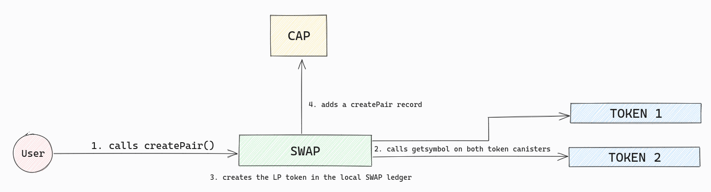

  

 
 

# Sonic Audit Report

## Scorecard

This is an overview of what we found during the audit, before our findings were addressed by the Sonic team. (see **[Post-Audit Review #1](#post-audit-review-1)**)

| Area | Description |
| --- | --- |
| Access Controls | **Sufficient:** Almost all canister update methods require authentication to modify the state (except for initiateTransfer) |
| Architecture/Design | **Strong:** The swap canister sits at the center of the multi-canister architecture. To reduce exploit surface, the swap canister maintains an internal copy of balances/allowances of the users that is used in swap and add liquidity operations, etc., making these operations atomic. While this strategy while this strategy reduces scalability, it makes transfers very straightforward semantically. |
| SNS Readiness | **Moderate:** The architecture can be easily adapted to work under an SNS, but some Very High findings will need to be addressed first. |
| Scalability | **Sufficient:** While there are limitations to the scalability of the canisters (see SS-SONIC-033) the current architecture can likely grow to quite a large size before it has to be changed. |
| Upgradeability | **Sufficient:** The canisters mostly follow the pattern of reading from stable state into intermediate structures and then copying to the final structures. While this reduces the max available memory, there are no complex calculations made at upgrade time which reduces the amount of cycles needed at upgrade time. |
| Documentation | **Moderate:** Documentation was very poor at the initial review hash, but has since been improved. |
| Testing & Verification | **Moderate:** Testing and build verification were very poor at the initial review hash but have since been improved. While testing needs to be further developed, there are now build verification instructions for the swap canister at: https://github.com/sonicdex/sonic-v1/blob/main/README.md |

---

## Table of Contents

- [Scorecard](#scorecard)
- [Introduction](#introduction)
  * [Purpose](#purpose)
  * [Auditing Agency](#auditing-agency)
  * [Audit Team](#audit-team)
- [Methodology & Assessment Priorities](#methodology--assessment-priorities)
  * [State of Audits on ICP](#state-of-audits-on-icp)
  * [Phase 1: Scoping](#phase-1-scoping)
  * [Phase 2: Execution](#phase-2-execution)
  * [Phase 3: Finalization](#phase-3-finalization)
  * [Risk Assessment Priorities](#risk-assessment-priorities)
- [Disclaimers & Scope](#disclaimers--scope)
  * [Review watermarks](#review-watermarks)
  * [General Disclaimers](#general-disclaimers)
  * [Within scope](#within-scope)
  * [Outside of scope](#outside-of-scope)
- [Summary of Findings](#summary-of-findings)
- [Application Architecture](#application-architecture)
  * [System Overview](#system-overview)
  * [Components](#components)
  * [Public functions from swap.mo](#public-functions-from-swapmo)
- [Repository Assessment & Recommendations](#repository-assessment--recommendations)
- [Detailed List of Findings](#detailed-list-of-findings)
  * [Summary](#summary)
  * [Security Related Findings](#security-related-findings)
  * [Non-Security Related Findings](#non-security-related-findings)
  * [SNS-Readiness Related Findings](#sns-readiness-related-findings)
- [Post-Audit Review #1](#post-audit-review-1)

---

# Introduction

This document is the official code security audit report by Solidstate (a [Code & State](https://www.codeandstate.com/) venture) for the [Sonic](https://www.sonic.ooo/) decentralized exchange. It represents the first professional security review by a team of industry-native [Internet Computer Protocol](https://internetcomputer.org/) (”IC”) experts. As such, it represents a significant milestone and sets a new standard for the emerging field of ICP decentralized application security.

This audit was started on August 7th 2023 and completed on September 7th 2023, with a **[Post-Audit Review #1](#post-audit-review-1)** completed on 9/18 to incorporate the Sonic team's resolutions to the [original audit findings](#detailed-list-of-findings).

## Purpose

This audit provides a detailed security review of the Sonic decentralized exchange application, specifically within the context of its decentralization swap sale on the SNS. It was created on behalf of Sonic by Solidstate as a public resource for the ICP ecosystem participants who will collectively be taking over the control of this decentralized application during its SNS launch.

## Auditing Agency

Solidstate is a venture by Code & State, an independent venture studio devoted to making it easier to build and earn on the Internet Computer. Solidstate contracts independent ICP protocol experts to execute professional code security audits for ICP projects. Our audits follow accepted industry standards while expanding them to cover the unique security considerations of ICP decentralized applications. We do not receive tokens in exchange for audits, and Code & State has no equity stake in Sonic. Solidstate conducts audits with the highest standards of professional integrity and deep respect for the ICP ecosystem.

## Audit Team

### Lead Auditor: David Alves

David is a leading mind in the development and security of decentralized infrastructure. While at DFINITY Foundation, he served as the Engineering Lead in charge of the creation of the NNS and the SNS. This experience gives him a rare level of protocol expertise that uniquely qualifies him as a leader in the emerging field of ICP security.

### Auditor: Anonymous by request

Our mid-level auditor co-founded notable projects on ICP since Genesis with a decade of development experience. They also have experience creating security tools for ICP dapps and currently serve as a CTO at a Web2 startup.

### Junior Auditor: Anonymous by request

Our junior auditor is a rare technical talent who led the development of multiple notable ICP projects. They currently serve as a Tech Lead in the Web3 space.

### Project Manager: Isaac Valadez

Isaac is the Venture Lead at Code & State. He assembled the auditor team and worked with the lead auditor and Sonic team to coordinate its completion.

# Methodology & Assessment Priorities

## State of Audits on ICP

ICP is unlike any other cloud network or L1 blockchain:

- It is asynchronous
- It hosts front ends
- It hosts complex data models
- It introduces new mutability types

Many established Web3 industry standards don’t translate to ICP. As such, security audits on the Internet Computer Protocol is an emerging field in its early stages, with few standards and resources to pull from.

This means protocol expertise for the auditors is paramount, and entirely new methodologies must be explored. The challenge the auditor team faced was not just to evaluate the security of a dapp, it was to advance the industry methodology needed to properly evaluate the security of an ICP dapp.

## Phase 1: Scoping

- Sonic provided access to their code repository, documentation, canister IDs, and all other required assets.
- Sonic and the Lead Auditor collaborated to scope the project and set risk assessment priorities.
- The lead auditor defined the audit assignments and the security practices necessary for this audit.

## Phase 2: Execution

- The auditors conducted a detailed code review of the Sonic GitHub repository.
- Each auditor built the code and tested it locally according to their assignments.
- The auditor team collaborated heavily both internally and with the Sonic team throughout the audit.

## Phase 3: Finalization

- The auditors reviewed and tested the new inputs from the Sonic team as they incorporated fixes to address findings during the audit.
- The audit team collected the final results in this audit report.

## Risk Assessment Priorities

These are the main risk assessment priorities that the Sonic swap canister code was evaluated for:

### Users have tokens stolen by attackers

- **Severity:** High
- **Description:** If vulnerabilities exist within Sonic's management of Web3 tokens, attackers could exploit these to directly siphon tokens from users' accounts, leading to significant financial losses and eroding trust in the platform.

### Users have Sonic liquidity stolen by attackers

- **Severity:** High
- **Description:** Sonic's liquidity pools are integral for its functionality. Any vulnerabilities might allow attackers to drain these pools, resulting in extensive financial loss for liquidity providers.

### Users have tokens made frozen/inaccessible (either maliciously or unintentionally)

- **Severity:** High
- **Description:** Vulnerabilities or bugs could render Web3 tokens inaccessible, either by malicious intent or unintended code behavior. This could lock funds indefinitely.

### Users have Sonic liquidity made frozen/inaccessible (either maliciously or unintentionally)

- **Severity:** High
- **Description:** Liquidity could become frozen due to code malfunctions or malicious exploits, causing providers to lose access to their assets.

### Sonic swap feature attacked via liquidity manipulation

- **Severity:** Medium
- **Description:** Bad actors might artificially inflate or deflate liquidity to exploit price differences, benefiting them at the cost of other users.

### Sonic swap feature attacked via frontrunning or malicious swapping tactics

- **Severity:** Medium
- **Description:** Attackers might observe pending transactions and quickly execute trades that benefit from those observed, disadvantaging the original transaction sender.

### Sonic swap feature halted or made inaccessible (either maliciously or unintentionally)

- **Severity:** High
- **Description:** Due to bugs, high network congestion, or malicious attacks, the swap feature could become temporarily inaccessible, disrupting the platform's main functionality.

### Data is lost during the canister upgrade process due to failure in saving it in the stable storage

- **Severity:** Medium
- **Description:** Upgrades are essential for system improvement. However, mishandling during the upgrade process, especially in saving data to stable storage, could result in irreversible data loss.

### Exploitation of intermediate state exposed by inter-canister calls

- **Severity:** High
- **Description:** When a canister makes an inter-canister call the temporary state created before the call is made persistent and visible. An attacker might be able to exploit this fact to their favor.

# Disclaimers & Scope

## Review watermarks

The audit performed in the code was based on commit `786e2cd061f6963f03812a3fd479f14690d37de0` of the `https://github.com/sonicdex/sonic-v1` Github repository. It was from this commit hash that the auditors reviewed all the code/documentation/scripts.

A post-audit review of fixes was done at commit: `b744b3822152991e7d342930066b132eb377065d`, the reviews of the fixes can be found in **[Post-Audit Review #1](#post-audit-review-1)**.

## General Disclaimers

- **ICP DeFi is experimental** - ICP dapp security is a constantly changing field full of unknowns. Keep this in mind and do your own research.
- **Use at your own risk** - Neither Solidstate nor our auditors are responsible for any losses experienced by users of the Sonic decentralized exchange.
- **Not investment advice** - Nothing in this report is investment advice.
- **Not comprehensive** - There is no such thing as a comprehensive audit, though there is always a scope. The work performed for this audit is captured within this report, do not assume that anything not explicitly covered here was evaluated.
- **No guarantees** - Due to the experimental nature of audits for ICP applications, neither Solidstate nor the auditors make any guarantees regarding the security of the Sonic decentralized application. We conducted a best-effort audit in good faith with talented protocol experts, but that is not enough to guarantee that new exploits won’t ever be discovered on a technology as novel as ICP.
- **Limited applicability** - ICP canisters have mutable code. This audit report was conducted on the specific commit hash of Sonic and the issues were verified to be fixed on another specific hash (see below). Once the code is updated, the applicability of this audit is voided and incremental reviews are recommended, as future versions of the Sonic source code may introduce new vulnerabilities.

## Within scope:

- **The Sonic Swap Canister (id: 3xwpq-ziaaa-aaaah-qcn4a-cai)**
    - Security of critical DeFi functions (swap, liquidity, wallets)
    - SNS launch readiness
    - Upgradeability
    - Scaling
    - State/Variable management
    - Best practices with the code repository (documentation, build-ability, comments, etc.)
- **The Sonic frontend canister (id: eukbz-7iaaa-aaaah-ac5tq-cai)**
    - The security of the integration between the frontend and the backend.

## Outside of scope:

- **Protocol-level exploits** - Auditing the entire Internet Computer Protocol, and the related tooling/packages provided by DFINITY Foundation, was out of scope.
- **Sonic LBP Dapp** - The Sonic Liquidity Bootstrapping Pool ("LBP") feature is a separate dapp that's not part of the SNS launch and is out of scope for this audit.
- **Integrated wallet providers & external dependencies** - External wallet providers such as Plug and other external dependencies were out of scope.
- **The XTC and WICP canisters** - The auditors did review the code for these canisters and they will be included in the Sonic SNS launch, but they were only audited within the context of how they impact the security of the Sonic swap canister. The XTC and WICP canisters did not receive independent in-depth audit evaluation/review outside of what was necessary to properly audit the security of the Sonic swap canister.
- **Malicious token canisters** - Malicious tokens can compromise the security of any DeFi applications to steal funds from users, a DEX cannot prevent this. Never interact with a token you do not trust and do your own research.
- **The Sonic analytics API and frontend** - This code was reviewed but not audited outside of what was necessary to properly audit the security of the Sonic swap canister.

# Summary of Findings

In this section, we present a summary of the findings. The full list and details are presented in the [Detailed List of Findings](#detailed-list-of-findings) section.

We audited the code across 3 main verticals. 1) **Security**: here we audited for code correctness and potential DOS or attack vectors, 2) **Quality & Documentation**: here we audited for testing coverage, quality of documentation, reproducibility of the build, etc. 3) **SNS-Readiness**: here we audited for how well the architecture and the code is ready to be handed over to an SNS.

We classify our findings into the following categories:

- **Low**: Stylistic or grammatical error that doesn’t influence how the program runs.
- **Medium**: Erroneous return or calculation that doesn’t affect the integrity of the overall application.
- **High**: Problem that affects the overall integrity of the application, but doesn’t allow to extract funds.
- **Very High**: A problem that affects the overall integrity of the application and allows a sophisticated caller to directly extract value.

In the **Security** category we found 0 *Very High* issues but found several *High*, *Medium*, and *Low*. The following issues are of note:

- **Ownership and Authorization Issues:**
    - In the SWAP component, static ownership checks prevent the changing of the owner, locking administrative functionalities (SS-SONIC-001).
    - Ambiguities exist regarding the ownership of both the cap canister and npm packages, potentially exposing the system to unauthorized modifications (SS-SONIC-017, SS-SONIC-018).
- **Function Vulnerabilities and Inefficiencies:**
    - Several functions in the SWAP component, such as `addToken`, `getBalance`, and `retryDepositTo`, have potential vulnerabilities or inefficiencies that might lead to system abuse, logical errors, or resource exhaustion (SS-SONIC-003, SS-SONIC-004, SS-SONIC-009).
- **Error Handling and Return Value Inconsistencies:**
    - SWAP's `AddToken`, `AddLiquidity`, and `setPairSupply` functions either lack proper error handling or return misleading values, complicating debugging and potentially misleading users (SS-SONIC-006, SS-SONIC-007, SS-SONIC-013, SS-SONIC-015).
- **Potential Denial of Service Risks:**
    - The absence of functions like `inspect()` and vulnerabilities in others such as `initiateTransfer` expose the SWAP component to cycles drainage or resource exhaustion attacks (SS-SONIC-005, SS-SONIC-011).
- **Scalability**
    - The single canister architecture greatly improves semantics by making most transfers within canisters atomic. However, it also makes it so that scalability is limited. The concrete limitations and recommendations are explored in SS-SONIC-033.

In the **Quality & Documentation** category we again found  0 *Very High* issues but found several *High*, *Medium*, and *Low*. The following issues are of note:

- **Frontend Testing Gap:**
    - There are no functional tests for the frontend, increasing the risk of new bugs. It's crucial to develop or rectify tests and include them in CI/CD pipelines (SS-SONIC-020).
- **Response Size Limitations:**
    - Both balance and subaccount exporting functions in SWAP aren't paginated, potentially causing data overflows (SS-SONIC-025 & SS-SONIC-026). Implementing pagination can ensure consistent performance.
- **Use of External Rust Crates:**
    - The BUILD component uses external Rust crates not managed by Sonic. This poses security and maintenance risks. It's recommended to either utilize official crates or maintain forks under Sonic's control (SS-SONIC-028).
- **Testnet Script Issues:**
    - Critical components for testnet scripts in the BUILD component are missing, complicating the testing process. It's essential to ensure all components are available for testing (SS-SONIC-029).
- **Build Process Failures:**
    - The WICP and XTC components face build failures due to missing crates. Such failures can delay development and deployment. Regular validation and maintenance of build scripts are crucial (SS-SONIC-030).
- **Outdated Frontend Bindings:**
    - The frontend uses outdated candid bindings. Using such outdated components can result in unexpected behaviors. It's advised to update the bindings to maintain compatibility with backend services (SS-SONIC-031).

In the **SNS-Readiness** category we found 2 *Very High* issues, that must be addressed before an SNS launch.

1. **Canister Ownership and Control:**
    - The SWAP component maintains an `auth` list of principals authorized for significant changes. For SNS decentralization, a single `owner` approach, likely the SNS governance canister, is recommended. If not rectified, this could allow unauthorized manipulations in trading (SS-SONIC-021).
2. **Data Export Methods Access:**
    - SWAP's data export methods are currently limited to the `owner` or `auth` list. With the transition to SNS, these methods need broader access as they are predominantly read-only (SS-SONIC-022).
3. **Token Metadata Update Methods:**
    - SWAP's token metadata update methods, currently restricted to `auth` users, are designed to refresh token metadata. Given the limited risk associated with these methods, they could benefit from more flexible access controls (SS-SONIC-024).
4. **Local Deployment & Build Reproduction:**
    - The BUILD component lacks a script for local deployment and doesn't provide detailed information on reproducing builds. This omission could impede development, auditing, and verification efforts, especially for SNS upgrades (SS-SONIC-027).
5. **Canister Monitoring:**
    - As canister ownership transitions to SNS, there's a lack of provisions to monitor key canister metrics, such as available cycles (SS-SONIC-032).

# Application Architecture

Sonic operates as a decentralized automated market maker (AMM), employing a singular canister architecture and a local ledger to deliver a comprehensive range of functionalities to its users.

The SWAP canister serves as the central hub for all user transactions within Sonic's ecosystem. It effectively executes a variety of tasks including swaps, managing liquidity pool deposits and withdrawals, and distributing liquidity pool rewards.

Moreover, the SWAP canister is entrusted with the responsibility of maintaining Sonic's local ledger for tokens. It facilitates user deposits and withdrawals, a critical aspect of the system. To engage with swap and liquidity pool features, users are required to deposit their assets into the SWAP canister. This canister meticulously records all incoming and outgoing transfers, thereby ensuring accurate updates to the local ledger. This process safeguards against discrepancies in holdings and mitigates the risk of potential asset losses.

Interaction between the SWAP canister and other token canisters is limited in scope. It encompasses specific operations such as deposits, withdrawals, and querying token metadata. Notably, all actions tied to liquidity pools draw upon the local ledger and user-deposited funds, enabling operations to be executed without necessitating inter-canister calls to respective token canisters.

The subsequent **components** section clarifies the public methods of the SWAP canister, as portrayed through sequence diagrams. It aims to offer insight into how this canister carries out a variety of operations.

## System Overview

The system is composed of the following components:

1. Backend Canister on the Internet Computer (IC) `swap.mo` [Github](https://github.com/sonicdex/sonic-v1/blob/main/sonic-v1/swap/src/swap.mo)
2. Frontend Application developed using React.js [Github](https://github.com/sonicdex/sonic-app)
3. CAP Canister for transaction history storage [Github](https://github.com/Psychedelic/cap)
4. Multiple Token Canisters adhering to either the ICRC1 or DIP20 standard. [ICRC1](https://github.com/dfinity/ICRC-1) [DIP20](https://github.com/Psychedelic/DIP20)

The Swap functionality is encapsulated within a single canister on the IC. While this design minimizes the intricacies associated with multiple inter-canister communications, it may pose potential scalability challenges in the future. Before executing any operations, such as addLiquidity or swap, tokens must be initially deposited into a designated container.

The frontend application, crafted using React.js, can be deployed on any web server compatible with its requirements. In the context of Sonic, the frontend resides in a distinct IC canister. The frontend extracts real-time data on swap prices and token availability directly from the Swap Canister. Analogous to the web3 swap on the Ethereum Virtual Machine (EVM) and similar blockchain structures, the frontend serves as an interface to the Swap Canister. In theory, it can be hosted either locally or by any third-party service.

The CAP Canister has been architected to securely archive the history of every transaction and action executed within the SWAP. [Github](https://github.com/Psychedelic/cap)

Regarding token standards, the system is compatible with both ICRC1 and DIP20. Despite the distinct characteristics and interfaces of these standards, the Swap Canister provides a standardized methodology for token interactions. The deposit flow is designed in a way that as long as the standard provides an `approval` method or supports subaccounts it can be used.

## Components

### Deposits and withdrawals

Sonic's operation relies on a local ledger that keeps track of user possessions for executing actions. As a result, the process of making deposits and withdrawals plays a crucial role in this system. Initially, users are required to deposit their tokens into Sonic by indicating the allowances of the SWAP canister on the corresponding token canisters. Only after completing this step can they proceed to invoke the deposit functions within the SWAP canister. Sonic then takes control of the designated assets by initiating a transferFrom inter-canister communication with the token canister, effectively transferring ownership to its own address. Subsequently, once the transaction is verified, the local ledger gets updated, enabling the user who made the deposit to utilize their assets for their intended activities.

In the Sonic system, withdrawals constitute the exclusive method for executing outward-bound external transfer calls. If users wish to retrieve their assets from the local ledger, they can conveniently utilize the withdrawal mechanisms. By doing so, they prompt Sonic to return their assets through a direct invocation of the transfer function on the token canister.

### Liquidity pools

Sonic operates as an automated market maker (AMM), leveraging the reserves within its liquidity pools. Individuals have the opportunity to become liquidity providers on Sonic, using their assets to earn rewards in proportion to the amount of liquidity they contribute and the specific token pair involved. By harnessing the liquidity supplied by users, Sonic facilitates the execution of token swaps.

### Swaps

Sonic can execute exchanges between any combination of tokens, granted that there exists sufficient liquidity within the corresponding reserves.

## Public functions from [swap.mo](https://github.com/sonicdex/sonic-v1/blob/main/sonic-v1/swap/src/swap.mo)

### Deposit functions

### Method `deposit`

**Arguments:**

- tokenId [Principal]: the principal ID of the token canister
- value [Nat]: the amount of tokens to be deposited

**Returns:**

- transaction receipt [TxReceipt]: receipt of the deposit transaction

### Method `depositTo`

**Arguments:**

- tokenId [Principal]: the principal ID of the token canister
- to [Principal]: the receiving principal address
- value [Nat]: the amount of tokens to be deposited

**Returns:**

- transaction receipt [TxReceipt]: receipt of the deposit transaction

### Method `retryDeposit`

**Arguments:**

- tokenId [Principal]: the principal ID of the token canister

**Returns:**

- transaction receipt [TxReceipt]: receipt of the deposit transaction

### Method `retryDepositTo`

**Arguments:**

- tokenId [Principal]: the principal ID of the token canister
- to [Principal]: the receiving principal address
- value [Nat]: the amount of tokens to be deposited

**Returns:**

- transaction receipt [TxReceipt]: receipt of the deposit transaction

---

### Withdraw functions

### Method `withdraw`

**Description:**

Withdraws a specified amount of tokens from the Sonic ledger to the caller's principal ID by calling the `transfer` function on the token canister. Initially, tokens inside Sonic's ledger are burned and only if the transfer fails for any reason, they are minted again.

**Arguments:**

- tokenId [Principal]: the principal ID of the token canister
- value [Nat]: the amount of tokens to be withdrawn

**Returns:**

- transaction receipt [TxReceipt]: receipt of the withdraw transaction

### Method `withdrawTo`

**Description:**

Withdraws a specified amount of tokens from the Sonic ledger to an external principal ID by calling the `transfer` function on the token canister. Initially, tokens inside Sonic's ledger are burned and only if the transfer fails for any reason, they are minted again.

**Arguments:**

- tokenId [Principal]: the principal ID of the token canister
- to [Principal]: the receiving principal address
- value [Nat]: the amount of tokens to be withdrawn

**Returns:**

- transaction receipt [TxReceipt]: receipt of the withdraw transaction

---

### Liquidity functions

### Method `createPair`

**Description:**

Creates a new liquidity pool and LP token for the pair of tokens `token0` and `token1`. Does not transfer any tokens, so all pools initially have reserves with zero tokens.

**Arguments:**

- token0 [Principal]: the principal ID of the first token canister
- token1 [Principal]: the principal ID of the second token canister

**Returns:**

- transaction receipt [TxReceipt]: receipt of the createPair transaction

### Method `addLiquidity`

**Description:**

Adds liquidity to the pool of `token0` and `token1`. Parameters `amount0Desired` and `amount1Desired` represent the maximum amount of tokens the caller is willing to deposit. Parameters `amount0Min` and `amount1Min` represent the minimum amount of tokens the caller is willing to provide. It is the responsibility of the function to calculate the current ratio of assets in the pool.

**Arguments:**

- token0 [Principal]: the principal ID of the first token canister
- token1 [Principal]: the principal ID of the second token canister
- amount0Desired [Nat]: maximum amount of the first token to deposit into the pool
- amount1Desired [Nat]: maximum amount of the second token to deposit into the pool
- amount0Min [Nat]: minimum amount of the first token to deposit into the pool
- amount1Min [Nat]: minimum amount of the second token to deposit into the pool
- deadline [Int]: The transaction must be completed before the deadline value

**Returns:**

- transaction receipt [TxReceipt]: receipt of the addLiquidity transaction

---

### Management functions

### Method `addAuth`

**Description:**

Grants the authorized role to the `id` address, if called by the owner of the SWAP canister.

**Arguments:**

- id [Principal]: the soon-to-be authorized principal ID

**Returns:**

- boolean value [Bool]: `true` for success, `false` for failure

### Method `removeAuth`

**Description:**

Removes the authorized role of the `id` address, if called by the owner of the SWAP canister.

**Arguments:**

- id [Principal]: the principal ID that is going to lose its privileges

**Returns:**

- boolean value [Bool]: `true` for success, `false` for failure

### Method `setOwner`

**Description:**

Assigns the ownership of the canister to the `newOwner` principal ID, if called by the current owner.

**Arguments:**

- newOwner [Principal]: the new owner principal ID

**Returns:**

- boolean value [Bool]: `true` for success, `false` for failure

### Method `setPermissionless`

**Description:**

Certain functions perform checks of the `permissionless` state variable to either guard themselves against unauthorized actors or make themselves accessible to all principal IDs. This function sets the value of the `permissionless` variable.

**Arguments:**

- newValue [Bool]: the new value (`true` for making those functions public, `false` for guarding against unknown callers)

**Returns:**

- boolean value [Bool]: `true` for success, `false` for failure

### Method `setMaxTokens`

**Description:**

SWAP has a `maxTokens` state variable that limits the number of tokens the canister can have at once. This function changes the value of the `maxTokens` state variable.

**Arguments:**

- newValue [Nat]: the new number of the maximum amount of tokens

**Returns:**

- boolean value [Bool]: `true` for success, `false` for failure

### Method `setFeeOn`

**Description:**

The fee that is subtracted from swap and liquidity transactions can be turned on or off. If set to on, one-sixth of the total value of each swap goes to the `feeTo` principal ID.

**Arguments:**

- newValue [Bool]: the new settings (`true` for enabling the feature, `false` for disabling)

**Returns:**

- boolean value [Bool]: `true` for success, `false` for failure

### Method `setFeeTo`

**Description:**

The fee that is subtracted from swap and liquidity transactions is transferred to the `feeTo` state variable. This function sets the value of the `feeTo` variable.

**Arguments:**

- newTo [Principal]: the new receiver of collected fees

**Returns:**

- boolean value [Bool]: `true` for success, `false` for failure

### Method `setGlobalTokenFee`

**Description:**

SWAP has a `tokenFee` state variable that is used to calculate the amount of fees collected during `transfer` and `approve` transactions performed on LP tokens. This function changes the value of `tokenFee`.

**Arguments:**

- newFee [Nat]: the new amount of fees to collect

**Returns:**

- boolean value [Bool]: `true` for success, `false` for failure

### Method `setFeeForToken`

**Description:**

Sets the fee value for a specific token (LP or non-LP).

**Arguments:**

- tokenId [Text]: token address
- newFee [Nat]: the new amount of fees to collect

**Returns:**

- boolean value [Bool]: `true` for success, `false` for failure

### Method `updateTokenMetadata`

**Description:**

Updates metadata associated with a specific token.

**Arguments:**

- tokenId [Text]: token address

**Returns:**

- boolean value [Bool]: `true` for success, `false` for failure

### Method `updateAllTokenMetadata`

**Description:**

Updates the respective metadata associated with all tokens stored in the canister.

**Returns:**

- boolean value [Bool]: `true` for success, `false` for failure

### Method `updateTokenFees`

**Description:**

Updates the respective token fee associated with all tokens stored in the canister.

**Returns:**

- boolean value [Bool]: `true` for success, `false` for failure

### Token functions

### Method `getBalance`

**Description:**

Returns the value of the token holdings of a certain principal ID

**Arguments:**

- caller [Principal]: the user whose balance should be returned
- tid [Text]: the token address

**Returns:**

- balance [Nat]: value of user holdings

### Method `addToken`

**Description:**

Adds a new token to the canister.

**Arguments:**

- tokenId [Principal]: the token address
- tokenType [Text]: the token standard

**Returns:**

- transaction receipt [TxReceipt]: an `addToken` receipt

# Repository Assessment & Recommendations

### 1. **Documentation**

Upon initial review the code lacked proper documentation, making it challenging to understand its functionality and intended behavior.

We recommended that the Sonic team write proper documentation and a `readme.md` that covers the following topics:

- **Local Development Environment Setup**
    - Prerequisites: List of software, tools, or libraries.
    - Clone the Repository: How to clone.
    - Dependency Installation: How to install dependencies.
    - Configuration: Environment variables, config files, etc.
    - Running Locally: How to run or start the project locally.
    - Debugging: Debugging tips.
    - Common Issues: Potential pitfalls and solutions.
- **Build Instructions**
    - Dependencies: Required libraries or tools.
    - Steps: How to build or compile the project.
- **Testing Instructions**
    - Test Suite: Mention the testing tool or framework.
    - Running Tests: Commands to execute tests.
    - Writing Tests: Guidelines for adding/modifying tests.
- **Deployment**
    - Pre-requisites: Environment or setup requirements.
    - Deployment Steps: Detailed deployment instructions.
    - Continuous Deployment: Info on continuous deployment, if applicable.
- **Usage**
    - Examples of how to use the project.
- **Features & Functionality**
    - Overview of main features.
- **Contribution Guidelines**
    - How to contribute, bug reporting, feature suggestions, etc.

### 2. **Local Development & Testing**

There's an absence of instructions on setting up the software for local development and test execution.

Example scripts for setting up the local environment are attached to this report

### 3. **Test Routes Exposure**

The presence of accessible test routes, like `/test`, `/test/t1`, and `/test/t2`, can pose security risks. Protecting routes and ensuring application safety should be prioritized.

### 4. **Code Consistency**

Consistent patterns like hooks or class-based components and managing side effects are essential. Currently, the code exhibits a mix of async functions and promises, and extraneous `console.log` statements.

### 5. **Webpack Optimization**

Given that the application is bundled with Webpack, the significant size of 3.83 MB for the application could slow down load times, impacting user experience.

### 6. **Redundant Exports**

Multiple unused exports have been identified, signaling the possibility of substantial dead code within the codebase. We've checked parts of the code, and found multiple instances of whole files that are no longer used, like `create-swap-actor.ts`

### 7. **Package Issues**

The @memecake/sonic-js and similar packages from @memecake point to psychedelic resources in their readme files, raising professionalism concerns.

Additionally, there are packages like `ethers` that are used for single functions and contribute significantly to output app size.

Refactor code to be more efficient in using external libraries.

### 8. **Testing Frameworks**

While both jest and cypress frameworks are present, Jest is non-functional, and the cypress tests fail, resulting in an absence of end-to-end (e2e) tests.

Either delete tests or rewrite them so they can be used during development

### 9. **Linting Errors & Warnings**

Linting, using the project's defined styles, has identified **337 errors and 280 warnings**. Most of them are about incorrect order of imports and usage of `any`.

Either modify linting rules or rewrite code to match them

### 10. **Refactoring and cleanup**

The frontend code is complex and hard to understand. This makes it hard to test, debug and maintain. There is a high chance that after cleaning up dead code, there will be dependencies that are no longer used.

# Detailed List of Findings

## Summary

To recap, we classified our findings into the following categories:

- **Low**: Stylistic or grammatical error that doesn’t influence how the program runs.
- **Medium**: Erroneous return or calculation that doesn’t affect the integrity of the overall application.
- **High**: Problem that affects the overall integrity of the application, but doesn’t allow to extract funds.
- **Very High**: A problem that affects the overall integrity of the application and allows a sophisticated caller to directly extract value.

| Category | Number of Findings | Status |
| --- | --- | --- |
| Very High | 2 (But only post SNS launch) | [[EVAL IN POST-AUDIT REVIEW](#post-audit-review-1)] |
| High | 11 | [[EVAL IN POST-AUDIT REVIEW](#post-audit-review-1)] |
| Medium | 9 | [[EVAL IN POST-AUDIT REVIEW](#post-audit-review-1)] |
| Low | 11 | [[EVAL IN POST-AUDIT REVIEW](#post-audit-review-1)] |

## Security Related Findings

### SS-SONIC-001: Incorrect owner assertion

- **Component:** SWAP
- **Severity:** High
- **Details:** The assertion `assert(msg.caller == owner_);` in two functions checks against a static `owner_` instead of the current owner's state variable.
- **Implication:** This makes it impossible to modify the owner, potentially locking critical administrative capabilities.
- **Recommendation:** Transition to dynamic checks against the current owner state variable to allow future owner changes.

### SS-SONIC-003: Ambiguous getBalance authentication

- **Component:** SWAP
- **Severity:** Low
- **Details:** The `getBalance` function presents unclear or unintuitive authentication semantics.
- **Implication:** This could lead to misinterpretation by developers, potentially resulting in errors or misuse.
- **Recommendation:** Refactor for clarity and provide accompanying documentation that clearly states the expected behavior.

### SS-SONIC-004: Permissionless addToken

- **Component:** SWAP
- **Severity:** High
- **Details:** The `addToken` function can be invoked without the necessary permissions.
- **Implication:** Unauthorized tokens might be added to the system, potentially leading to system abuse or compromise of platform integrity.
- **Recommendation:** Introduce permission checks or validation mechanisms to prevent unauthorized token additions.

### SS-SONIC-005: Cycles drainage vulnerability

- **Component:** SWAP
- **Severity:** High
- **Details:** Absence of the `inspect()` function can pave the way for cycles drainage attacks.
- **Implication:** Attackers could exhaust canister resources, effectively executing a denial of service.
- **Recommendation:** Integrate the `inspect()` function to oversee and deter such attack vectors.

### SS-SONIC-011: Resource exhaustion via depositTransactions

- **Component:** SWAP
- **Severity:** High
- **Details:** Functions `initiateTransfer`, `InitiateICRC1Transfer`, and `initiateICRC1TransferForUser` are vulnerable. Attackers can emulate different users and exhaust canister resources by adding to "depositTransactions".
- **Implication:** This can lead to a potential denial of service where the system resources are exhausted.
- **Recommendation:** Implement rate limiting or introduce validation mechanisms to deter mass fake entries.

### SS-SONIC-017: Unclear ownership of the cap canister

- **Component:** CAP
- **Severity:** High
- **Details:** The cap canister is widely used for recording transactions. However, there's ambiguity regarding the ownership of this canister's code.
- **Implication:** Unclear code ownership poses risks in terms of code integrity, potential backdoors, or unauthorized modifications.
- **Recommendation:** Clearly define and document the ownership of the cap canister. Ensure rigorous access controls and audit trails for any changes made.

### SS-SONIC-018 Unclear ownership of the npm packages

- **Component:** NPM Package
- **Severity:** High
- **Details:** The @memecake npm.js packages are used in the frontend. However, some packages still use descriptions from Psychedelic. Right now it is confusing who owns these packages. Specifically, @memecake/sonic-js, which is used for making calls directly to swap canister. There are several references to psychedelic in [readme.md](http://readme.md/) either in links or in the required configuration.
- **Implication:** Unclear code ownership poses risks in terms of code integrity, potential backdoors, or unauthorized modifications.
- **Recommendation:** Fix the readme file and state who is the owner and maintainer of those packages. Fix all the links and references to psychedelic.

### SS-SONIC-033 Scalability of canisters

- **COMPONENT:** SWAP, XTC, WICP
- **SEVERITY:** High
- **Details:** The project's architecture makes the explicit choice of minimizing inter-canister calls, which in the IC makes the semantics of operations much harder to reason about, by caching information about the balances and allowances of users. This makes it so that inter-user transfers, swaps, etc. can all be done without inter-canister calls which greatly improves security as it makes these operations atomic. However, this comes at the cost of having to keep this state inside the canister forever.
- **Implication:** Canister state size is capped and thus it's paramount to make sure that there will always be enough memory to upgrade the canister.
- **Recommendation:** The strategy we recommend to address this is twofold: a) First and foremost we recommend monitoring: The canister should expose exactly the number the elements of `balances`, `allowances`, and/or any other such state that can grow unbounded. These exposed metrics can and should be monitored by the community to see how far they come from the theoretical limits (see below). b) An architectural change should be planned such that this unbounded state can eventually be stored off-canister. This change need not be urgent and only needs to be in place once and if the state reaches a safe portion of the theoretical limits (e.g. 50%).

### Calculation for the recommended and theoretical maximum number of balances and allowances.

Here we go through the exercise of calculating the theoretical maximum for the two most prevalent types of state that have no upper bound in size. We then provide a recommendation of the maximum amount of such state that should be allowed to exist before the canister is either frozen or an architectural change has been made.

*Assumptions*:

- Calculations are as conservative as reasonable
- Calculations are made for the rust canisters because there are widely available benchmarks of the sizes of data structures. It’s possible Motoko data structures take considerably more space and thus the numbers would need to be further tweaked down.
- Maximum canister state (between stable memory and heap) is assumed to be 8GB.
- State should at most take 50% of the possible state since stable memory is copied into the intermediate state before being copied into the canister state (e.g. stable memory is read into Vec before being transformed into a HashMap). In the worst case scenario (e.g. if stable memory is not deleted and the space recovered) then the state can take at most 33.33% of the 8GB, or 2.66GB. This is the maximum size that we'll use for this exercise.
- Hashmaps which are widely used can have up to 1.25x overhead and an empty HashMap might use somewhere in the ballpark of 200-300 bytes on a 64-bit system. We'll assume 320 bytes to be pessimistic.
- Principals are 30 bytes.
- Token values are mostly 8 bytes.

*Balances*:

Balances are usually stored in a form equivalent to HashMap<Principal, u64>. Each entry (rounded to the next 8 bytes) is thus: (32 + 8) * 1.25 = 50 or 56 bytes. This means that a canister can have at most ~50 million balances before it runs out of space. We recommend that this quantity is monitored and the canister is never allowed to surpass 10 million balances before it's either a) frozen or b) an architectural change that overcomes this limitation has been introduced.

*Allowances*:

Allowances are usually stored in the form of a HashMap<Principal, HashMap<Principal, u64>> Each entry (rounded to the next 8 bytes) is then (32 + 320 + 32 + 8) * 1.25 = 490 bytes. This means that a canister can have at most ~5.8 million allowances before it runs out of space. We recommend that this quantity is monitored and the canister is never allowed to surpass 1 million allowances before it's either a) frozen or b) an architectural change that overcomes this limitation has been introduced.

*Important Note:* While balances and allowances are the most prevalent, canisters have other state that might grow without bounds, e.g. Tokens in swap. We recommend that all such unbounded state is monitored and that a clear plan to overcome the state size limitation is made for every case.

### SS-SONIC-013: setPairSupply anomaly

- **Component:** SWAP
- **Severity:** Medium
- **Details:** The `setPairSupply` function from `swap.mo` always returns true, even in instances of non-existent pairs.
- **Implication:** This could introduce false positives, leading to potential logical errors or misinformation.
- **Recommendation:** Modify the function to ensure accurate return values based on the actual presence or absence of pairs.

### SS-SONIC-014: Unused public functions

- **Component:** SWAP
- **Severity:** Medium
- **Details:** There are multiple public functions from `swap.mo` that aren't utilized in the frontend, posing as potential attack vectors.
- **Implication:** Unused or redundant functions can be exploited or lead to unforeseen vulnerabilities.
- **Recommendation:** Review the necessity of these functions. If they aren't required, consider removing or restricting their access.

### SS-SONIC-006: Unhandled errors in AddToken

- **Component:** SWAP
- **Severity:** Medium
- **Details:** Potential errors within the `AddToken` function from `swap.mo` aren't addressed.
- **Implication:** Neglecting error handling can crash the function or yield unexpected outcomes.
- **Recommendation:** Incorporate robust error handling mechanisms and consider returning informative error messages for transparency.

### SS-SONIC-007: Erroneous error values in liquidity functions

- **Component:** SWAP
- **Severity:** Medium
- **Details:** The `AddLiquidity` and `AddLiquidityForUser` functions in `swap.mo` return misleading error values.
- **Implication:** Incorrect error messages can mislead developers and users, complicating debugging efforts.
- **Recommendation:** Review and correct error return values to ensure they accurately reflect actual issues.

### SS-SONIC-008: getBalance discrepancy for non-icrc1 tokens

- **Component:** SWAP
- **Severity:** Low
- **Details:** The `getBalance` function returns a value of 0 for non-icrc1 tokens, regardless of the actual balance.
- **Implication:** This could mislead users or developers about the actual balance of non-icrc1 tokens in the system.
- **Recommendation:** Ensure the `getBalance` function can correctly fetch the balances of all token types supported by the platform.

### SS-SONIC-009: Cap insertion in retryDepositTo

- **Component:** SWAP
- **Severity:** Low
- **Details:** There's a lack of a defined cap for insertions in the `retryDepositTo` function.
- **Implication:** Unrestricted insertions could lead to resource exhaustion or system slowdown.
- **Recommendation:** Introduce an appropriate cap or limit for insertions to prevent potential system overloads.

### SS-SONIC-010: Condition repositioning in retryDeposit

- **Component:** SWAP
- **Severity:** Low
- **Details:** Conditions within the `retryDeposit` function might benefit from repositioning for optimal processing.
- **Implication:** Current positioning could introduce inefficiencies or logical errors.
- **Recommendation:** Review the function's logic and reposition conditions for clarity and efficiency.

### SS-SONIC-015: deposit error transparency

- **Component:** SWAP
- **Severity:** Low
- **Details:** The `deposit` function fails to return a detailed error upon failure, even though such a detail is available.
- **Implication:** Lack of detailed errors can complicate debugging and troubleshooting.
- **Recommendation:** Enhance the function to provide detailed error messages for better clarity during failure scenarios.

### SS-SONIC-016: setPairSupply behavior

- **Component:** SWAP
- **Severity:** Low
- **Details:** The `setPairSupply` function solely decrements the total supply value, regardless of the operation.
- **Implication:** This could lead to inconsistencies in supply tracking and potential logical issues.
- **Recommendation:** Update the function to handle both increments and decrements based on the specific operation.

## Non-Security Related Findings

This section contains findings that, while not security vulnerabilities represent aspects that are lacking and could be improved either for quality, maintenance, or user experience.

### SS-SONIC-030: Build failure in wicp/xtc due to `build.sh` with missing crates

- **Component:** WICP, XTC
- **Severity:** High
- **Details:** The build process for the wicp/xtc component fails due to issues with the `build.sh` script, specifically missing crates from a private git repo.
- **Implication:** A failing build process could halt development and deployment operations, potentially delaying updates, fixes, or new features. Moreover, reliance on missing crates may indicate dependency management issues.
- **Recommendation:** Investigate the missing crates in the `build.sh` script and ensure they are appropriately referenced and available. Regular maintenance and validation of build scripts are essential to ensure smooth CI/CD operations.

### SS-SONIC-031: Outdated candid bindings in frontend

- **Component:** Frontend
- **Severity:** Medium
- **Details:** The frontend is currently using an old version of candid bindings, potentially from an outdated version of swap. This was observed in the file: `src/did/sonic/swap.did.ts`.
- **Implication:** Using outdated bindings can introduce inconsistencies between the frontend and backend, potentially causing failures, inaccuracies, or unexpected behavior. Moreover, newer versions might have addressed certain vulnerabilities or bugs present in the older version.
- **Recommendation:** Update the candid bindings in the frontend to the latest and most compatible version. Ensure regular reviews of dependencies and bindings to maintain synchronization with backend services.

### SS-SONIC-029: Non-functional scripts in testnet due to missing components

- **Component:** BUILD
- **Severity:** Medium
- **Details:** Scripts designated for the testnet are currently non-functional. Critical components such as `dfx.json` and certain git submodules are missing.
- **Implication:** Without these essential components, testing in the testnet environment becomes challenging or impossible. This can lead to undetected issues and vulnerabilities not being addressed before production deployment.
- **Recommendation:** Ensure that all necessary files and submodules are available and properly linked for testnet scripts. Regularly audit and test deployment scripts to confirm their operability in different environments.

### SS-SONIC-028: Use of private Rust crates not under Sonic's control

- **Component:** BUILD
- **Severity:** Medium
- **Details:** Rust canisters are currently utilizing private crates that aren't under the direct control or oversight of Sonic.
- **Implication:** Depending on external private crates introduces potential security risks, as these crates might be modified without Sonic's knowledge. It can also pose maintenance challenges if the private crates become deprecated or unsupported.
- **Recommendation:** Restrict the use of Rust canisters to official crates from `crates.io` or fork the necessary crates under Sonic's control to maintain full oversight and ensure security and consistency.

### SS-SONIC-020 Missing frontend tests

- **Component:** Frontend
- **Severity:** Medium
- **Details:** There are old test scripts, however, they either do not run at all or fail.
- **Implication:** It is really easy to introduce new bugs and break already working features.
- **Recommendation:** Write or fix a set of tests. Include running them in CI/CD pipelines.

### SS-SONIC-019 Multiple unused exports in frontend

- **Component:** Frontend
- **Severity:** Medium
- **Details:** All the files by default export all the items defined in a file. Many of those exports are never used in other files, which might suggest that they should be purged.
- **Implication:** Dead code might be used in the future and introduce major bugs, which might lead to users not being able to use certain features or loose assets.
- **Recommendation:** Modify files to export items only used in other files. Delete all the dead code that was found after fixing the exports.

### SS-SONIC-002: Deprecated function usage

- **Component:** SWAP
- **Severity:** Low
- **Details:** The system flagged the usage of deprecated functions during the build process, specifically `Option.unwrap` and `Array.append`.
- **Implication:** Relying on deprecated functions can lead to unpredictable behavior in future updates and complicate code maintenance.
- **Recommendation:** Update the codebase to replace deprecated functions with their recommended alternatives.

### SS-SONIC-012: Logging inconsistency in withdrawTo

- **Component:** SWAP
- **Severity:** Low
- **Details:** The `withdrawTo` function logs an incorrect "to" field in the "withdrawTo-init" record.
- **Implication:** This can lead to misinformation when analyzing logs and impede accurate troubleshooting.
- **Recommendation:** Rectify the logging mechanism to ensure it captures the correct "to" field.

### SS-SONIC-023 Some methods can be made queries

- **Component:** SWAP
- **Severity:** Low
- **Details:** Some methods can be made queries since they don't alter the state. Relevant methods: `getBalance`, `historySize`.
- **Implications:** Forcing these methods to be updates removes the possibility to call these as queries (though queries can always be called as updates).
- **Recommendation:** Change these to queries.

### SS-SONIC-025: Export balances might exceed the max response size

- **Component:** SWAP
- **Severity:** Low
- **Details:** The function responsible for exporting balances is not paginated.
- **Implication:** As the number of balances grows, the response might become too large and exceed the maximum allowable response size. This could lead to incomplete data retrieval or function failures.
- **Recommendation:** Implement pagination or limit the amount of data returned in a single request to ensure consistent performance and data integrity.

### SS-SONIC-026: Export subaccounts might exceed max response size

- **Component:** SWAP
- **Severity:** Low
- **Details:** The function responsible for exporting subaccounts is not paginated.
- **Implication:** As the number of subaccounts grows, the response might become too large and exceed the maximum allowable response size, potentially leading to incomplete data retrieval or function failures.
- **Recommendation:** Implement pagination or limit the amount of data returned in a single request to ensure consistent performance and data integrity.

## SNS-Readiness Related Findings

This section contains findings that might become problematic in the context of an SNS, i.e. if the project is decentralized and all critical interactions must come via SNS governance proposals.

### SS-SONIC-021 Canister should have a single `owner` that should eventually be the SNS governance canister

- **Component:** SWAP
- **Severity:** Currently Medium, Very High for SNS
- **Details:** Currently there is an `auth` list of principals that can make major changes to the canister. This list should be eliminated to only one, likely `owner`. This owner should eventually be the SNS governance canister so that these methods can only be called via proposal. Relevant methods: `addAuth`, `removeAuth`, `setOwner`, `setPermissionless`, `setMaxTokens`, `setFeeOn`, `setFeeTo`, `setGlobalTokenFee`, `setFeeForToken`, and `addToken`.
- **Implication:** If the principals in auth continue to exist at SNS launch, even if the canister's owner (at the protocol level) is set to be the SNS's root canister and the `owner` field is set to be the governance canister, any of the principals on this list can still make changes that could potentially allow manipulation of trading.
- **Recommendation:** Eliminate the `auth` list and retain only the `owner` field, which can then be changed to be the SNS's governance canister once the SNS is launched. It should be verifiable via API who is `owner`.

### SS-SONIC-027: Absence of local deploy script and build reproduction info

- **Component:** BUILD
- **Severity:** Currently Medium, Very High for SNS
- **Details:** There isn't a script provided for local deployment, and there's no documentation detailing how to reproduce builds.
- **Implication:** The absence of these resources might hinder developers or auditors from effectively testing or verifying the application in a local environment. It also raises concerns about reproducibility and consistency for SNS upgrade purposes.
- **Recommendation:** Provide a comprehensive script for local deployment and detailed documentation on how to reproduce builds for clarity and easier verification.

### SS-SONIC-032: Expose query methods to monitor canister status/size

- **Component:** ALL CANISTERS
- **Severity:** Currently Medium, High for SNS
- **Details:** Once the canisters are owned by another controller (e.g. the SNS) it won't be possible to get certain information, like cycles.
- **Implication:** It will become impossible to monitor canisters once the ownership is transferred to the SNS.
- **Recommendation:** Provide methods that expose internal canister information, like available cycles, size of the canister, used stable memory, number of account balances, etc.

### SS-SONIC-022 Make the `export*` methods public or have a separate access control list

- **Component:** SWAP
- **Severity:** Currently Low, High for SNS
- **Details:** There are several methods to export data that are only callable by either the `owner` or the list in `auth`. Relevant methods are: `exportSwapInfo`, `exportSubAcounts`, `exportBalances`, and `exportRewardInfo`.
- **Implication:** If the `auth` list is eliminated as recommended in SS-SONIC-021 only `owner` will be able to call these methods, meaning only the the governance canister can call the methods via proposal. However, this will be pointless since these are mostly read-only methods and the response is discarded by the governance canister.
- **Recommendation:** Make these methods public, or have a separate access control list (e.g. named `exporters`) to access these methods. It should be possible to add and remove from this list by `owner`.

### SS-SONIC-024 Make the `update*` methods public or have a separate access control list

- **Component:** SWAP
- **Severity:** Low
- **Details:** These methods are meant to refresh token metadata and are only callable by the `auth` users. While the `auth` list should be removed for the SNS launch, these methods don't need to be made very secure, since all they do is refresh the metadata from the token canister. Relevant methods are: `updateTokenMetadata`, `updateAllTokenMetadata`, `updateTokenFees`.
- **Implication:** On SNS launch these methods are either made inaccessible (if `auth` is removed) or only callable by proposal.
- **Recommendation:** Create a separate access control list including principals that can call these methods, updateable via proposal. Potentially these methods could also be made public.

# Post-Audit Review #1

We performed a post-audit review focused on reviewing the fixes to the issues that we identified in the initial review. We performed the post-audit review at commit `b744b3822152991e7d342930066b132eb377065d` pushed on 09/16/23.

### Findings list

| Finding | Severity |Status | Commit | Notes |
| ------------ | ---------------- | ------------------------------------------------------------ | :----------------------------------------------------------: | ---- |
| SS-SONIC-001 | High | Fixed            | [1ec2798237281e0a499d6d90262ad239ad280090](https://github.com/sonicdex/sonic-v1/commit/1ec2798237281e0a499d6d90262ad239ad280090) |                              -                               |
| SS-SONIC-003 | Low | Fixed | [aca604d89b60ef074355c4e2053b6257f915b437](https://github.com/sonicdex/sonic-v1/commit/aca604d89b60ef074355c4e2053b6257f915b437) |                              -                               |
| SS-SONIC-004 | High | Fixed | [63a778d69f48468c314cbc3310809f940e3c797e](https://github.com/sonicdex/sonic-v1/commit/63a778d69f48468c314cbc3310809f940e3c797e) |                              -                               |
| SS-SONIC-005 | High | Fixed  | [6e30acb2d094b089d0fd393a059ed8f4a7aec89a](https://github.com/sonicdex/sonic-v1/commit/6e30acb2d094b089d0fd393a059ed8f4a7aec89a) |                              -                               |
| SS-SONIC-017 | High | Partially Fixed  | [5eaae572e9565247bf0e9cde4b0a317468af241a](https://github.com/sonicdex/sonic-v1/commit/5eaae572e9565247bf0e9cde4b0a317468af241a) | The CAP code has been forked and is now owned by Sonic. Changes have been merged to support a CAP V2 which is going to be, in our understanding, the new version of CAP. However, we haven’t found migration tests that show that this will work as expected. |
| SS-SONIC-013 | Medium |Function Removed | [a4d804ea899c2fc8cde85fc1e9ca064b44408e5f](https://github.com/sonicdex/sonic-v1/commit/a4d804ea899c2fc8cde85fc1e9ca064b44408e5f) |                              -                               |
| SS-SONIC-016 | Low | Function Removed | [a4d804ea899c2fc8cde85fc1e9ca064b44408e5f](https://github.com/sonicdex/sonic-v1/commit/a4d804ea899c2fc8cde85fc1e9ca064b44408e5f) |                              -                               |
| SS-SONIC-008 | Low | Fixed            | [aca604d89b60ef074355c4e2053b6257f915b437](https://github.com/sonicdex/sonic-v1/commit/aca604d89b60ef074355c4e2053b6257f915b437) |                              -                               |
| SS-SONIC-031 | Medium | Partial Fix | [01e2250f3b3722e66a07f0e2ce979e229fea73d1](https://github.com/sonicdex/sonic-app/tree/01e2250f3b3722e66a07f0e2ce979e229fea73d1) | https://github.com/sonicdex/sonic-app/blob/main/src/did/sonic/swap.did.ts still contains outdated bindings (for instance the setPairSupply method has been removed from swap.mo but still exists) |
| SS-SONIC-019 | Medium | Fixed | [c18cfbf3dea49cde2c26cd462eb0044dc991f55f](https://github.com/sonicdex/sonic-app/commit/c18cfbf3dea49cde2c26cd462eb0044dc991f55f) | - |
| SS-SONIC-012 | Low | Fixed | [aca604d89b60ef074355c4e2053b6257f915b437](https://github.com/sonicdex/sonic-v1/commit/aca604d89b60ef074355c4e2053b6257f915b437) | - |
| SS-SONIC-018 | High | Fixed | [01e2250f3b3722e66a07f0e2ce979e229fea73d1](https://github.com/sonicdex/sonic-app/commit/01e2250f3b3722e66a07f0e2ce979e229fea73d1) | - |
| SS-SONIC-011 | High | Fixed | [6408e458e54452641a8d6af0f5c1f0e355267c73](https://github.com/sonicdex/sonic-v1/commit/6408e458e54452641a8d6af0f5c1f0e355267c73) | The fix seems to resolve the problem, but our confidence is limited, particularly on migration, without seeing more tests. |
| SS-SONIC-010 | Low | Fixed | [233d6c13a24d42c608a3642d022ad11bdbcae26b](https://github.com/sonicdex/sonic-v1/commit/233d6c13a24d42c608a3642d022ad11bdbcae26b) | - |
| SS-SONIC-032 | Currently Medium, High for SNS | Fixed | [284c3e6458f34c9ac13b12141723fb504ab5eddb](https://github.com/sonicdex/sonic-v1/commit/284c3e6458f34c9ac13b12141723fb504ab5eddb) | Could still be made a query method. |
| SS-SONIC-006 | Medium | Partial Fix | [30dc448617c80b9d2670b850739f8d68136a6fa8](https://github.com/sonicdex/sonic-v1/commit/30dc448617c80b9d2670b850739f8d68136a6fa8) | The fix seems to have been to just make `createTokenType` return nothing, but it still logs that a token has been added to CAP even if it hasn’t. |
| SS-SONIC-007 | Medium | Fixed | [2e9b2e2e0353bad12f49ad07a4be6b7c65c47b99](https://github.com/sonicdex/sonic-v1/commit/2e9b2e2e0353bad12f49ad07a4be6b7c65c47b99) | There is a typo in the error message (missing a space). |
| SS-SONIC-009 | Low | Fixed | [9e044b3238c581cc459c91b405482ced5fc963e0](https://github.com/sonicdex/sonic-v1/commit/9e044b3238c581cc459c91b405482ced5fc963e0) | - |
| SS-SONIC-014 | Medium | Can't Fix | - | The listed functions are need for future UX updates |