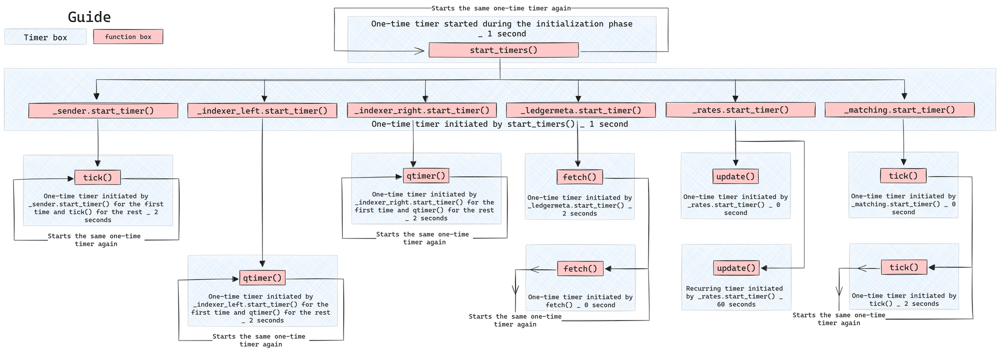

  

 
 

# DeFi Vector Audit Report

> ⚠️ **General Disclaimer**
> This audit report aims to detail the current state of security and potential weaknesses of the audited app within a limited scope. It does not make any recommendations regarding the app’s user experience, investment potential, or other factors.

## Scorecard

This scorecard is a broad overview of all our findings. You can also view the [Summary of Findings](#summary-of-findings) from our initial audit review, as well as see how the Neutrinite core team updated their code in response to those initial findings, by viewing [Post-Audit Review #1](#post-audit-review-1).

| Area | Description |
| --- | --- |
| Access Controls | **Strong**: The system has robust access control mechanisms, effectively handling various user roles and permissions. |
| Architecture/Design | **Strong**: The architecture minimizes inter-canister calls and maintains simplicity and cleanliness in code structure, making the code and the inter-canister interactions easy to understand. |
| Scalability | **Sufficient**: The scalability of DeFi Vector canister is sufficient. As an audit item, the developers added a maximum size to the transaction history and errors logs, without which adding transactions/errors would eventually compromise the upgrade of the canister. A more permanent, scalable, archival solution, particularly for the transaction history, would be better. |
| Upgradeability | **Sufficient**: It supports canister upgrades well with basic version management and rollback strategies in place. |
| Documentation | **Sufficient**: The documentation has improved significantly, covering system operations, architecture, and developer guides adequately. |
| Testing & Verification | **Sufficient**: Recent additions to the test suites and documentation have enhanced the testing and verification processes, providing good coverage and insights into system behavior. Tests could also be improved by testing more edge cases. |

### Scorecard levels:

* **Poor:** The scored area does not meet best practices criteria. The area is highly deficient, and improvements to it as a whole must addressed immediately.
* **Moderate**: The scored area almost meets best practices criteria. The area has some core deficiencies, but there are some key actionable items that, if addressed, would make this area minimally meet best practices.
* **Sufficient**: The scored area matches best practices criteria even though some key, concrete items could be improved.
* **Strong**: The scored area surpasses best practices criteria and only minor issues, if any, were found.

---

## Table of Contents

   * [Scorecard](#scorecard)
   * [Introduction](#introduction)
      + [Purpose](#purpose)
      + [Auditing Agency](#auditing-agency)
      + [Audit Team](#audit-team)
   * [Methodology & Assessment Priorities](#methodology--assessment-priorities)
      + [State of Audits on ICP](#state-of-audits-on-icp)
      + [Phase 1: Scoping](#phase-1-scoping)
      + [Phase 2: Execution](#phase-2-execution)
      + [Phase 3: Finalization](#phase-3-finalization)
      + [Risk Assessment Priorities](#risk-assessment-priorities)
   * [Disclaimers & Scope](#disclaimers--scope)
      + [Review watermarks](#review-watermarks)
      + [General Disclaimers](#general-disclaimers)
      + [Within scope](#within-scope)
      + [Outside of scope](#outside-of-scope)
   * [Summary of Findings](#summary-of-findings)
      + [Tally of issues by severity](#tally-of-issues-by-severity)
      + [Security](#security)
      + [Quality & Documentation](#quality--documentation)
   * [Application Architecture](#application-architecture)
      + [System Overview](#system-overview)
      + [Risks & Considerations](#risks--considerations)
      + [Recommendations](#recommendations)
      + [Components](#components)
         - [DeFi Vector](#defi-vector)
      + [Public Functions](#public-functions)
   * [Repository Assessment](#repository-assessment)
      + [Code Quality Assessment](#code-quality-assessment)
      + [CI/CD Assessment](#cicd-assessment)
      + [Tests Assessment](#tests-assessment)
   * [Detailed List of Findings](#detailed-list-of-findings)
      + [Summary](#summary)
      + [Security Related Findings](#security-related-findings)
      + [Non-Security Related Findings](#non-security-related-findings)
   * [Post-Audit Review #1](#post-audit-review-1)
      + [Status of found issues](#status-of-found-issues)

---

## Introduction

This document is the official code security audit report by [Solidstate](https://www.solidstateauditing.com/) for [Neutrinite DAO](https://dashboard.internetcomputer.org/sns/extk7-gaaaa-aaaaq-aacda-cai), the entity who is reviewing, accepting ownership of, and utilizing the [DeFi Vectors](https://github.com/Neutrinomic/defivectors) project. It represents a professional security review by a team of industry-native [Internet Computer Protocol](https://icpguide.com/) (”ICP”) experts.

The initial audit review began on March 13, 2024, and concluded on March 28, 2024, with the [Post-Audit Review #1](#post-audit-review-1) started April 9, 2024, and completed on April 11, 2024. The latest audit review incorporated the Neutrinite core team's latest code updates since the audit began, including their resolutions and responses to the [Detailed List of Findings](#detailed-list-of-findings).

### Purpose

This audit report provides a detailed security review of the [DeFi Vectors project](https://github.com/Neutrinomic/defivectors), specifically within the context of its impending transfer to, and usage by, the Neutrinite DAO. The Neutrinite core team created the DeFi Vectors project with the intention of using it to diversify the DAO’s treasury. Neutrinite DAO directly hired Solidstate to create this document so that DAO participants could gain insight into the project before it begins to interact with the DAO’s assets.

### Auditing Agency

Solidstate is the first ICP-native code security auditing agency. It’s a venture by [Code & State](https://www.codeandstate.com/), an independent venture studio devoted to making it easier to build and earn on the Internet Computer. Solidstate contracts independent ICP protocol experts, each with extensive experience building secure, ICP-decentralized applications, to execute professional code security audits for ICP projects. Our audits follow accepted industry standards, expanding them to cover the unique security considerations of ICP-decentralized applications.

#### Integrity Directives

Solidstate conducts audits with the highest standards of professional integrity and deep respect for the ICP ecosystem.

We work with our clients to allow them some control over the scope and duration of the audits, but clients do not have any control over the content of the final audit report. Our audit reports must be an accurate representation of all findings during the audit.

Compensation for Solidstate audits is determined by a fixed USD-based daily rate that’s contracted with the client upfront. To avoid any potential conflicts of interest, Solidstate does not accept any native tokens or equity from a project as compensation for executing its audit. The compensation for this project is recorded on chain.

Solidstate and Code & State do not hold any equity stake in Neutrinite DAO.

Solidstate auditors are instructed to follow the following directives:

- The [scope](#within-scope) of the audit must be made clear in the audit report.
- The audit report must list any important security considerations that were not covered during the audit as [outside of scope](#outside-of-scope).
- All known issues identified and verified must be included in the [detailed list of findings](#detailed-list-of-findings) section on the audit report.
- Issues will remain listed as open, or “not fixed”, on the audit report until an appropriate resolution is verified during a post-audit review.
- In general, any significant considerations that might impact prospective investors and users of the decentralized application should be included in the final audit report.

### Audit Team

#### Lead Auditor: [David Alves](https://twitter.com/dribeiroalves)

David is a leading mind in the development and security of decentralized infrastructure. While at DFINITY Foundation, he served as the Engineering Lead in charge of the creation of the NNS and the SNS. This experience gives him a rare level of protocol expertise that uniquely qualifies him as a leader in the emerging field of ICP security.

#### Senior Auditor: Anonymous by request

Our senior auditor co-founded notable projects on ICP since Genesis and brings over a decade of development experience. They also have experience creating security tools for ICP dApps and currently serve as the CTO at a Web2 startup.

#### Junior Auditor: [Nima Rasooli](https://twitter.com/0xNimaRa)

Nima led the development of multiple notable ICP projects such as DAB and Daowabunga as Tech Lead at Psychedelic. After Psychedelic converted into Fleek, he lead the development for cross-chain integrations.

#### Technical Writer: [Robin Moore](https://twitter.com/RobinMooreWeb3)

Robin edited the raw input of the auditors into this final report. Leveraging her expertise in editing, technical content creation, SEO, social media, and deep research, she strives to make technology accessible and engaging from beginners to enthusiasts.

#### Project Manager: [Isaac Valadez](https://twitter.com/isaac_icp)

Isaac is the Venture Lead at Code & State. He assembled the auditor team, worked with the lead auditor, Neutrinite DAO, and worked with the Neutrinite core team to coordinate the execution of the audit. Additionally, he assisted in writing and structuring this final audit report.

## Methodology & Assessment Priorities

### State of Audits on ICP

ICP is unlike any other cloud network or Layer-1 (L1) blockchain for the following reasons:

- It is asynchronous
- It hosts front ends
- It hosts complex data models
- It introduces new mutability types
- It decentralizes large amounts of data storage and significant computing capacity
- It can interact directly with both Web2 and Web3 protocols
- It allows for multi-canister decentralized application architecture, which is an entirely new technological frontier

As with any technology that pushes new boundaries, ICP's advanced capabilities introduce novel security implications. Many established Web3 industry standards don’t translate to ICP. As such, security audits on the Internet Computer Protocol are an emerging field in its early stages with few existing standards, resources, and examples to reference.

ICP auditors face the challenge of exploring and developing new industry methodologies so that decentralized applications on ICP can have their inherent security measures adequately evaluated. This means that solid protocol expertise and extensive experience building on ICP are critical requirements for any ICP auditor.

### Phase 1: Scoping

- The Neutrinite core team provided access to their code repositories, documentation, canister IDs, and all other required assets.
- The Neutrinite core team and the Lead Auditor collaborated to scope the project and set [risk assessment priorities](#risk-assessment-priorities).
- The lead auditor defined the audit assignments and the security practices necessary for this audit.

### Phase 2: Execution

- The auditors conducted a detailed code review of the DeFi Vectors GitHub repository.
- Each auditor deployed the code locally and evaluated it according to their assignments.
- The audit team collaborated heavily internally and with the Neutrinite core team throughout the audit.

### Phase 3: Finalization

- The auditors conducted a post-audit review to:
    1. Incorporate the Neutrinite core team's latest code updates since work on the initial audit review began.
    2. Evaluate any attempted resolutions for issues identified during the initial audit review.
- The audit team collected the results compiled into this final audit report.

### Risk Assessment Priorities

The DeFi Vectors project was evaluated for a few critical risk assessment priorities shown below:

### Users may have tokens stolen by attackers

- **Description:** If vulnerabilities exist within the management of Web3 tokens, attackers could exploit these to siphon tokens from vectors directly. This may lead to significant financial losses combined with eroding trust in the platform.

### Users may have tokens made frozen/inaccessible by either malicious or unintentional actions

- **Description:** Vulnerabilities or bugs could render Web3 tokens inaccessible, either by malicious intent or by unintended code behavior. This vulnerability could lock funds indefinitely or temporarily, leading to significant financial losses and eroding trust in the platform.

### DeFi Vector manipulation

- **Description:** Bad actors might try to stall, create, alter, take over, or manipulate the proper operation of vectors to benefit themselves or cause harm to others.

### DeFi Vector canister-level disruption by either malicious or unintentional actions

- **Description:** Due to bugs, high network congestion, or malicious attacks, the DeFi Vectors within a canister could become temporarily inaccessible, disrupting the platform's main functionality.

### Data is lost during the canister upgrade process due to a failure that may occur while saving it in the stable storage

- **Description:** Upgrades are essential for system improvement. However, mishandling during the upgrade process, especially when saving data to stable storage, could result in irreversible data loss.

## Disclaimers & Scope

### Review watermarks

The initial audit review performed in the code was based on commits:

- `8f3055bd3e5537d4c1bbeb87e58d59b58f5bb0bd` of the https://github.com/Neutrinomic/defivectors/ GitHub repository.
- `96513957f4c84210ba3e6bbe76886d98e0f129b9` of the https://github.com/Neutrinomic/devefi_icrc_ledger GitHub repository.

It was from these commit hashes that the auditors reviewed all the code, documentation, and scripts.

A post-audit review of fixes was done at commits:

- `2a09f2fb5738c8d9954339f10269c30d7539d711` of the https://github.com/Neutrinomic/defivectors/ GitHub repository.
- `96513957f4c84210ba3e6bbe76886d98e0f129b9` of the https://github.com/Neutrinomic/devefi_icrc_ledger GitHub repository.

The reviews of the fixes can be found in [Post-Audit Review #1](#post-audit-review-1).

### General Disclaimers

- **ICP DeFi is experimental** - ICP decentralized app security is a constantly changing frontier full of unknowns. Potential users of DeFi dApps on the ICP protocol should keep this in mind and do their own research.
- **Use at your own risk** - Neither Solidstate, Code & State, nor our auditors are responsible for any losses experienced by users of the DeFi Vectors project.
- **Not investment advice** - Nothing in this report should be taken as investment advice.
- **Not comprehensive** - There is no such thing as a comprehensive audit, but there is always a limited scope. The work performed for this audit was captured within this report. Furthermore, readers of this report should not assume that any information that was not explicitly covered here was information that was evaluated.
- **No guarantees** - Due to the experimental nature of audits for ICP applications, neither Solidstate, Code & State, nor the auditors make any guarantees regarding the security of the DeFi Vectors project. We conducted a best-effort audit with talented protocol experts in good faith, but that is not enough to guarantee that new exploits won’t ever be discovered on a novel technology like ICP.
- **Limited applicability** - ICP canisters have mutable code. This audit report was conducted on specific commit hashes of the DeFi Vectors project, and the issues were verified to be fixed on another set of specific hashes (see section above). Once the code is updated again, the applicability of this audit is voided, and incremental reviews are recommended, as future versions of the DeFi Vectors project’s source code may introduce new vulnerabilities.
- **Malicious token canisters general warning** - Malicious tokens (on any blockchain) can compromise the security of any DeFi application by stealing funds from users. This can even occur in ways a DEX may not be able to prevent. In addition, ICP tokens may have mutable code and suddenly become unsafe, possibly compromising ICP DeFi applications to impact users who never even directly interacted with the malicious token. Any potential users of DeFi dApps on ICP should be careful not to interact with an ICP token or DeFi application they do not trust. Additionally, potential users do their own research.

### Within scope

- DeFi Vectors project code for the ckBTC/NTN canister
    - Security of critical DeFi functions
    - Upgradeability
    - Scaling
    - State/Variable management
    - Best practices with the code repository (documentation, build-ability, comments, etc.)

### Outside of scope

- **Protocol-level exploits** - Auditing the entire Internet Computer Protocol and the related tooling/packages provided by DFINITY Foundation was outside of this audit's scope.
- **All other Neutrinite projects** - The Neutrinite core team has built other decentralized applications, and some of these different applications are dependencies of the DeFi Vector project. All other Neutrinite dApps, canisters, and repos were outside this audit's scope.
- **ICPCoins** - ICPCoins is a price aggregator for ICP fungible tokens built by the Neutrinite core team. As a critical dependency, ICPCoins provides price data to the DeFi Vectors project. ICPCoins was also outside the scope of this audit.
- **External dependencies** - External dependencies with code not written by the Neutrinite core team were outside of the scope of this audit.
- **$ICP, $ckBTC, & $NTN token canisters** - These token canisters were outside this audit’s scope.
- **Front-end Integration** - The security of the integration between the front end and the back end was outside of the scope of this audit.
- **Vector algorithm** - Both the concept of the vector and the algorithm itself are custom-made solutions. It is outside the scope of this audit to question the algorithm’s validity, yet it is within the scope to audit that the implementation matches the design.

## Summary of Findings

This section presents a summary of the findings from the initial audit review. The complete list and details are presented in the [Detailed List of Findings](#detailed-list-of-findings) section, and the findings for the latest code commit can be found in [Post-Audit Review #1](#post-audit-review-1).

We audited the code across two main verticals.

1. **Security**: In terms of security, we audited for code correctness and potential denial-of-service attack (DOS), or attack vectors.
2. **Quality & Documentation**: In terms of quality and documentation, we audited for testing coverage, quality of documentation, reproducibility of the build, and more.

We classify our findings into the following categories:

- **Low**: Stylistic or grammatical error that doesn’t influence how the application runs.
- **Medium**: Erroneous return or calculation that doesn’t affect the integrity of the overall application.
- **High**: A problem that affects the overall integrity of the application but doesn’t allow the extraction of funds.
- **Very High**: A problem that affects the overall integrity of the application and allows a sophisticated caller to extract value or take control of critical application functions directly.

### Tally of issues by severity

| Category | Number of Findings |
| --- | --- |
| Very High | 1 |
| High | 5 |
| Medium | 6 |
| Low | 4 |
| Total: | 16 |

See [here](#status-of-found-issues) for the status after [Post-Audit Review #1](#post-audit-review-1).

### **Security**

We identified vulnerabilities of varying severity within the Neutrinite system that have since been fixed. Here are the notable findings:

- **Precision Loss in Token Transfers Due to Float Usage (Medium):** Transfers using floating-point arithmetic can lead to precision loss, which can affect transaction integrity. This is especially true when tokens have different magnitudes.
- **Misconfigured ICP Transfer in Vector Creation (Very High):** Misconfiguration in the **`require_icp_transfer()`** function causes ICP transfers to be incorrectly processed through the NTN ledger, leading to functional failures.
- **Errors Not Persisting Through Upgrades (Medium):** Failure to retain errors across upgrades could hinder problem resolution and system improvement efforts.

## **Quality & Documentation**

The audit revealed areas for improvement in both testing coverage and documentation, which are essential for ensuring the system's reliability and maintainability, and these areas have since been fixed. Notably:

- **Missing Functional Tests**: Initially, critical components, like token swap functionalities, lacked comprehensive functional tests. This omission could lead to undetected bugs and operational failures.
- **Insufficient Documentation**: The project lacked detailed documentation on system operations, architecture, and testing. This gap makes it difficult for new developers to understand and contribute effectively to the project, and it complicates system maintenance and scalability.

## Application Architecture

### System Overview

The backend of the DeFi Vectors project comprises three distinct components, each represented as a smart contract canister:

1. The "DeFiVector" canister, housed within the DeFi Vectors’ repository, is designed to manage the primary logic of the swapper. This component facilitates transactions involving ckBTC and ICP tokens. Extensive use of timers is implemented to automate swaps and enable Dollar Cost Averaging (DCA) functionality.
2. The DeVeFi Ledger Middleware is dedicated to supporting ICRC1 tokens and also prioritizes providing streamlined and secure internal atomicity for transactions. Additionally, it serves as a reusable library for integration into other DeFi projects.
3. The DeVeFi ICP Ledger Middleware specializes in supporting the ICP ledger and offers functionalities akin to those provided by the ICRC1 middleware component.

### Risks & Considerations

#### Considerations

The project architecture is characterized by a single canister that manages multiple vector definitions and periodically checks for matching vectors to perform swaps. Currently, the documentation is lacking, including no README or insights into the canister's usage, its inner mechanisms, or guidelines for building and testing.

#### Trading Algorithm

The custom-developed trading algorithm needs more documentation regarding its operation and parameters. This absence raises concerns about potential bugs and the possibility of exploitation.

#### Security Measures

The current design allows any caller to create, modify, and withdraw vectors without the need for administrative functions or roles. The lack of any management functions results in no admin/owner access control.

#### Governance

The canister's configuration, including token swap settings, ledgers, and DeFi aggregator rates, is immutable post-deployment. Any modifications necessitate reinstallation, highlighting a rigid governance structure.

#### Scalability

Deploying additional canisters for either the same or different token pairs addresses scalability, indicating a straightforward scaling strategy.

#### Auditability and Transparency

The project's needs more documentation, including a README, descriptions of its inner workings, and test execution instructions.

#### Rates

Rates are updated every 60 seconds and subsequently cached, optimizing cycle usage but exposing the system to potential oracle manipulation attacks.

#### Backup

The project lacks mechanisms for data backup and restoration, compromising its resilience and continuity.

#### Test suites

No current guidance provided for executing the test suite, limiting the project's maintainability and the reproducibility of test results.

### Recommendations

#### Governance

It is recommended to incorporate features that allow for the dynamic adjustment of the canister's settings and addresses, which will enhance flexibility.

#### Readability

To facilitate better understanding and usage of the canister, it is essential to provide comprehensive documentation, including a detailed architectural overview, usage examples, and a reference implementation for rate calculation.

#### Maintainability

Implementing backup and restore capabilities and the ability to update initial configuration parameters will significantly enhance the project's robustness and maintainability.

#### Tests

Detailed instructions for executing the test suite from a clean repository clone should be provided, along with information on test scope and coverage, to ensure thorough testing.

#### Risk Mitigation

1. **Implement Test Suites**: Develop comprehensive test suites for all components to identify and address potential bugs and vulnerabilities. Focus on v1 vector algorithm verification. Tests should contain edge cases to confirm both proper and intended behavior.
2. **Backup and Restore**: Implement back and restore functions. They are essential to ensure smooth operations and the increase ease of handling critical bugs and issues.
3. **Add option to pause/unpause:** From the governance perspective, there are cases that require a temporary pause of the canister's operations, typically to mitigate ongoing exploits. Incorporating this functionality would enhance the system's governance capabilities and overall resilience.

---

### Components

#### DeFi Vector

This canister is responsible for managing vectors that engage with ICP and ckBTC tokens. Non-DAO actors are mandated to remit a vector creation fee to the canister either through ICP or NTN token deposits.

The canister provides access to only three public-facing update methods, which external actors, whether a smart contract canister or an Externally Owned Account (EOA), can utilize. This deliberate limitation helps mitigate potential attack vectors.

Internally, the canister maintains a comprehensive transaction history and two distinct indexers, each dedicated to ICP and ckBTC tokens.

DeFi Vector allows users to create swapping vectors triggered at regular intervals, providing a streamlined solution for token transfers. Users can configure each vector's parameters, such as interval duration, maximum tradable USD value, and slippage thresholds. This can occur during deployment or after deployment. Once created, a vector remains permanent and cannot be deleted, but its settings can be modified. Additionally, funds can be withdrawn as needed.

To fund a vector, the creator simply needs to send tokens to its source, and the DeFi Vectors canister will handle the rest. This operational simplicity and flexibility makes DeFi Vectors an indispensable tool for developers and Decentralized Autonomous Organizations (DAOs) in the realm of dApp tokenization.

Each vector follows a trading algorithm whose parameters can be configured by the vector’s architect. The following settings can be adjusted:

- `max`: The highest rate to which the trade can be executed.
- `multiplier`: The exchange rate will be multiplied by this value to achieve rates that are higher or lower than the market value.
- `multiplier_wiggle` and `multiplier_wiggle_seconds`: These two optional parameters, whose absence results in a fixed trading rate, enable dynamic rate adjustment. They affect the rate by applying a sine function to the time difference between the **current** and the vector's **creation** timestamps. This introduces slight rate variations, which can enhance trade matching by offering more favorable rates most of the time. Additionally, this still allows for adjustments to suit market conditions.
- `interval_seconds`: This establishes how often the swap should be triggered.
- `interval_release_usd`: This outlines the amount of assets to be allocated to the pool of tradable funds with each interval.
- `max_tradable_usd`: This parameter defines the maximum USD value of the tokens that should be considered tradable at any moment.

Upon initialization of the canister, a series of timers are activated sequentially, initiating various processes within the canister. This includes the right and left indexers and matching and sender processes, among other actions. The following diagram illustrates the flow of timers post-initialization:

### Public functions

This list contains all of the publicly executable functions of the DeFiVector canister.

### DeFiVector

---

**Method `create_vector`:**

Creates a new vector.

**Arguments:**

- `req`: The vector’s metadata.
- `payment_token`: A selection between the two choices of NTN and ICP.

**Returns:**

The vector’s ID on success or text on failure.

---

**Method `modify_vector`:**

Modifies an already existing vector.

**Arguments:**

- `req`: The new metadata for the vector.

**Returns:**

Nothing on success or text on failure.

---

**Method `withdraw_vector`:**

Withdraws a vector from the canister’s registry.

**Arguments:**

- `id`: The vector ID.
- `to`: The receiver of funds.
- `amountInc`: Amount to withdraw.
- `location`: The source and destination ledgers.

**Returns:**

A transaction ID on success or text on failure.

---

## Repository Assessment

### Code Quality Assessment

The code is of high quality and adheres to best practices, thus contributing to the project's overall robustness.

#### Structure

The codebase is well-organized across multiple files, with the ICRC-1 ledger notably isolated into a separate package.

### CI/CD Assessment

#### Build Reproducibility

The absence of build instructions and reference hashes for module verification limits the project's build reproducibility, posing challenges for consistent deployment and community verification of deployed canisters.

#### Dependency Management

The documentation needs more detailed information on dependency management for both build and test execution.

### Tests Assessment

The project includes tests for both the main package and other packages that are used as dependencies. These tests cover all the public functions that can be invoked. To facilitate the creation and execution of tests, the project utilizes PocketIC and @hadronous/pic within a JavaScript/TypeScript setup. Once all the requirements for running the tests are met, all the prepared tests pass successfully. However, tests are created in a way that they need to be run in bulk to pass. Notably, it is not possible to run them individually, which limits their usability.

In terms of test coverage, all functions are tested to verify both their invocability and the accuracy of their results. However, there is a deficiency in tests for invalid function invocations, which are necessary to confirm that the implemented safeguards function as intended. Additionally, there are a lack of tests to verify that the vector algorithm operates precisely as expected.

## Detailed List of Findings

### Summary

To recap, we classified our findings into the following categories:

- **Low**: A stylistic or grammatical error that doesn’t influence how the application runs.
- **Medium**: An erroneous return or calculation that doesn’t affect the integrity of the overall application.
- **High**: A problem that affects the overall integrity of the application but doesn’t allow the extraction of funds.
- **Very High**: A problem that affects the overall integrity of the application and allows a sophisticated caller to extract value or take control of critical application functions directly.

### Security Related Findings

---

#### SS-NEUTRINITE-001: Precision Loss in Token Transfers Due to Float Usage

- **Component:** Defivectors/matching.mo
- **Severity:** High
- **Details:**
Transfers of token amounts are performed using floating-point numbers. This approach introduces a risk of precision loss, especially when the tokens involved have different magnitudes. The inconsistency in precision loss between the tokens may lead to discrepancies in value transfer, potentially affecting transaction integrity.
- **Implication:**
Using floating-point numbers for token transfers can result in imprecise transactions, leading to the potential loss of value for one party and unintended gain for another. This issue is particularly significant in transactions involving tokens of varying magnitudes, specifically where the precision loss could be uneven.
- **Recommendation:**
Consider adopting fixed-point arithmetic or integer-based calculations for handling token amounts. This change would ensure consistent precision across transactions and prevent the risks associated with floating.

---

#### SS-NEUTRINITE-002: Canister Failure on `create_vector()` Due to Division by Zero

- **Component:** Defivector/main.mo
- **Severity:** Medium
- **Details:**
In the `create_vector()` method within `main.mo`, the calculation for `vector_cost_ICP` depends on the rates provided by an external rates canister for NTN and ICP prices. If the rates canister returns zero for the ICP price, the division by zero in the calculation of `vector_cost_ICP` leads to a failure. This issue prevents the creation of vectors by non-gov identities, effectively halting a critical functionality of the system if the rates canister is dishonest or malfunctions.
- **Implication:**
A division-by-zero error in a critical operation like `create_vector()` not only disrupts the service, but it also highlights a dependency vulnerability where external data can lead to significant operational failures. This could be exploited by either providing malicious rate data or if an unintentional bug returns a zero price.
- **Recommendation:**
Implement robust error handling for rate fetching operations, including checks against zero or undefined rates. Consider a fallback mechanism or an alert system for rate anomalies to prevent operational disruptions. Additionally, introducing redundancy in rate sources could mitigate the risks associated with dependency on a single rates canister.

---

#### SS-NEUTRINITE-004: Vector ID Skipped Due to Awaiting on Inter-Canister Calls

- **Component:** Defivectors/main.mo
- **Severity:** Medium
- **Details:**
In the `create_vector()` function, there's a potential issue where vector IDs could be inadvertently skipped. This happens because the vector ID counter is incremented before making calls to the source and destination ledgers. If these calls fail, or if a trap occurs after incrementing `_nextDVectorId` but before successfully completing the vector creation, the canister state is rolled back to the last resolved `await`, excluding the vector ID increment. This means the vector ID counter will have advanced without a corresponding vector being registered, leading to skipped IDs.
- **Implication:**
Skipping vector IDs may not immediately affect the canister's functional correctness but could introduce inefficiencies and confusion, especially in tracking and auditing vector creation events. It may also indicate underlying issues with error handling and state management that could have broader implications under certain conditions.
- **Recommendation:**
Adjust the vector creation logic to ensure that the vector ID counter is only incremented after all operations required to create a vector successfully have been completed without error. Consider implementing a transaction-like mechanism or leveraging existing programming patterns designed to handle state changes atomically, thereby preventing the counter from advancing in case of failures during the vector creation process. 

---

#### SS-NEUTRINITE-005: Misconfigured ICP Transfer in Vector Creation

- **Component:** Defivectors/main.mo
- **Severity:** Very High
- **Details:**
During vector creation, when the fee is paid by ICP, the `require_icp_transfer()` function incorrectly performs the transfer using the NTN ledger instead of the ICP ledger. This misconfiguration is evident, as both the `require_ntn_transfer()` and `require_icp_transfer()` functions have identical code that references the NTN ledger for executing transfers, despite the latter being intended for ICP transfers.
- **Implication:**
This issue directly impacts the functionality of vector creation with ICP payment, potentially preventing users from successfully creating vectors when opting to pay with ICP. It could lead to failed transactions, user dissatisfaction, and trust issues due to the inability to perform operations as intended.
- **Recommendation:**
Correct the implementation of the `require_icp_transfer()` function to ensure it utilizes the ICP ledger for transfers, aligning with its intended purpose. This adjustment will enable proper handling of fees paid by ICP during vector creation, ensuring the functionality works as expected for users. Additionally, consider implementing additional checks or tests to prevent similar issues in the future, ensuring ledger references are correctly aligned with the operation being performed.

---

#### SS-NEUTRINITE-006: Ledger Metadata Discrepancies in Vector Creation

- **Component:** Defivectors
- **Severity:** Medium
- **Details:**
The `create_vector()` function in Neutrinite's main module utilizes user-provided arguments from `req: DVectorRequest` to define the source and destination of ledger metadata. This approach poses a risk of discrepancies between user-provided metadata and actual ledger characteristics. Instead, the function could make query calls directly to the source and destination ledger canisters to retrieve and validate ledger metadata, ensuring accuracy and consistency.
- **Implication:**
Relying on user-provided ledger metadata without validation may lead to operations based on incorrect information, such as decimal places, symbols, or fees. This could affect the correctness of vector creation, leading to potential financial discrepancies or errors in transaction processing.
- **Recommendation:**
Modify the `create_vector()` function to perform query calls to the source and destination ledger canisters for the purpose of retrieving accurate metadata directly from the ledgers. This ensures that all operations are based on validated and current information, reducing the risk of errors and inconsistencies. Implementing this change will enhance the robustness and reliability of vector creation by aligning it with actual ledger characteristics.

---

#### SS-NEUTRINITE-007: Configuration Limitations for Error Handling in `icrc_ledger`

- **Component:** Defivectors
- **Severity:** Medium
- **Details:**
The `icrc_ledger` in Neutrinite lacks configuration options for error handling, specifically in terms of the number of stored errors and the frequency of error deletions. Without configurable parameters, the system may either retain too many error entries, consume unnecessary resources, or delete errors too frequently, potentially losing valuable debugging information.
- **Implication:**
The absence of configuration options for error handling could lead to inefficient resource use or hinder effective debugging and monitoring of the ledger's operations. Excessive error logs may consume significant storage, impacting the ledger's performance, while aggressive cleanup policies could remove critical error information needed for troubleshooting.
- **Recommendation:**
Introduce configuration options for error handling within the `icrc_ledger`, allowing administrators to specify both the maximum number of error logs to store and the frequency of their deletion. This improvement will enable more efficient management of storage resources and enhance the operational flexibility of error monitoring and debugging processes. Implementing these options will contribute to optimized performance and better maintenance capabilities of the ledger system.

---

#### SS-NEUTRINITE-008: Errors Not Persisting Through Upgrades

- **Component:** Defivectors
- **Severity:** Medium
- **Details:**
In the current implementation of Neutrinite's system, errors logged by the `icrc_ledger` or other components do not persist through canister upgrades. This behavior could result in the loss of crucial diagnostic information following system updates, hindering the ability to analyze and rectify issues that may have occurred prior to the upgrade.
- **Implication:**
The non-persistence of errors across upgrades poses significant challenges for ongoing system maintenance and debugging. Critical error information that could aid in diagnosing past issues or in understanding the state of the system prior to an upgrade is lost, potentially complicating efforts to ensure stability and reliability.
- **Recommendation:**
Modify the system to ensure that error logs are retained across upgrades, potentially by storing them in stable storage or employing a mechanism to archive errors before an upgrade and restore them afterward. This approach will preserve valuable diagnostic information, aiding in the continuous improvement and support of the system.

---

#### SS-NEUTRINITE-011: Lack of Backup and Restore Mechanisms

- **Component:** Defivectors
- **Severity:** High
- **Details:**
The system currently lacks a dedicated mechanism for backing up and subsequently restoring the state of the canister. This absence presents significant risks in terms of data preservation and recovery, which is critical for maintaining the integrity and continuity of operations, especially in disaster recovery scenarios.
- **Implication:**
Without the ability to backup and restore canister state, the system is vulnerable to data loss and inability to recover from catastrophic failures, jeopardizing the reliability and trustworthiness of the platform.
- **Recommendation:**
Implement comprehensive backup and restore functionalities that allow for the preservation and recovery of the canister state. These mechanisms should support both manual and automated operations, ensuring data integrity and availability across various scenarios.

---

#### SS-NEUTRINITE-014: Unbounded History Vector Cycle Consumption

- **Component:** System
- **Severity:** High
- **Details:**
The history vector within the system is designed without an upper limit on its size. This unbounded growth poses a significant risk, as it will inevitably lead to increased cycle consumption during canister upgrades. As the history vector grows, the cost to serialize and deserialize this data will also increase. Eventually, this will consume all allocated cycles and potentially cause the canister to halt operations.
- **Implication:**
If left unaddressed, this issue could lead to a scenario where the canister becomes non-operational due to the depletion of cycles, particularly during upgrade processes when the entire state —including the history vector — must be serialized and deserialized.
- **Recommendation:**
Implement a mechanism to limit the size of the history vector. This could involve pruning older entries, archiving them outside of the main canister state, or implementing a more sophisticated data management strategy that reduces the cycle consumption associated with this vector's growth. Additionally, consider implementing cycle management strategies to monitor and replenish cycles as necessary to prevent operational disruptions.

---

#### SS-NEUTRINITE-015: Non-redeemable vector creation fee

- **Component:** Defivector
- **Severity:** Medium
- **Details:**
In the process of creating a vector by non-DAO agents, an external agent is required to pay a fee, which can be in the form of ICP or NTN tokens. Following the transfer of the fee, two inter-canister calls are initiated to the source and destination ledgers' `icrc1_balance_of()` methods. If either of these ledgers is non-functional due to improper implementation of the functions or lack of cycles to operate on, the calls will fail. This will result in the failure of vector creation. In such cases, the agent will not have a solution for redeeming the fee paid for the vector that was not created. 
- **Implication:**
In the absence of the ability to retrieve the funds utilized as fees by the agent, funds become inaccessible within the canister.
- **Recommendation:**
Develop a fee-withdrawal mechanism that enables users to redeem their deposited fee in the original token form or enhance error handling within the vector creation process to automatically refund the fee to the user.

---

#### **SS-NEUTRINITE-016: Inadequate Testing for Token Swap Functionalities**

- **Component:** Defivectors
- **Severity:** High
- **Details:**
Initially, the DeFi Vectors project lacked comprehensive tests for its token swap functionalities, which are central to its operations. The absence of these tests posed a significant risk, as it could lead to undetected bugs or vulnerabilities in the swap mechanisms. Subsequently, this could affect the reliability and security of the platform.
- **Implication:**
Without sufficient testing, critical functionalities like token swaps might not perform as expected, potentially leading to financial losses for users and an eroding trust in the platform. The lack of tests could also hinder the platform's ability to detect and address vulnerabilities promptly, increasing the risk of exploits.
- **Recommendation:**
Develop and implement a detailed suite of tests specifically designed to cover all aspects of token swaps, including edge cases and failure scenarios. These tests should verify the correctness of the swap logic, ensure the integrity of transactions, and validate the handling of various token types and conditions. Integrating these tests into the continuous integration and deployment pipeline will help maintain the robustness and security of the platform as it evolves.

---

### Non-Security Related Findings

---

#### SS-NEUTRINITE-003: Unnecessary Payment Token Argument in `create_vector()`

- **Component:** Defivectors/main.mo
- **Severity:** Low
- **Details:**
The `create_vector()` function unnecessarily requires a payment token argument even when the governance canister, which should not be subjected to payment, is the caller. This design can be misleading and may impose unnecessary constraints or confusion when integrating with the function, especially since the governance canister's operations are typically exempt from such requirements.
- **Implication:**
Requiring unnecessary or irrelevant parameters, especially for privileged operations initiated by governance mechanisms, complicates the function interface and can lead to inefficiencies or errors in transaction processing. It also introduces potential barriers to automated or streamlined operations within the governance framework.
- **Recommendation:**
Optimize the `create_vector()` function's interface by either making the payment token argument conditional or removing it altogether for calls initiated by the governance canister. Implementing checks within the function to discern the caller's identity and adjusting requirements accordingly can enhance usability and clarity. 

---

#### SS-NEUTRINITE-009: Duplicate Error Code in `Debug.trap()` Calls

- **Component:** Defivectors/architect.mo
- **Severity:** Low
- **Details:**
In the `architect.mo` file, two `Debug.trap()` calls have been found with identical codes at lines of code (LOC) 44 and 48. This redundancy may indicate copy-paste errors or unnecessary code duplication, which could lead to confusion during debugging and maintenance processes.
- **Implication:**
Duplicate `Debug.trap()` calls with the same error code can make it more challenging to pinpoint the exact location and context of issues, as this obscures the source of errors. This duplication could hinder efficient debugging and error resolution.
- **Recommendation:**
Review the necessity of each `Debug.trap()` call and ensure that they are used appropriately. Consider assigning unique codes or messages to each trap to facilitate more precise error tracking and debugging. If one of the calls is redundant or does not serve a distinct purpose, it should be removed or modified to reflect its specific context.

---

#### SS-NEUTRINITE-010: Inaccurate Retry Interval Comment

- **Component:** Defivectors/sender.mo
- **Severity:** Low
- **Details:**
In the `sender.mo` file, a comment suggests that retries are performed every 30 seconds, yet the actual value of `RETRY_EVERY_SEC` is set to 60 seconds. This discrepancy between the documented intention and the implemented logic can lead to confusion regarding the behavior of retry mechanisms.
- **Implication:**
Misleading comments can cause misunderstandings about the system's operational characteristics, potentially affecting maintenance and future modifications.
- **Recommendation:**
Update the comment to accurately reflect the implemented retry interval of 60 seconds, ensuring consistency between documentation and code behavior.

---

#### SS-NEUTRINITE-012: Insufficient Documentation on Defivectors

- **Component:** Defivectors
- **Severity:** High
- **Details:**
There is a notable absence of comprehensive documentation for the Defivectors platform, specifically regarding the descriptions of various canisters/components and the process for conducting reproducible builds. This lack of documentation can significantly hinder the understanding, maintainability, and scalability of the system.
- **Implication:**
The absence of detailed documentation and guidelines for reproducible builds may lead to challenges in system maintenance, upgrades, and verification by third parties. This gap can affect the platform's security posture, its ability to quickly adapt to new requirements, or the ability to recover from issues.
- **Recommendation:**
Develop and maintain thorough documentation covering all aspects of the Defivectors system, including detailed component descriptions and a clear, step-by-step guide for achieving reproducible builds. This documentation should be readily accessible and regularly updated to reflect the system's current state.

---

#### SS-NEUTRINITE-013: Redundant Code in Matching Module
- **Component:** Defivector/matching.mo
- **Severity:** Low
- **Details:**
In `matching.mo`, specifically at line 70, there is a commented code fragment that appears to be redundant, likely due to a previous refactoring where the relevant code was moved to its own method. This extraneous line does not contribute to the functionality and may cause confusion or clutter in the codebase.
- **Implication:**
While not directly impacting functionality, redundant code can lead to unnecessary complexity, making the code harder to read and maintain. It may also mislead developers about the code's logic or intent.
- **Recommendation:**
Review and remove the redundant line of code at LOC 70 in `matching.mo` to streamline the codebase, enhancing clarity and maintainability.

---

## Post-Audit Review #1

A “post-audit review” is essentially another audit focused on reviewing and incorporating all of the changes in the code since the previously audited commit process. The majority of this report was based on the “initial audit review”, and this section covers the findings of the first and last “post-audit review” required to incorporate code changes leading up to the publication of this final audit report.

### Status of found issues

**Summary**

| Severity | Found | Fixed/Partially Fixed | Not an Issue | Not fixed (see Notes) | Downgraded |
| --- | --- | --- | --- | --- | --- |
| Very High | 1 | 1 | - | 0 | - |
| High | 5 | 4 | - | 1 | - |
| Medium | 6 | 4 | 1 | 1 | 1 |
| Low | 4 | 3 | - | 1 | - |

Detailed Statuses

| Finding | Severity | Status | Commit | Notes |
| --- | --- | --- | --- | --- |
| SS-NEUTRINITE-001 | High | Not Fixed |  | Developer notes: “The loss will be most likely around 1 cent when swapping tens of thousands of dollars worth of tokens. “ |
| SS-NEUTRINITE-002 | Medium | Partially Fixed | [7252111755b3b5250567faec68531f61fa13cee6](https://github.com/Neutrinomic/defivectors/commit/7252111755b3b5250567faec68531f61fa13cee6) | Developer notes: “The rates module will now not return 0, but a null and error will be returned. For a more robust error handling here, a change inside the DeFi aggregator is needed, but that can’t be quickly done now.” |
| SS-NEUTRINITE-003 | Low | Not fixed |  |  |
| SS-NEUTRINITE-004 | Medium | Fixed | [025a8d221e418d5f8ecc733212012e21a6ec5f1d](https://github.com/Neutrinomic/defivectors/commit/025a8d221e418d5f8ecc733212012e21a6ec5f1d) |  |
| SS-NEUTRINITE-005 | Very High | Fixed | [ba0457618eb4976ec1ff38b051cb3634a7487e7c](https://github.com/Neutrinomic/defivectors/commit/ba0457618eb4976ec1ff38b051cb3634a7487e7c) |  |
| SS-NEUTRINITE-006 | Medium | Not an Issue |  |  |
| SS-NEUTRINITE-007 | Medium | Partially Fixed | [b7a94818a71e43d797300b93974649d4d0322c85](https://github.com/Neutrinomic/defivectors/commit/b7a94818a71e43d797300b93974649d4d0322c85) | Errors are now capped to 1000. This can no longer exhaust canister resources, but ideally, a permanent log would be created. |
| SS-NEUTRINITE-008 | Medium | Fixed | [b7a94818a71e43d797300b93974649d4d0322c85](https://github.com/Neutrinomic/defivectors/commit/b7a94818a71e43d797300b93974649d4d0322c85) |  |
| SS-NEUTRINITE-009 | Low | Fixed | [2a09f2fb5738c8d9954339f10269c30d7539d711](https://github.com/Neutrinomic/defivectors/commit/2a09f2fb5738c8d9954339f10269c30d7539d711) |  |
| SS-NEUTRINITE-010 | Low | Fixed | [cef78dffecb341f16b332c998e5a4c71f00767f7](https://github.com/Neutrinomic/defivectors/commit/cef78dffecb341f16b332c998e5a4c71f00767f7) |  |
| SS-NEUTRINITE-011 | High | Partially Fixed | [704e6ce6c16121cc50219206f2884f53d7389b65](https://github.com/Neutrinomic/defivectors/commit/704e6ce6c16121cc50219206f2884f53d7389b65) | Developer notes: “Added a create_vector event, and the history will be recorded. In the event of disaster, we can recreate all vectors and make them inactive; users won’t be losing funds. They can withdraw tokens from their vectors or set them up again. This is a temporary solution to reduce the severity. This way we don’t know the trade algorithm parameters, but users will have access to their tokens.“ |
| SS-NEUTRINITE-012 | High | Fixed | [4b6e5972de013cf6afc7d233950b4542c7877bd2](https://github.com/Neutrinomic/defivectors/commit/4b6e5972de013cf6afc7d233950b4542c7877bd2) |  |
| SS-NEUTRINITE-013 | Low | Fixed | [bd76745e3a22adf2e4aa95398bf4f1e6b4311488](https://github.com/Neutrinomic/defivectors/commit/bd76745e3a22adf2e4aa95398bf4f1e6b4311488) |  |
| SS-NEUTRINITE-014 | High | Fixed | [b7a94818a71e43d797300b93974649d4d0322c85](https://github.com/Neutrinomic/defivectors/commit/b7a94818a71e43d797300b93974649d4d0322c85) |  |
| SS-NEUTRINITE-015 | Medium (Downgraded from High) | Not Fixed |  | Developer notes: “Practically, SNS and NNS ledgers get upgraded once a month. The ICP ledger won’t run out of cycles, and the NTN ledger has enough for years ahead. Additionally, they don’t stop when upgraded. Funds are directly sent to the DAO treasury. The chances are that a transaction goes through, but if the DeVeFi canister doesn’t register, it will probably be around a one in a million chance, if not lower.  If a mechanism gets developed where the canister holds these funds and periodically sends them to the DAO treasury while providing fee refunds, this will increase the complexity and possibly result in a bigger problem, including more possible attack vectors.” |
| SS-NEUTRINITE-016 | High | Fixed | [d79d8131635b053b414a61e100fca327b61c9b80](https://github.com/Neutrinomic/defivectors/commit/d79d8131635b053b414a61e100fca327b61c9b80) |  |
